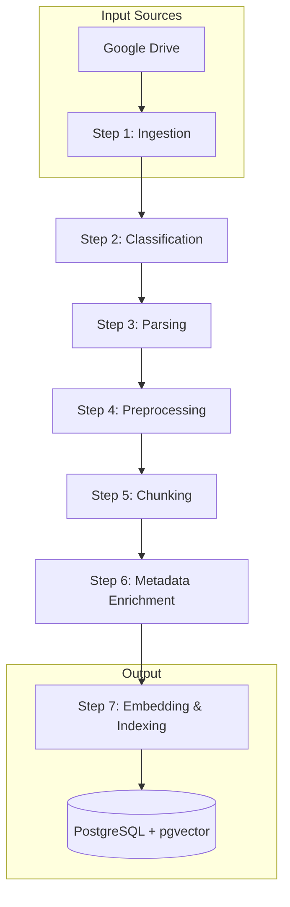

# Council-AI RAG Data Pipeline

이 문서는 Council-AI의 7단계 RAG 데이터 파이프라인을 설명합니다.

## Pipeline Overview



---

## Step 1: Ingestion (수집)

Google Drive에서 rclone을 사용하여 문서를 수집합니다.

**모듈:** `app/pipeline/step_01_ingest.py`

**주요 기능:**

- rclone을 통한 Google Drive 동기화
- Mac/Windows 파일 인코딩 처리 (NFC/NFD)
- Google Forms 링크 수집 (Reference 테이블용)

**입력:** Google Drive 폴더 ID
**출력:** 로컬 파일 목록 + Google Form 링크

```python
ingester = IngestionService()
result = await ingester.sync_from_drive(folder_id)
files = await ingester.list_synced_files()
```

---

## Step 2: Classification (분류)

파일명과 폴더 경로를 분석하여 문서를 분류합니다.

**모듈:** `app/pipeline/step_02_classify.py`

**분류 체계:**
| Category | Description | 예시 |
|----------|-------------|------|
| `meeting_document` | 회의 서류 | 안건지, 속기록, 결과지 |
| `work_document` | 업무 서류 | 예산안, 기획안, PPT |
| `other_document` | 기타 | 홍보물, 참고자료 |

**Meeting Subtypes:**
| Subtype | Pattern | Reliability |
|---------|---------|-------------|
| `agenda` | 안건지, agenda | Low (1) |
| `minutes` | 속기록, 회의록 | Medium (2) |
| `result` | 결과지, 확정 | High (3) |

**LLM 파일명 표준화:**

```
Input:  "제38대 학생회 국장단 1차 회의 속기록"
Output: "[속기록] 제38대 학생회 집행위원회 국장단 제1차 회의"
```

---

## Step 3: Parsing (파싱)

Upstage Document Parse API로 문서를 HTML/Markdown으로 변환합니다.

**모듈:** `app/pipeline/step_03_parse.py`

**처리 흐름:**

1. Upstage API로 문서 → HTML 변환
2. 이미지/표 좌표 추출
3. PDF에서 좌표 기반 이미지 크롭 (고해상도)
4. Gemini Vision으로 이미지/표 캡션 생성
5. HTML 내 이미지 태그를 텍스트 설명으로 대체

**표 변환 예시:**

```markdown
| 항목   | 예산    | 집행    |
| ------ | ------- | ------- |
| 간식비 | 500,000 | 450,000 |
```

---

## Step 4: Preprocessing (전처리)

LLM을 사용하여 Markdown 헤더 구조를 추가합니다.

**모듈:** `app/pipeline/step_04_preprocess.py`

**헤더 규칙:**

- `#` (H1): 안건 종류 (보고안건, 논의안건, 의결안건)
- `##` (H2): 개별 안건 (1. 축제 가수 섭외 건)

**변환 예시:**

```markdown
# 보고안건

## 1. 축제 준비 현황

축제 준비가 순조롭게 진행되고 있습니다...

# 논의안건

## 1. 가수 섭외 건

가수 후보 리스트를 검토합니다...
```

---

## Step 5: Chunking (청킹)

Parent-Child 청킹 전략으로 문서를 분할합니다.

**모듈:** `app/pipeline/step_05_chunk.py`

**전략:**

- **Parent Chunks:** `##` 헤더로 분리된 완전한 안건
- **Child Chunks:** Parent를 500자 단위로 세분화

```
## 논의안건 1. 축제 가수 (Parent)
    ├── Child: "가수 후보 리스트..."
    ├── Child: "예산은 300만원..."
    └── Child: "투표 결과..."
```

**검색 효과:**
| Component | 역할 |
|-----------|------|
| Child | 높은 정밀도 검색 (임베딩) |
| Parent Content | 충분한 맥락 제공 (LLM 입력) |

---

## Step 6: Metadata Enrichment (메타데이터 주입)

문서와 청크에 메타데이터를 추가합니다.

**모듈:** `app/pipeline/step_06_enrich.py`

**주입 항목:**
| Field | Description |
|-------|-------------|
| `event_id` | 연관 이벤트 FK |
| `access_level` | 접근 권한 (1-4) |
| `time_decay_date` | 시간 가중치 기준일 |
| `department` | 담당 국서 |

**Access Level 결정:**

```python
if meeting_subtype == RESULT:
    return 4  # Public (투명한 결정 사항)
elif doc_category == MEETING_DOCUMENT:
    return 3  # Council members
elif doc_category == WORK_DOCUMENT:
    return 2  # Department heads
```

---

## Step 7: Embedding & Indexing (임베딩)

Vertex AI로 벡터 임베딩을 생성하고 HNSW 인덱스를 구축합니다.

**모듈:** `app/pipeline/step_07_embed.py`

**임베딩 모델:**

- Model: `text-embedding-004`
- Dimension: 768
- Provider: Google Vertex AI

**검색 기능:**

1. **기본 유사도 검색:**

```python
results = await embedder.search_similar(
    query_embedding=query_vec,
    limit=10,
    access_level=user_level,
)
```

2. **시간 가중치 검색:**

```python
# Final Score = 0.7 * semantic + 0.3 * recency
results = await embedder.search_with_time_decay(
    query_embedding=query_vec,
    semantic_weight=0.7,
    time_weight=0.3,
)
```

**HNSW Index:**

```sql
CREATE INDEX idx_chunks_embedding_hnsw
ON document_chunks
USING hnsw (embedding vector_cosine_ops)
WITH (m = 16, ef_construction = 64);
```

---

## Celery Tasks

파이프라인은 Celery 태스크로 비동기 실행됩니다.

**모듈:** `app/tasks/pipeline.py`

| Task                 | Description                        |
| -------------------- | ---------------------------------- |
| `run_full_pipeline`  | 단일 문서 전체 파이프라인          |
| `ingest_folder`      | 폴더 수집 + 개별 파이프라인 트리거 |
| `reprocess_document` | 문서 재처리                        |
| `create_hnsw_index`  | HNSW 인덱스 생성                   |

**사용 예시:**

```python
from app.tasks.pipeline import ingest_folder

# 폴더 수집 시작
result = ingest_folder.delay(
    drive_folder_id="1abc...",
    event_hints={"event_title": "2025 축제", "year": 2025}
)
```

---

## Configuration

### Environment Variables

```bash
# Cloud SQL
CLOUD_SQL_CONNECTION_NAME=project:region:instance
USE_CLOUD_SQL=true

# Vertex AI
GOOGLE_CLOUD_PROJECT=your-project
VERTEX_AI_LOCATION=asia-northeast3

# APIs
GEMINI_API_KEY=...
UPSTAGE_API_KEY=...
```

### Settings (config.py)

```python
VERTEX_AI_EMBEDDING_MODEL = "text-embedding-004"
VERTEX_AI_EMBEDDING_DIMENSION = 768
GEMINI_MODEL = "gemini-2.0-flash"
```
