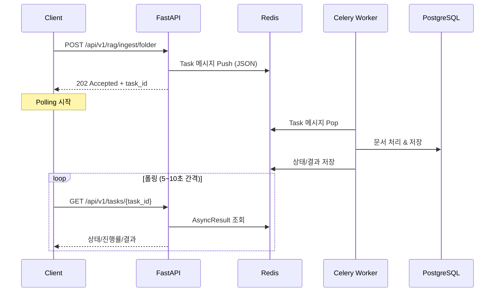

# Council-AI 비동기 API 기술 명세서

> **작성일:** 2026-01-31  
> **버전:** 1.0  
> **담당:** Backend Lead Developer

이 문서는 FastAPI와 Celery 간의 비동기 통신 규격을 정의합니다.

---

## 1. 아키텍처 개요

### 1.1 시스템 구성도



### 1.2 컴포넌트 역할

| 컴포넌트          | 역할                           | 기술 스택                |
| ----------------- | ------------------------------ | ------------------------ |
| **FastAPI**       | API Gateway, Task 트리거       | Python 3.11+             |
| **Redis**         | Message Broker, Result Backend | Redis 7                  |
| **Celery Worker** | 비동기 태스크 실행             | Celery 5.x               |
| **PostgreSQL**    | 데이터 영속화                  | PostgreSQL 16 + pgvector |

---

## 2. API 명세

### 2.1 태스크 트리거: `POST /api/v1/rag/ingest/folder`

Google Drive 폴더의 문서를 수집하고 RAG 파이프라인을 실행합니다.

#### Request

```http
POST /api/v1/rag/ingest/folder HTTP/1.1
Host: api.council-ai.com
Content-Type: application/json
X-API-Key: your-api-key

{
    "folder_id": "1BxiMVs0XRA5nFMdKvBdBZjgmUUqptlbs74OgvE2upms",
    "options": {
        "is_privacy_sensitive": false,
        "recursive": true,
        "file_types": ["google_doc", "pdf"],
        "exclude_patterns": ["*.tmp", "~*"]
    },
    "user_level": 2
}
```

#### Response (202 Accepted)

```json
{
  "task_id": "550e8400-e29b-41d4-a716-446655440000",
  "message": "문서 수집이 시작되었습니다. Event 매핑은 청크 수준에서 결정됩니다.",
  "documents_found": 0
}
```

#### Error Responses

| Status | 설명                | 원인               |
| ------ | ------------------- | ------------------ |
| 401    | Unauthorized        | API 키 누락/잘못됨 |
| 422    | Validation Error    | 잘못된 요청 형식   |
| 503    | Service Unavailable | Redis 연결 실패    |

---

### 2.2 태스크 상태 조회: `GET /api/v1/tasks/{task_id}`

태스크의 현재 상태, 진행률, 결과를 조회합니다.

#### Request

```http
GET /api/v1/tasks/550e8400-e29b-41d4-a716-446655440000 HTTP/1.1
Host: api.council-ai.com
X-API-Key: your-api-key
```

#### Response 예시 (상태별)

##### PENDING (대기 중)

```json
{
  "task_id": "550e8400-e29b-41d4-a716-446655440000",
  "status": "PENDING",
  "progress": 0,
  "result": null,
  "error": null,
  "started_at": null,
  "completed_at": null,
  "task_name": null
}
```

##### PROGRESS (진행 중)

```json
{
  "task_id": "550e8400-e29b-41d4-a716-446655440000",
  "status": "PROGRESS",
  "progress": 65,
  "result": null,
  "error": null,
  "started_at": "2026-01-31T17:30:00+09:00",
  "completed_at": null,
  "task_name": "app.tasks.pipeline.ingest_folder"
}
```

##### SUCCESS (완료)

```json
{
  "task_id": "550e8400-e29b-41d4-a716-446655440000",
  "status": "SUCCESS",
  "progress": 100,
  "result": {
    "output_doc_id": null,
    "output_doc_link": null,
    "items_processed": 15,
    "events_created": null,
    "documents_processed": 15,
    "chunks_created": 142
  },
  "error": null,
  "started_at": "2026-01-31T17:30:00+09:00",
  "completed_at": "2026-01-31T17:35:42+09:00",
  "task_name": "app.tasks.pipeline.ingest_folder"
}
```

##### FAILURE (실패)

```json
{
  "task_id": "550e8400-e29b-41d4-a716-446655440000",
  "status": "FAILURE",
  "progress": 0,
  "result": null,
  "error": "Upstage API rate limit exceeded (429)",
  "started_at": "2026-01-31T17:30:00+09:00",
  "completed_at": null,
  "task_name": "app.tasks.pipeline.ingest_folder"
}
```

---

### 2.3 태스크 취소: `DELETE /api/v1/tasks/{task_id}`

대기 중이거나 실행 중인 태스크를 취소합니다.

#### Request

```http
DELETE /api/v1/tasks/550e8400-e29b-41d4-a716-446655440000 HTTP/1.1
Host: api.council-ai.com
X-API-Key: your-api-key
```

#### Response

- **204 No Content**: 취소 성공 또는 이미 완료된 태스크 (멱등성)
- **503 Service Unavailable**: Redis 연결 실패

---

## 3. 개발자 가이드

### 3.1 Pydantic 모델 직렬화

> ⚠️ **중요:** Celery는 Pydantic 모델을 직접 전달할 수 없습니다.

```python
# ❌ 잘못된 방법
task.delay(options=request.options)  # TypeError!

# ✅ 올바른 방법
task.delay(options=request.options.model_dump())  # dict로 변환
```

### 3.2 커스텀 진행률 보고

태스크 내에서 진행률을 보고하려면 `self.update_state()`를 사용합니다:

```python
@shared_task(bind=True)
def my_task(self, items):
    total = len(items)
    for i, item in enumerate(items):
        # 항목 처리...

        # 진행률 업데이트
        self.update_state(
            state="PROGRESS",
            meta={"progress": int((i + 1) / total * 100)}
        )

    return {"status": "success", "items_processed": total}
```

### 3.3 Redis 연결 실패 예외 처리

```python
from fastapi import HTTPException, status

try:
    task = my_task.delay(arg1, arg2)
except Exception as e:
    raise HTTPException(
        status_code=status.HTTP_503_SERVICE_UNAVAILABLE,
        detail=f"비동기 작업 큐 연결 실패: {str(e)}",
    )
```

### 3.4 폴링 구현 가이드 (프론트엔드)

```javascript
async function pollTaskStatus(taskId, maxAttempts = 60) {
  let attempt = 0;

  while (attempt < maxAttempts) {
    const response = await fetch(`/api/v1/tasks/${taskId}`);
    const data = await response.json();

    if (data.status === "SUCCESS") {
      return data.result;
    }

    if (data.status === "FAILURE") {
      throw new Error(data.error);
    }

    // 점진적 백오프: 처음 5회는 5초, 이후 10초
    const delay = attempt < 5 ? 5000 : 10000;
    await new Promise((resolve) => setTimeout(resolve, delay));

    attempt++;
  }

  throw new Error("태스크 타임아웃");
}
```

---

## 4. 추후 비동기 API 구현 시 주의사항

### 4.1 Search API 비동기화 (예정)

현재 Search API는 동기 방식이지만, LLM 응답 생성이 추가되면 비동기화가 필요할 수 있습니다:

```python
# 고려사항:
# 1. 짧은 검색 (< 3초): 동기 유지
# 2. LLM 답변 생성 (> 5초): 비동기 전환 권장

@router.post("/search")
async def search_documents(request: SearchRequest):
    if request.generate_answer:
        # LLM 응답 필요 → 비동기 태스크
        task = search_with_llm_task.delay(
            query=request.query,
            top_k=request.top_k,
        )
        return {"task_id": task.id, "status": "PENDING"}
    else:
        # 검색만 → 동기 처리
        results = await embedding_service.search_similar(...)
        return {"results": results}
```

### 4.2 태스크 체이닝

여러 비동기 작업을 연결할 때는 Celery Chain을 사용합니다:

```python
from celery import chain

# 순차 실행 체인
result = chain(
    parse_documents.s(folder_id),
    chunk_documents.s(),
    embed_chunks.s(),
    index_vectors.s(),
)()
```

---

## 5. 설정 참조

### 5.1 환경 변수

```bash
# Celery
CELERY_BROKER_URL=redis://localhost:6379/0
CELERY_RESULT_BACKEND=redis://localhost:6379/0

# 타임아웃
CELERY_TASK_TIME_LIMIT=3600  # 1시간
```

### 5.2 Celery 앱 설정 (`tasks/celery_app.py`)

```python
celery_app.conf.update(
    task_serializer="json",
    result_serializer="json",
    result_expires=3600,  # 결과 1시간 보관
    task_acks_late=True,  # 태스크 완료 후 ACK
)
```

---

## 6. 트러블슈팅

### Q: 태스크가 계속 PENDING 상태입니다

1. Celery Worker가 실행 중인지 확인:

   ```bash
   celery -A app.tasks.celery_app worker --loglevel=info
   ```

2. Redis 연결 확인:

   ```bash
   redis-cli ping  # → PONG
   ```

3. 태스크 라우팅 확인 (올바른 큐 이름)

### Q: 503 Service Unavailable 오류

Redis 서버가 다운되었거나 연결 URL이 잘못되었습니다:

```bash
# Docker 환경
docker-compose up -d redis

# 로컬 환경
redis-server
```

---

## 변경 이력

| 버전 | 날짜       | 변경 내용                              |
| ---- | ---------- | -------------------------------------- |
| 1.0  | 2026-01-31 | 초기 작성 - Ingestion 비동기 연결 구현 |
