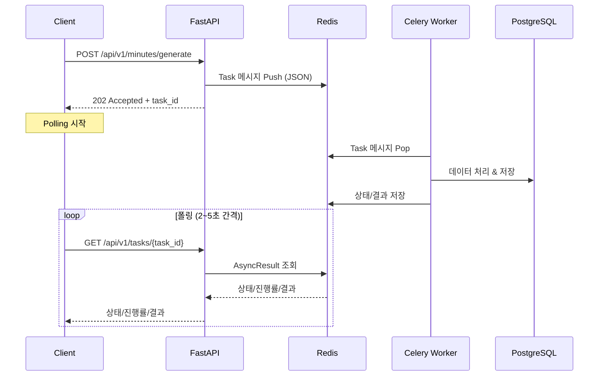

# Council-AI 비동기 API 기술 명세서

> **Version:** 2.0.0  
> **Last Updated:** 2026-02-02

이 문서는 FastAPI와 Celery 간의 비동기 통신 규격을 정의합니다.

---

## 1. 아키텍처 개요

### 1.1 시스템 구성도



### 1.2 컴포넌트 역할

| 컴포넌트          | 역할                           | 기술 스택                |
| ----------------- | ------------------------------ | ------------------------ |
| **FastAPI**       | API Gateway, Task 트리거       | Python 3.11+, Uvicorn    |
| **Redis**         | Message Broker, Result Backend | Redis 7                  |
| **Celery Worker** | 비동기 태스크 실행             | Celery 5.x               |
| **PostgreSQL**    | 데이터 영속화                  | PostgreSQL 16 + pgvector |

---

## 2. Celery Tasks 목록

### 2.1 Pipeline Tasks (`app.tasks.pipeline`)

| Task Name | Description | Rate Limit |
|-----------|-------------|------------|
| `run_full_pipeline` | 단일 문서 7단계 RAG 파이프라인 | 5/m |
| `ingest_folder` | Google Drive 폴더 수집 + 파이프라인 트리거 | - |
| `reprocess_document` | 문서 재처리 | - |
| `create_hnsw_index` | HNSW 벡터 인덱스 생성 | - |

### 2.2 Feature Tasks (`app.tasks.features`)

| Task Name | Description | Max Retries |
|-----------|-------------|-------------|
| `generate_minutes` | Smart Minutes 결과지 생성 | 3 |
| `sync_calendar` | 캘린더 동기화 (Deprecated) | 3 |
| `generate_handover` | 인수인계서 생성 | 2 |

### 2.3 Document Tasks (`app.tasks.document`)

| Task Name | Description |
|-----------|-------------|
| `ingest_folder` | 폴더 수집 (레거시) |
| `process_document` | 단일 문서 처리 |
| `process_minutes` | 회의록 처리 |

### 2.4 Embedding Tasks (`app.tasks.embedding`)

| Task Name | Description |
|-----------|-------------|
| `test_celery_task` | Celery 연결 테스트 |
| `embed_documents_task` | 문서 임베딩 생성 |

---

## 3. 태스크별 상세 명세

### 3.1 generate_minutes (Smart Minutes)

```python
@shared_task(bind=True, max_retries=3, default_retry_delay=60)
def generate_minutes(
    self,
    agenda_doc_id: str,           # 안건지 Google Docs ID
    transcript_doc_id: str | None, # 속기록 Google Docs ID
    transcript_text: str | None,   # 속기록 텍스트 (대안)
    template_doc_id: str | None,   # 결과 템플릿 ID
    meeting_name: str,             # 회의명
    meeting_date: str | None,      # 회의일자
    output_folder_id: str | None,  # 출력 폴더 ID
) -> dict:
    ...
```

**처리 단계:**
1. 속기록 로드 (Google Docs API or 텍스트)
2. 헤더 기반 섹션 분할 (`split_by_headers`)
3. 각 섹션 Gemini로 요약
4. 안건지 복사하여 결과 문서 생성
5. Placeholder 치환 (`{{report_N_result}}` 등)

**반환값:**
```json
{
  "status": "SUCCESS",
  "output_doc_id": "1newDocId...",
  "output_doc_link": "https://docs.google.com/...",
  "meeting_name": "제12차 운영위원회",
  "agenda_summaries": [...],
  "items_processed": 5,
  "decisions_extracted": 3,
  "action_items_extracted": 7
}
```

### 3.2 generate_handover (인수인계서)

```python
@shared_task(bind=True, max_retries=2, default_retry_delay=120)
def generate_handover(
    self,
    target_year: int,              # 대상 연도
    department: str | None,        # 부서 필터
    target_folder_id: str | None,  # 출력 폴더 ID
    doc_title: str | None,         # 문서 제목
    include_event_summaries: bool, # 행사 요약 포함
    include_insights: bool,        # 인사이트 포함
    include_statistics: bool,      # 통계 포함
) -> dict:
    ...
```

### 3.3 ingest_folder (문서 수집)

```python
@shared_task(bind=True)
def ingest_folder(
    self,
    drive_folder_id: str,          # Google Drive 폴더 ID
    options: dict | None,          # 수집 옵션
) -> dict:
    ...
```

---

## 4. 진행률 보고 (Progress Reporting)

### 4.1 update_state 사용법

```python
@shared_task(bind=True)
def my_task(self, items):
    total = len(items)
    for i, item in enumerate(items):
        # 진행률 업데이트
        self.update_state(
            state="PROGRESS",
            meta={
                "progress": int((i + 1) / total * 100),
                "step": f"Processing item {i + 1}/{total}",
                "current_item": item.name,
            }
        )
        process(item)
    
    return {"status": "success", "items_processed": total}
```

### 4.2 진행률 단계 (Smart Minutes 예시)

| Progress | Step |
|----------|------|
| 5% | Initializing |
| 10% | Loading transcript |
| 20% | Splitting by agenda |
| 30-70% | Summarizing section N/M |
| 75% | Creating result document |
| 85% | Replacing placeholders |
| 95% | Finalizing |
| 100% | Complete |

---

## 5. Task 상태 조회 API

### 5.1 GET /api/v1/tasks/{task_id}

```python
@router.get("/{task_id}")
async def get_task_status(task_id: str) -> TaskStatusResponse:
    result = AsyncResult(task_id)
    
    response = TaskStatusResponse(
        task_id=task_id,
        status=result.status,
        progress=result.info.get("progress", 0) if result.info else 0,
        result=result.result if result.successful() else None,
        error=str(result.result) if result.failed() else None,
        task_name=result.name,
    )
    return response
```

### 5.2 상태 값

| Status | Description | HTTP Status |
|--------|-------------|-------------|
| `PENDING` | 대기 중 | 202 |
| `STARTED` | 실행 시작 | 202 |
| `PROGRESS` | 진행 중 | 202 |
| `SUCCESS` | 완료 | 200 |
| `FAILURE` | 실패 | 500 |
| `REVOKED` | 취소됨 | 410 |

---

## 6. 프론트엔드 폴링 가이드

### 6.1 JavaScript 구현

```javascript
async function pollTaskStatus(taskId, options = {}) {
  const {
    interval = 2000,      // 폴링 간격 (ms)
    maxAttempts = 60,     // 최대 시도 횟수
    onProgress = null,    // 진행률 콜백
  } = options;
  
  let attempt = 0;
  
  while (attempt < maxAttempts) {
    const response = await fetch(`/api/v1/tasks/${taskId}`, {
      headers: { 'X-API-Key': API_KEY }
    });
    const data = await response.json();
    
    // 진행률 콜백
    if (onProgress && data.progress) {
      onProgress(data.progress, data.step);
    }
    
    // 완료 체크
    if (data.status === 'SUCCESS') {
      return data.result;
    }
    
    // 실패 체크
    if (data.status === 'FAILURE') {
      throw new Error(data.error || 'Task failed');
    }
    
    // 취소 체크
    if (data.status === 'REVOKED') {
      throw new Error('Task was cancelled');
    }
    
    // 대기
    await new Promise(resolve => setTimeout(resolve, interval));
    attempt++;
  }
  
  throw new Error('Task timeout');
}

// 사용 예시
try {
  const result = await pollTaskStatus('task-uuid', {
    interval: 2000,
    onProgress: (progress, step) => {
      console.log(`Progress: ${progress}% - ${step}`);
      updateProgressBar(progress);
    }
  });
  console.log('Task completed:', result);
} catch (error) {
  console.error('Task failed:', error);
}
```

### 6.2 Apps Script 구현

```javascript
function pollTaskStatus(taskId) {
  const maxAttempts = 60;
  const interval = 2000;
  
  for (let i = 0; i < maxAttempts; i++) {
    const response = UrlFetchApp.fetch(
      `${API_BASE}/api/v1/tasks/${taskId}`,
      {
        headers: { 'X-API-Key': API_KEY },
        muteHttpExceptions: true
      }
    );
    
    const data = JSON.parse(response.getContentText());
    
    if (data.status === 'SUCCESS') {
      return data.result;
    }
    
    if (data.status === 'FAILURE') {
      throw new Error(data.error);
    }
    
    Utilities.sleep(interval);
  }
  
  throw new Error('Task timeout');
}
```

---

## 7. 에러 처리

### 7.1 Redis 연결 실패

```python
from fastapi import HTTPException, status

try:
    task = my_task.delay(arg1, arg2)
except Exception as e:
    raise HTTPException(
        status_code=status.HTTP_503_SERVICE_UNAVAILABLE,
        detail=f"Task queue unavailable: {str(e)}"
    )
```

### 7.2 Task 재시도 설정

```python
@shared_task(
    bind=True,
    max_retries=3,
    default_retry_delay=60,
    autoretry_for=(ConnectionError, TimeoutError),
    retry_backoff=True,
    retry_backoff_max=600,
)
def my_task(self, ...):
    try:
        # 작업 수행
        ...
    except TemporaryError as e:
        # 수동 재시도
        raise self.retry(exc=e, countdown=60)
```

---

## 8. 환경 변수

```bash
# Celery
CELERY_BROKER_URL=redis://localhost:6379/0
CELERY_RESULT_BACKEND=redis://localhost:6379/0

# 타임아웃
CELERY_TASK_TIME_LIMIT=3600      # 1시간
CELERY_TASK_SOFT_TIME_LIMIT=3300 # 55분 (soft)

# 동시성
CELERY_WORKER_CONCURRENCY=4
```

---

## 9. Celery 앱 설정

```python
# app/tasks/celery_app.py
celery_app.conf.update(
    task_serializer="json",
    accept_content=["json"],
    result_serializer="json",
    timezone="Asia/Seoul",
    enable_utc=True,
    task_acks_late=True,
    task_reject_on_worker_lost=True,
    worker_prefetch_multiplier=1,
)
```

---

## 변경 이력

| 버전 | 날짜 | 변경 내용 |
|------|------|-----------|
| 1.0 | 2026-01-31 | 초기 작성 |
| 2.0 | 2026-02-02 | Task 목록 업데이트, 진행률 상세 추가, 폴링 가이드 개선 |
