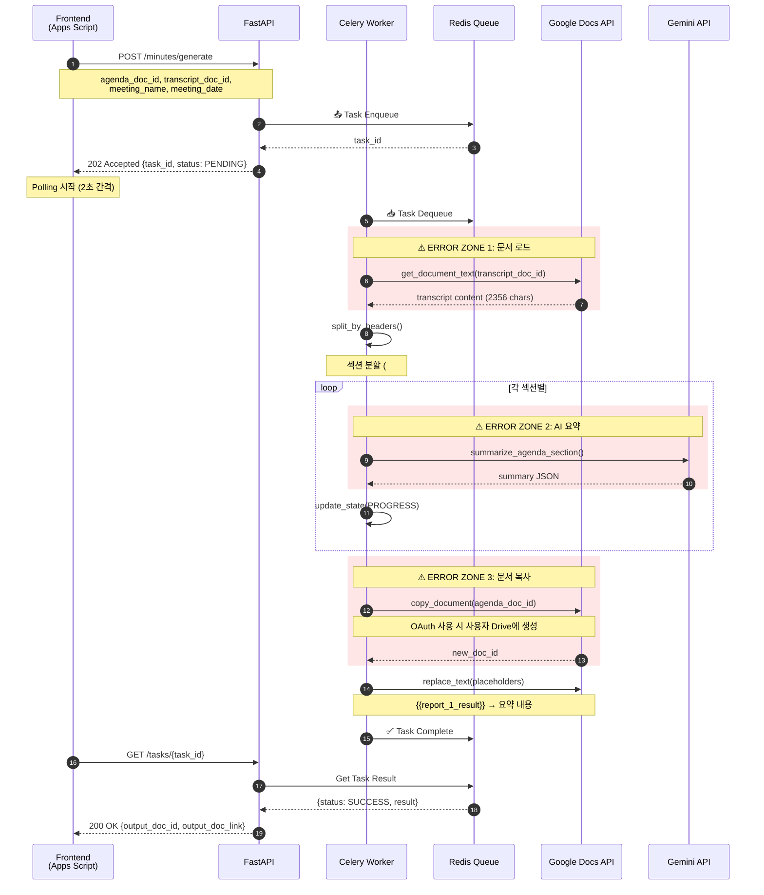
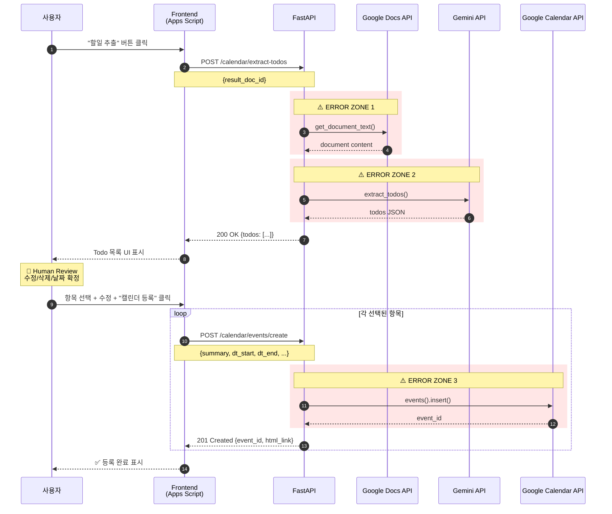
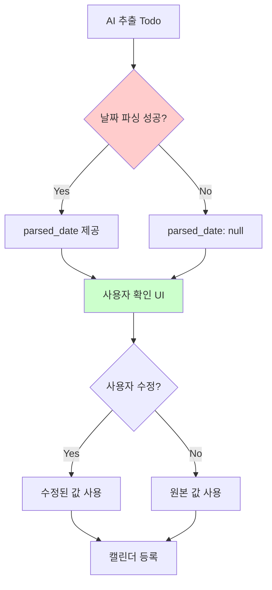
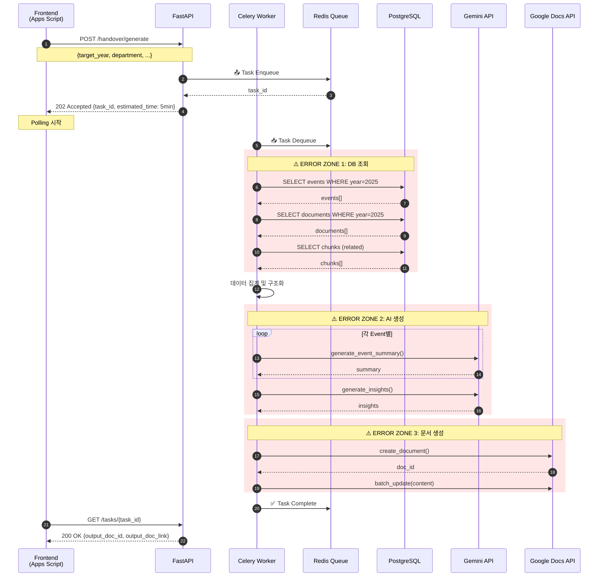
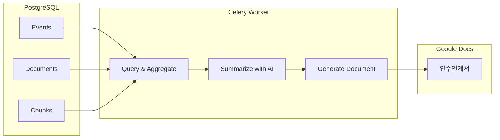
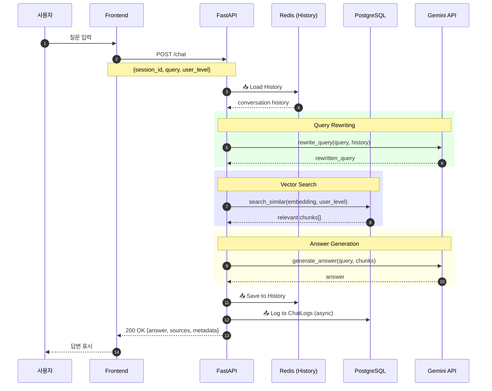
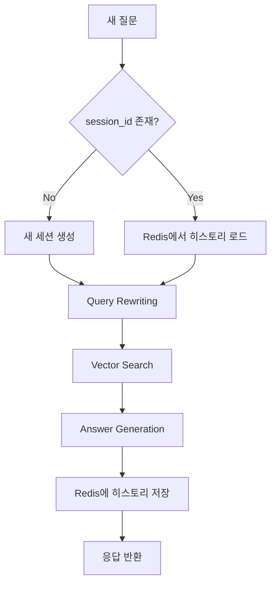
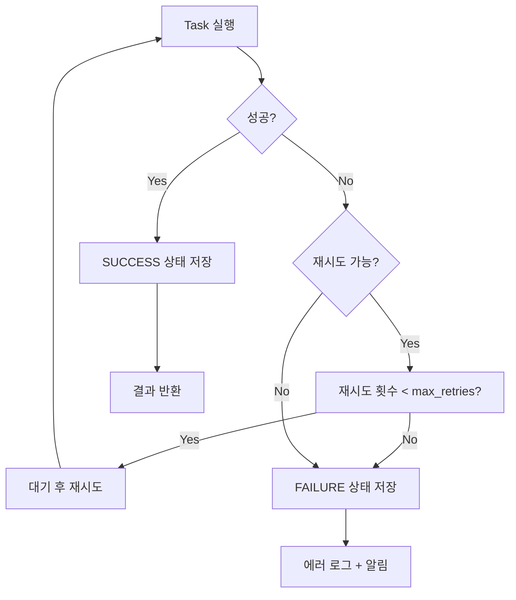
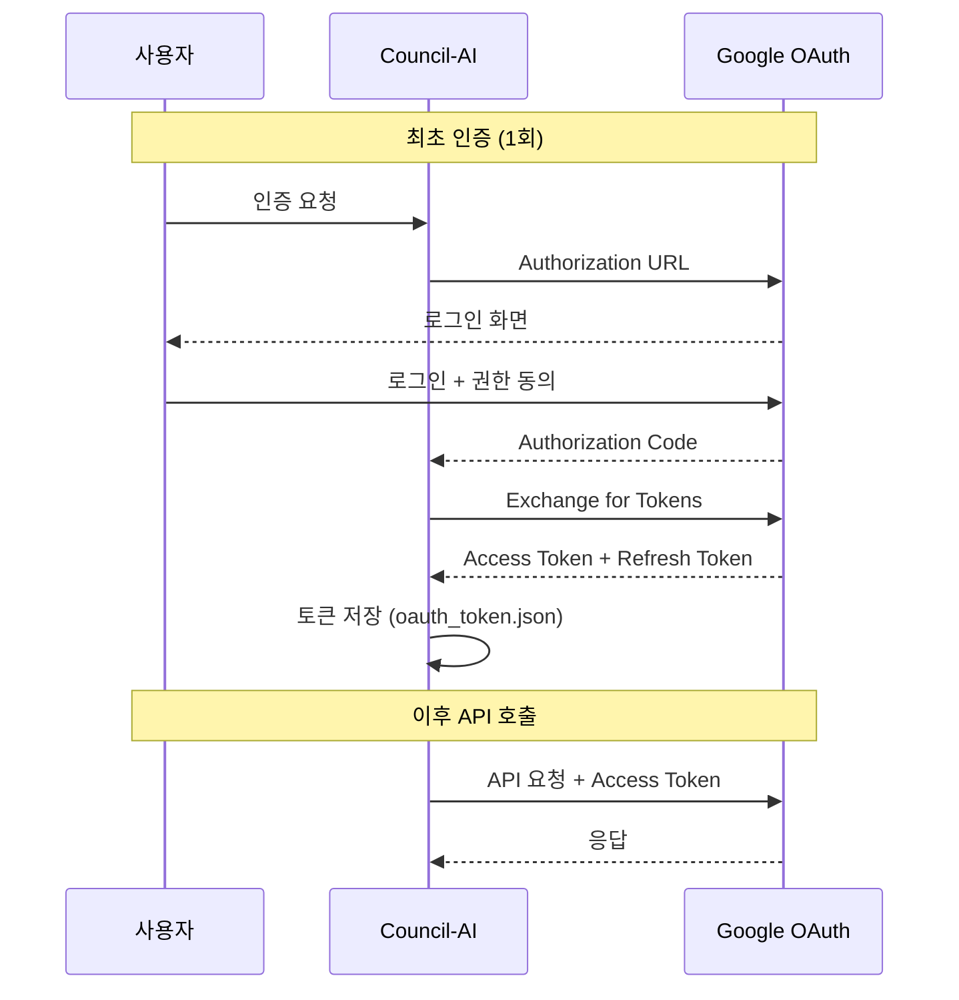

# Council-AI 통신 흐름 다이어그램

> **Version:** 2.0.0  
> **Last Updated:** 2026-02-02

---

## 1. Smart Minutes (결과지 자동 생성)

### 전체 흐름



### Placeholder 치환 규칙

| Placeholder | 용도 | 예시 |
|-------------|------|------|
| `{{report_N_result}}` | 보고안건 N | `{{report_1_result}}` |
| `{{discuss_N_result}}` | 논의안건 N | `{{discuss_2_result}}` |
| `{{decision_N_result}}` | 의결안건 N | `{{decision_1_result}}` |
| `{{other_N_result}}` | 기타안건 N | `{{other_1_result}}` |

### 에러 발생 가능 포인트

| Zone | 상황 | 원인 | 대응 |
|------|------|------|------|
| 1 | Google Docs 접근 실패 | 문서 공유 안됨, 잘못된 ID | 400 Bad Request + 상세 메시지 |
| 2 | Gemini 요청 실패 | Rate Limit, 토큰 초과 | Retry 3회 후 Partial 결과 반환 |
| 3 | 문서 복사 실패 | Drive 권한/quota 부족 | OAuth 사용 또는 output_doc_id 제공 |

### 🆕 OAuth vs Service Account

| 방식 | 장점 | 단점 | 사용 시점 |
|------|------|------|-----------|
| **Service Account** | 설정 간단, 자동화 용이 | quota 제한, 서비스 계정 Drive에 저장 | 읽기 전용 작업 |
| **OAuth** | 사용자 Drive에 저장, quota 문제 없음 | 토큰 관리 필요 | 문서 생성/복사 작업 |

```python
# OAuth 사용 설정
docs_service = GoogleDocsService(use_oauth=True)
```

---

## 2. Calendar Sync (Human-in-the-Loop)

> **🆕 v2.0 변경사항:** 자동 동기화 → Human-in-the-Loop 방식으로 변경

### 전체 흐름



### Human-in-the-Loop 설계 이유



**왜 Human-in-the-Loop인가?**
1. **날짜 파싱 불확실성**: "다음 주", "빠른 시일 내" 등 모호한 표현
2. **우선순위 판단 필요**: 모든 Todo가 캘린더에 등록될 필요는 없음
3. **담당자 확인**: AI가 추출한 담당자가 실제 이메일과 매칭되는지 확인 필요

### API 변경 사항 (v1 → v2)

| v1 (Deprecated) | v2 (Current) | 변경 이유 |
|-----------------|--------------|-----------|
| `POST /calendar/sync` | `POST /calendar/extract-todos` | 추출과 등록 분리 |
| 자동 등록 | `POST /calendar/events/create` | 사용자 확인 단계 추가 |

### 에러 발생 가능 포인트

| Zone | 상황 | 원인 | 대응 |
|------|------|------|------|
| 1 | 문서 텍스트 추출 실패 | 문서 접근 권한 없음 | 403 Forbidden |
| 2 | Todo 추출 실패 | AI 응답 파싱 오류 | 빈 배열 반환 |
| 3 | 이벤트 생성 실패 | 캘린더 쓰기 권한 없음 | 403 Forbidden |

---

## 3. Handover (인수인계서 생성)

### 전체 흐름



### 데이터 흐름



### 인수인계서 구조

```markdown
# 2025년 [부서명] 인수인계서

## 1. 개요
- 총 행사 수: N개
- 총 회의 수: M개
- 총 문서 수: K개

## 2. 행사별 요약
### 2.1 [행사명]
- 일시: YYYY-MM-DD
- 주요 결정사항: ...
- 담당자: ...

## 3. 주요 인사이트
- ...

## 4. 인수인계 사항
- ...
```

### 에러 발생 가능 포인트

| Zone | 상황 | 원인 | 대응 |
|------|------|------|------|
| 1 | DB 쿼리 실패 | 연결 끊김, 타임아웃 | Retry + 알림 |
| 2 | AI 생성 실패 | 토큰 초과 (많은 데이터) | 데이터 청킹 |
| 3 | 문서 생성 실패 | Drive 용량 부족 | 사용자에게 알림 |

---

## 4. RAG Chat (실시간)

### 전체 흐름



### 멀티턴 대화 처리



---

## 5. 공통 에러 처리 패턴

### Celery Task 에러 핸들링



### 상태 코드 매핑

| Celery State | HTTP Status | 의미 |
|--------------|-------------|------|
| `PENDING` | 202 | 대기 중 |
| `STARTED` | 202 | 처리 중 |
| `PROGRESS` | 202 | 진행 중 (progress % 제공) |
| `SUCCESS` | 200 | 완료 |
| `FAILURE` | 500 | 실패 |
| `REVOKED` | 410 | 취소됨 |

---

## 6. 인증 흐름

### 🆕 OAuth 2.0 흐름 (사용자 인증)



### Service Account vs OAuth 사용 분기

| 작업 | 인증 방식 | 이유 |
|------|-----------|------|
| 문서 읽기 | Service Account | 공유된 문서 접근 |
| 문서 생성/복사 | OAuth | 사용자 Drive에 저장, quota 문제 회피 |
| 캘린더 이벤트 생성 | OAuth | 사용자 캘린더에 접근 |

---

## 7. 핵심 리스크 포인트 정리

### 리스크 맵

| 영역 | 리스크 | 심각도 | 대응 |
|------|--------|--------|------|
| **Google API** | 인증 만료 | 🟡 | 토큰 자동 갱신 |
| **Google API** | Rate Limit | 🟡 | 지수 백오프 재시도 |
| **Google API** | Quota 초과 | 🔴 | OAuth 사용 |
| **Gemini** | 토큰 초과 | 🟡 | 입력 청킹 |
| **Gemini** | Rate Limit | 🟡 | 재시도 + 대기 |
| **DB** | 연결 타임아웃 | 🟡 | 연결 풀 재설정 |
| **Redis** | 연결 실패 | 🔴 | 503 반환 |

### 각 리스크별 탐지 및 대응

| 리스크 | 탐지 방법 | 자동 대응 |
|--------|----------|-----------|
| Google API 인증 만료 | 401 응답 | OAuth refresh token 사용 |
| Rate Limit | 429 응답 | 지수 백오프 (1s → 2s → 4s → ...) |
| Gemini 토큰 초과 | 400 응답 | 입력 텍스트 분할 후 재시도 |
| DB 타임아웃 | ConnectionError | 연결 풀 재생성 |
| Redis 연결 실패 | ConnectionError | 503 Service Unavailable 반환 |

---

## 변경 이력

| 버전 | 날짜 | 변경 내용 |
|------|------|-----------|
| 1.0 | 2025-01-31 | 초기 작성 |
| 2.0 | 2026-02-02 | Human-in-the-Loop 캘린더 추가, OAuth 흐름 추가, RAG Chat 흐름 추가 |
