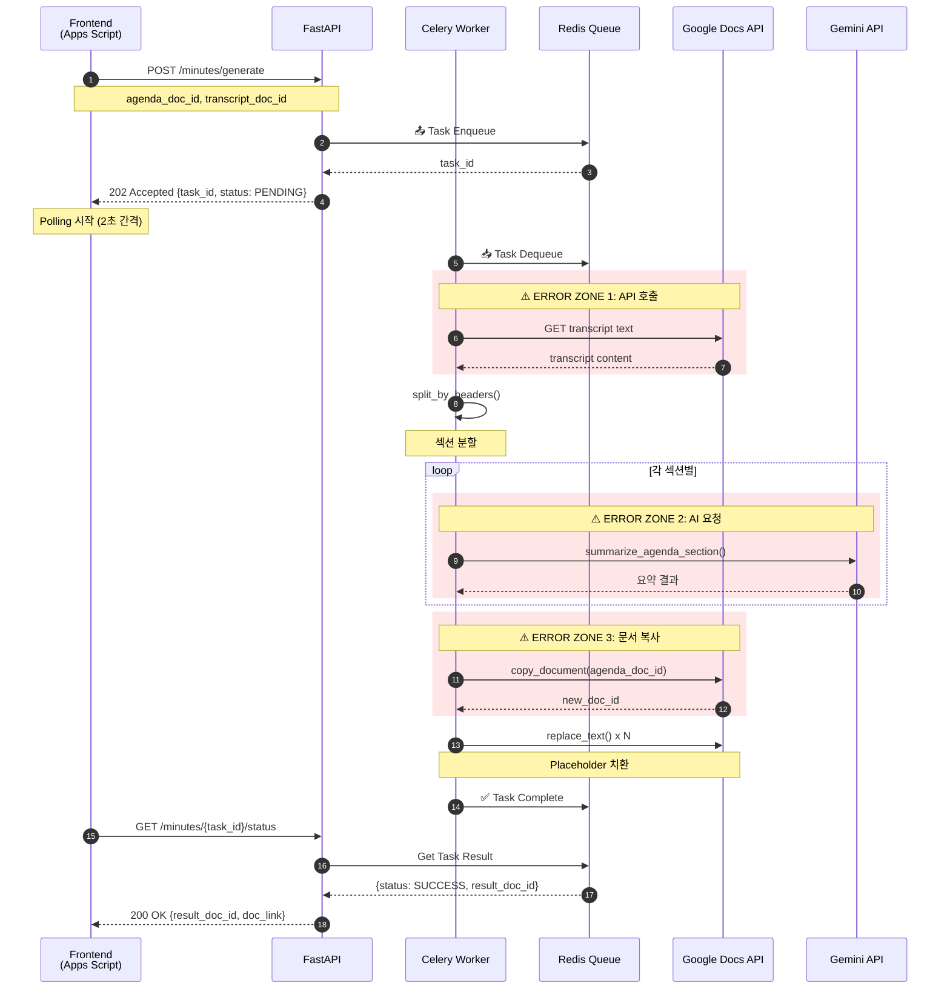
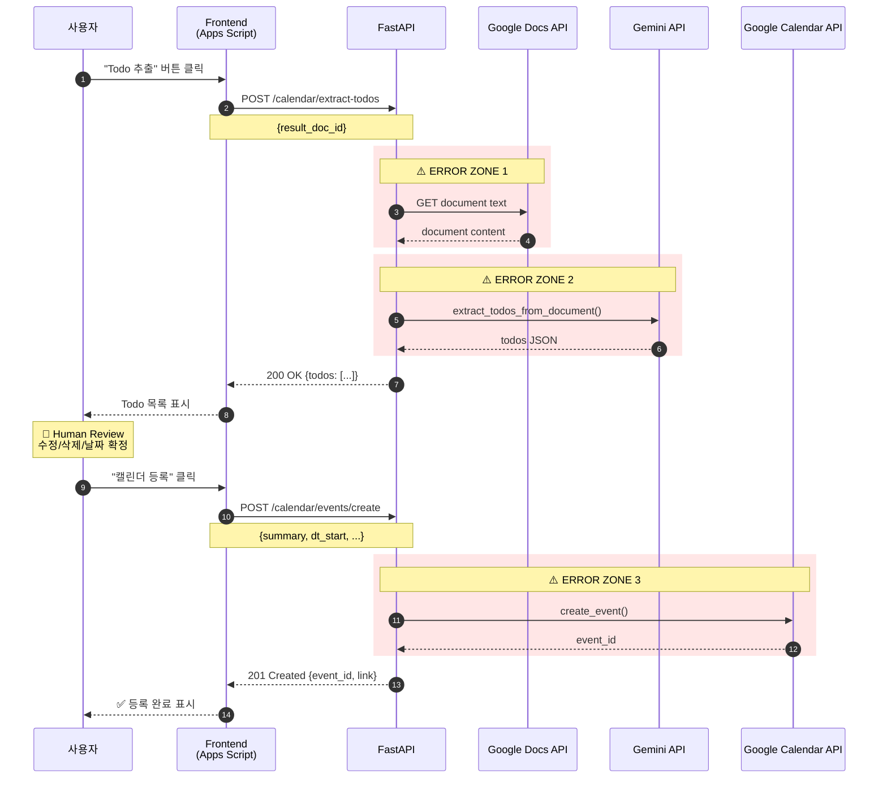
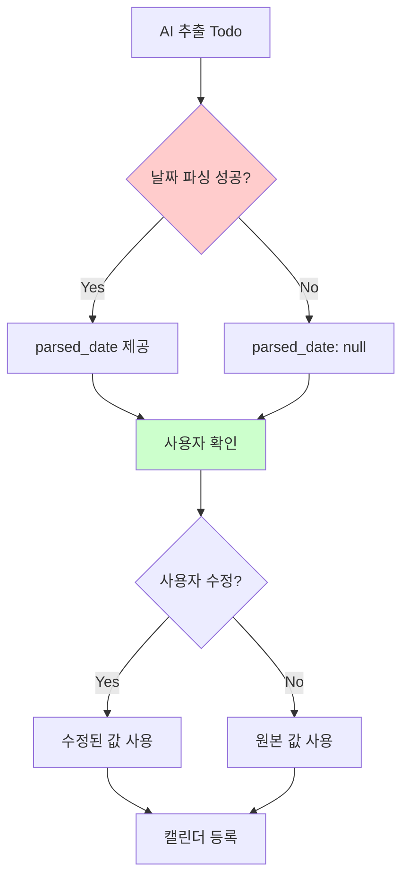
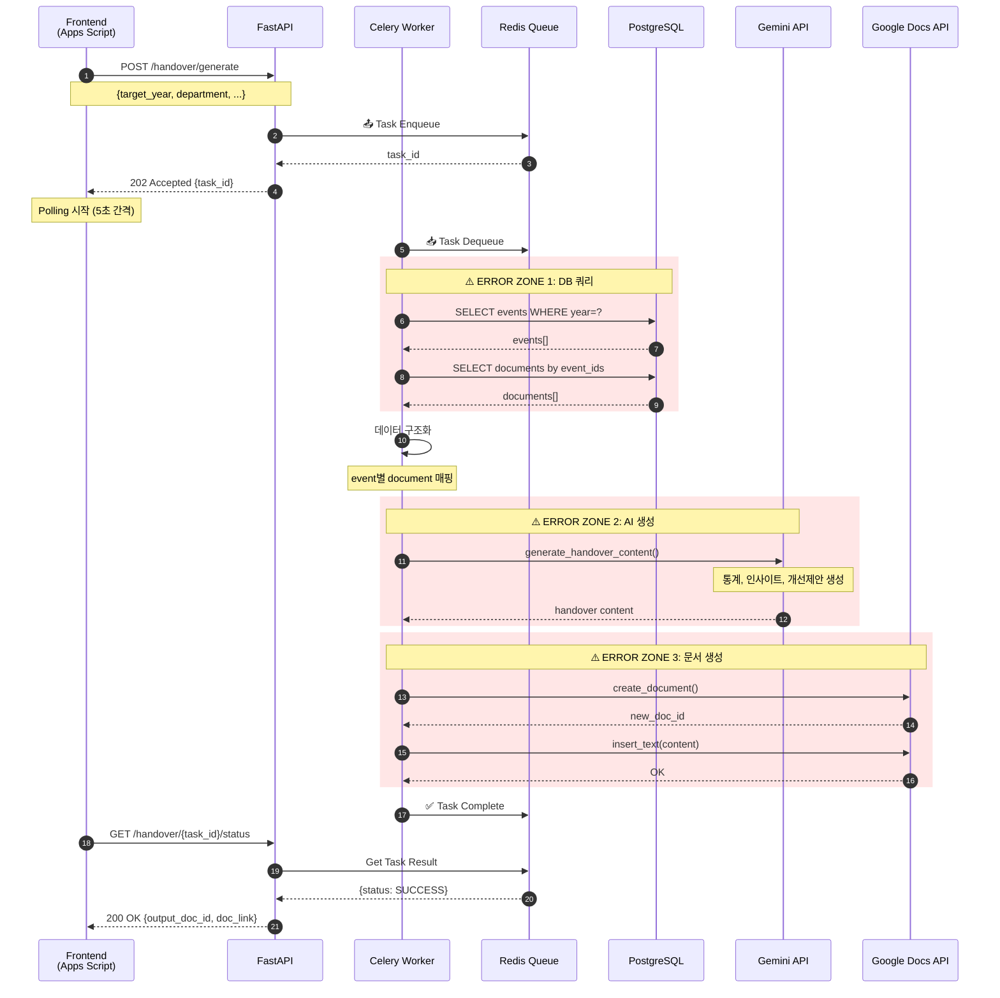
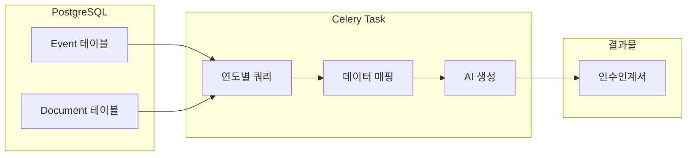
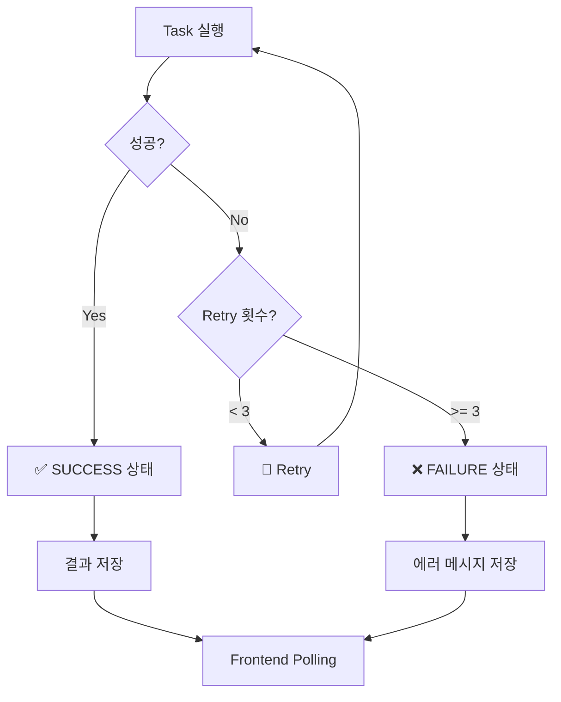
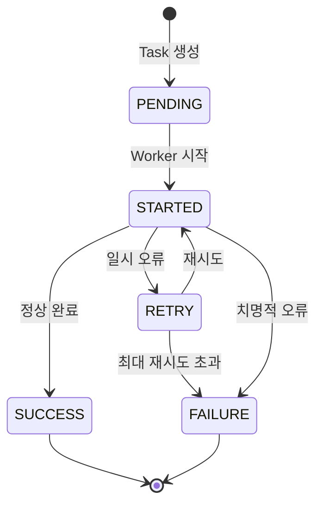
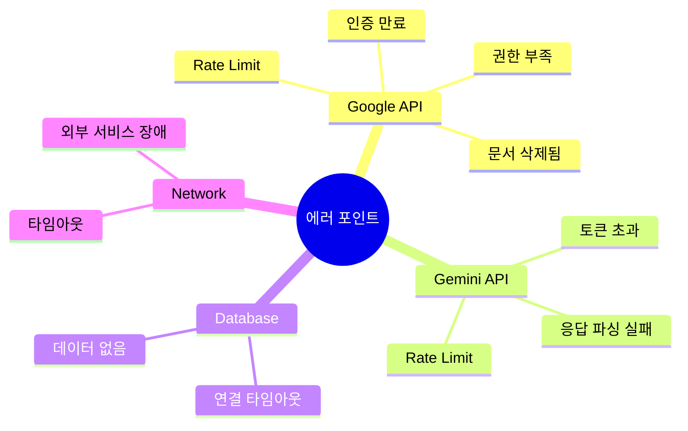

# Council-AI 통신 흐름 다이어그램

## 1. Smart Minutes (결과지 자동 생성)

### 전체 흐름

### 에러 발생 가능 포인트

| Zone | 상황 | 원인 | 대응 |
|------|------|------|------|
| 1 | Google Docs 접근 실패 | 문서 공유 안됨, 잘못된 ID | 400 Bad Request + 상세 메시지 |
| 2 | Gemini 요청 실패 | Rate Limit, 토큰 초과 | Retry 3회 후 Partial 결과 반환 |
| 3 | 문서 복사 실패 | Drive 권한 없음 | 500 Internal Error |

---

## 2. Calendar Sync (Human-in-the-Loop)

### 전체 흐름

### Human-in-the-Loop 설계 이유

**왜 Human-in-the-Loop인가?**
1. 날짜 파싱 불확실성: "다음 주", "빠른 시일 내" 등 모호한 표현
2. 우선순위 판단 필요: 모든 Todo가 캘린더에 등록될 필요는 없음
3. 담당자 확인: AI가 추출한 담당자가 실제 이메일과 매칭되는지 확인 필요

### 에러 발생 가능 포인트

| Zone | 상황 | 원인 | 대응 |
|------|------|------|------|
| 1 | 문서 텍스트 추출 실패 | 문서 접근 권한 없음 | 403 Forbidden |
| 2 | Todo 추출 실패 | AI 응답 파싱 오류 | 빈 배열 반환 |
| 3 | 이벤트 생성 실패 | 캘린더 쓰기 권한 없음 | 403 Forbidden |

---

## 3. Handover (인수인계서 생성)

### 전체 흐름

### 데이터 흐름

### 에러 발생 가능 포인트

| Zone | 상황 | 원인 | 대응 |
|------|------|------|------|
| 1 | DB 쿼리 실패 | 연결 끊김, 타임아웃 | Retry + 알림 |
| 2 | AI 생성 실패 | 토큰 초과 (많은 데이터) | 데이터 청킹 |
| 3 | 문서 생성 실패 | Drive 용량 부족 | 사용자에게 알림 |

---

## 4. 공통 에러 처리 패턴

### Celery Task 에러 핸들링

### 상태 코드 매핑

| Celery State | HTTP Status | 의미 |
|--------------|-------------|------|
| PENDING | 202 | 대기 중 |
| STARTED | 202 | 처리 중 |
| SUCCESS | 200 | 완료 |
| FAILURE | 500 | 실패 |
| REVOKED | 410 | 취소됨 |

---

## 5. 전체 시스템 상태 다이어그램

---

## 6. 핵심 리스크 포인트 정리

### 각 리스크별 대응 전략

| 리스크 | 탐지 | 대응 |
|--------|------|------|
| Google API 인증 만료 | 401 응답 | 토큰 자동 갱신 |
| Rate Limit | 429 응답 | 지수 백오프 재시도 |
| Gemini 토큰 초과 | 400 응답 | 입력 청킹 |
| DB 타임아웃 | ConnectionError | 연결 풀 재설정 |

---

*Last Updated: 2025-02-02*
