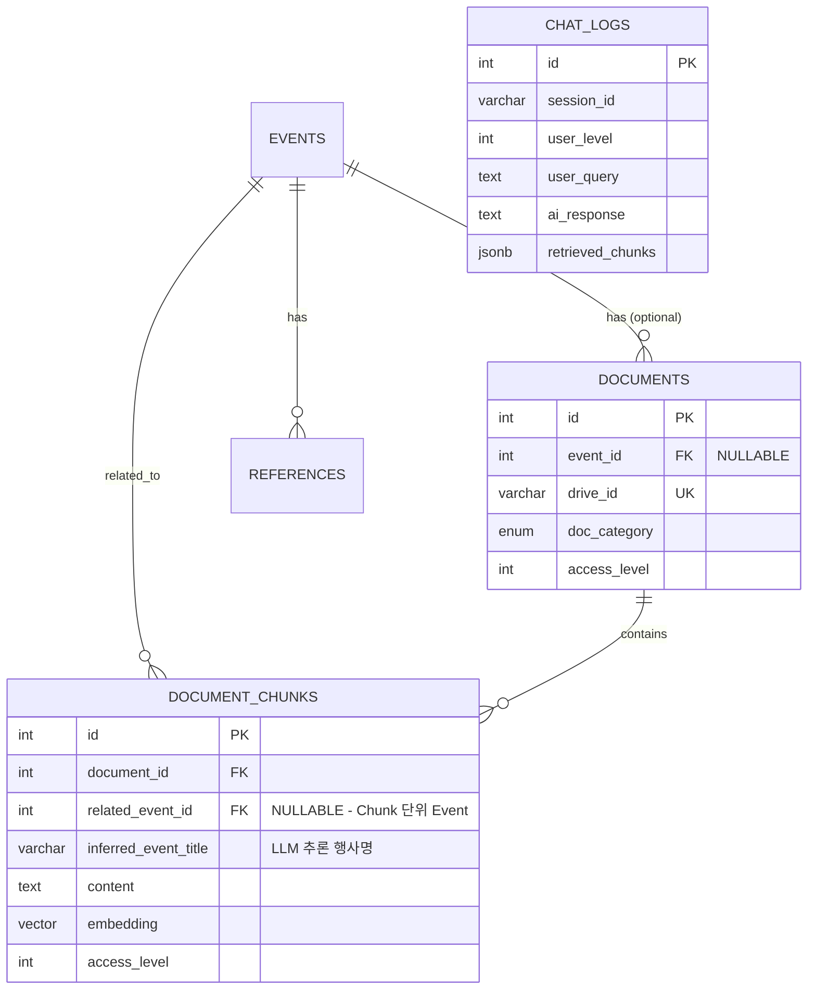

# Council-AI API 명세서 및 DB Schema 구현 계획

## 개요

사용자의 Ground Truth 요구사항을 반영하여 **API 명세서**, **Redis Queue Payload**, **수정된 DB Schema**를 작성합니다.

> [!IMPORTANT]
> **핵심 변경사항:** "1개 파일 ≠ 1개 행사" 원칙에 따라, Event 매핑을 **Document 레벨 → Chunk 레벨**로 이동합니다.

---

## 1. Critical Review 체크리스트

### ✅ Schema Mismatch 해결

| 항목 | 현재 상태 | 수정 방향 |
|------|----------|----------|
| `documents.event_id` | **Required FK** | ❌ 제거 또는 **Nullable**로 변경 |
| `document_chunks.related_event_id` | 없음 | ✅ **새로 추가** - Chunk 단위 Event 매핑 |
| N:M 관계 | 미지원 | ✅ Chunk(안건)↔Event(행사) 매핑으로 해결 |

### ✅ Chunking & DB Link 검토

- [현재 코드](file:///c:/Users/imtae/madcamp/2025Winter_4th/backend/app/tasks/pipeline.py#L112-L138): 파이프라인이 DB에 Document → Chunks 정상 Insert
- Chunks 테이블에 `embedding` 벡터 필드 존재 ✅
- **개선점:** Chunk 생성 시 `related_event_id` 태깅 로직 추가 필요

### ✅ New Features Architecture (비동기 필수)

| 기능 | 예상 실행 시간 | 처리 방식 |
|------|--------------|----------|
| 결과지 작성 (Smart Minutes) | 30초~2분 | **Celery Task** |
| 캘린더 등록 (Calendar Sync) | 5~10초 | **Celery Task** |
| 인수인계서 작성 (Handover) | 2~5분 | **Celery Task** |
| RAG Chat | 2~5초 | **동기 (FastAPI)** |
| Folder Ingest | 수분~수십분 | **Celery Task** |

---

## 2. Revised DB Schema (SQLAlchemy/SQLModel)

### 2.1 주요 변경사항

```diff
-- documents 테이블
- event_id INTEGER NOT NULL REFERENCES events(id)
+ event_id INTEGER NULL REFERENCES events(id)  -- Nullable로 변경 (Ingestion 시점에는 Event 모름)

-- document_chunks 테이블
+ related_event_id INTEGER NULL REFERENCES events(id)  -- ⭐ Chunk 단위 Event 매핑
+ inferred_event_title VARCHAR(500)  -- LLM이 추론한 행사명 (Event 미매칭 시)

-- 신규 테이블
+ chat_logs  -- 채팅 로그 장기 저장
+ task_status  -- Celery Task 상태 추적 (Optional)
```

### 2.2 Document 모델 수정

```python
# app/models/document.py 수정사항

class Document(Base, TimestampMixin):
    """Document model - event_id를 Nullable로 변경"""
    
    __tablename__ = "documents"
    
    # Event association - ⭐ Nullable로 변경
    event_id: Mapped[int | None] = mapped_column(
        ForeignKey("events.id", ondelete="SET NULL"),
        index=True,
        nullable=True,  # ⭐ Ingestion 시점에는 Event를 모름
    )
```

### 2.3 DocumentChunk 모델 수정

```python
# app/models/embedding.py 수정사항

class DocumentChunk(Base, TimestampMixin):
    """DocumentChunk - Chunk 단위 Event 매핑 추가"""
    
    __tablename__ = "document_chunks"
    
    # 기존 필드들...
    
    # ⭐ NEW: Chunk 단위 Event 매핑
    related_event_id: Mapped[int | None] = mapped_column(
        ForeignKey("events.id", ondelete="SET NULL"),
        index=True,
        nullable=True,
    )
    
    # LLM이 추론한 행사명 (Event 매칭 전 임시 저장)
    inferred_event_title: Mapped[str | None] = mapped_column(String(500))
    
    # Event Relationship
    related_event: Mapped["Event | None"] = relationship(
        "Event",
        back_populates="related_chunks",
        foreign_keys=[related_event_id],
    )
```

### 2.4 Event 모델 수정

```python
# app/models/event.py 수정사항

class Event(Base, TimestampMixin):
    """Event - Chunk 역참조 추가"""
    
    # 기존 documents relationship 유지
    documents: Mapped[list["Document"]] = relationship(...)
    
    # ⭐ NEW: Chunk 역참조
    related_chunks: Mapped[list["DocumentChunk"]] = relationship(
        "DocumentChunk",
        back_populates="related_event",
        foreign_keys="DocumentChunk.related_event_id",
    )
```

### 2.5 ChatLog 모델 (신규)

```python
# app/models/chat.py (신규 파일)

from datetime import datetime
from sqlalchemy import Integer, String, Text
from sqlalchemy.dialects.postgresql import JSONB
from sqlalchemy.orm import Mapped, mapped_column
from app.models.base import Base, TimestampMixin


class ChatLog(Base, TimestampMixin):
    """채팅 로그 저장 (장기 기억/감사용)"""
    
    __tablename__ = "chat_logs"
    
    id: Mapped[int] = mapped_column(primary_key=True, autoincrement=True)
    
    # 세션 식별
    session_id: Mapped[str] = mapped_column(String(100), index=True)
    user_level: Mapped[int] = mapped_column(Integer, default=4)  # 1-4
    
    # 대화 내용
    user_query: Mapped[str] = mapped_column(Text, nullable=False)
    rewritten_query: Mapped[str | None] = mapped_column(Text)  # Query Rewriting 결과
    ai_response: Mapped[str] = mapped_column(Text, nullable=False)
    
    # 검색 결과 메타데이터
    retrieved_chunks: Mapped[list | None] = mapped_column(JSONB)  # chunk_ids, scores
    sources: Mapped[list | None] = mapped_column(JSONB)  # 참조 문서 정보
    
    # 대화 순서
    turn_index: Mapped[int] = mapped_column(Integer, default=0)
    
    # 처리 시간 (ms)
    latency_ms: Mapped[int | None] = mapped_column(Integer)
```

### 2.6 ERD (수정된 구조)



---

## 3. API Specification (FastAPI)

### 3.1 공통 헤더 및 인증

| Header | Type | Required | Description |
|--------|------|----------|-------------|
| `X-API-KEY` | string | ✅ | `.env`의 `API_SECRET_KEY`와 일치 |

```python
# app/api/deps.py - 인증 의존성
async def verify_api_key(x_api_key: str = Header(...)):
    if x_api_key != settings.API_SECRET_KEY:
        raise HTTPException(status_code=401, detail="Invalid API Key")
    return x_api_key
```

---

### 3.2 RAG Chat API

#### `POST /api/v1/chat`

**Description:** 멀티턴 대화 지원 RAG 검색 + 답변 생성

**Request Body:**
```json
{
    "session_id": "uuid-string",
    "query": "간식행사 예산 얼마야?",
    "user_level": 3,
    "options": {
        "include_sources": true,
        "max_results": 5,
        "year_filter": [2024, 2025]
    }
}
```

**Response Model:**
```json
{
    "session_id": "uuid-string",
    "query": "간식행사 예산 얼마야?",
    "rewritten_query": "2025년 간식행사의 확정된 예산은 얼마인가?",
    "answer": "2025년 간식행사 예산은 50만원으로 확정되었습니다...",
    "sources": [
        {
            "document_id": 123,
            "document_title": "[결과지] 제6차 국장단회의",
            "chunk_id": 456,
            "section_header": "논의안건 2. 간식행사 예산",
            "relevance_score": 0.92,
            "drive_link": "https://docs.google.com/..."
        }
    ],
    "metadata": {
        "total_chunks_searched": 1520,
        "latency_ms": 2340
    }
}
```

**Processing Logic:**
1. Redis에서 `session_id`로 History 조회 (TTL 1시간)
2. Gemini로 Query Rewriting (멀티턴 컨텍스트 반영)
3. Vector Search + Time Decay + Access Level 필터링
4. LLM 답변 생성 (Parent Content 활용)
5. Redis에 대화 저장, DB에 비동기 로깅

---

### 3.3 Ingest Folder API

#### `POST /api/v1/ingest/folder`

**Description:** Google Drive 폴더 수집 요청 (Celery Task 트리거)

**Request Body:**
```json
{
    "folder_id": "1abc123...",
    "options": {
        "is_privacy_sensitive": false,
        "recursive": true,
        "file_types": ["google_doc", "pdf", "docx"]
    },
    "user_level": 2
}
```

**Response Model:**
```json
{
    "task_id": "celery-task-uuid",
    "status": "PENDING",
    "message": "Ingestion task queued successfully",
    "folder_id": "1abc123..."
}
```

---

### 3.4 Smart Minutes API (결과지 생성)

#### `POST /api/v1/minutes/generate`

**Description:** 안건지 + 속기록 → 결과지 자동 생성

**Request Body:**
```json
{
    "agenda_doc_id": "google-doc-id-for-agenda",
    "transcript_text": "회의 속기록 전체 텍스트...",
    "result_template_doc_id": "google-doc-id-for-template",
    "meeting_info": {
        "meeting_name": "제7차 국장단회의",
        "meeting_date": "2025-01-31",
        "attendees": ["회장 홍길동", "부회장 임태빈", "..."]
    },
    "user_level": 2
}
```

**Response Model:**
```json
{
    "task_id": "celery-task-uuid",
    "status": "PENDING",
    "message": "Minutes generation task queued"
}
```

---

### 3.5 Calendar Sync API

#### `POST /api/v1/calendar/sync`

**Description:** 결과지에서 일정 추출 → Google Calendar 등록

**Request Body:**
```json
{
    "result_doc_id": "google-doc-id-for-result",
    "calendar_id": "shared-calendar-id@group.calendar.google.com",
    "options": {
        "create_reminders": true,
        "notify_assignees": false
    },
    "user_level": 2
}
```

**Response Model:**
```json
{
    "task_id": "celery-task-uuid",
    "status": "PENDING",
    "message": "Calendar sync task queued"
}
```

---

### 3.6 Handover API (인수인계서 생성)

#### `POST /api/v1/handover/generate`

**Description:** 연도별 종합 인수인계서 자동 생성

**Request Body:**
```json
{
    "target_year": 2025,
    "department": "문화국",
    "output_doc_title": "제38대 문화국 인수인계서",
    "options": {
        "include_insights": true,
        "include_statistics": true
    },
    "user_level": 1
}
```

**Response Model:**
```json
{
    "task_id": "celery-task-uuid",
    "status": "PENDING",
    "message": "Handover generation task queued",
    "estimated_time_minutes": 5
}
```

---

### 3.7 Task Status API

#### `GET /api/v1/tasks/{task_id}`

**Description:** Celery Task 상태 조회

**Response Model:**
```json
{
    "task_id": "celery-task-uuid",
    "status": "SUCCESS",
    "progress": 100,
    "result": {
        "output_doc_id": "google-doc-id",
        "output_doc_link": "https://docs.google.com/...",
        "items_processed": 45
    },
    "error": null,
    "started_at": "2025-01-31T13:50:00Z",
    "completed_at": "2025-01-31T13:52:30Z"
}
```

---

## 4. Redis Queue Payload (Celery Tasks)

### 4.1 `pipeline.ingest_folder`

```python
# Task Name: app.tasks.pipeline.ingest_folder

PAYLOAD = {
    "folder_id": "google-drive-folder-id",  # ⭐ event_id 제거됨
    "options": {
        "is_privacy_sensitive": False,  # True면 Reference로만 저장
        "recursive": True,
        "file_types": ["google_doc", "pdf", "docx"],  # None이면 전체
        "exclude_patterns": ["*.tmp", "~*"]
    },
    "request_metadata": {
        "requested_by": "user_level_2",
        "request_time": "2025-01-31T13:45:00Z"
    }
}
```

> [!CAUTION]
> `event_id`는 Ingestion 시점에 알 수 없음. Chunking 단계에서 LLM이 Chunk별로 Event를 추론.

---

### 4.2 `features.generate_minutes`

```python
# Task Name: app.tasks.features.generate_minutes

PAYLOAD = {
    "agenda_doc_id": "google-doc-id-for-agenda",
    "transcript_text": "회의 속기록 전체 텍스트...",
    "result_template_doc_id": "google-doc-id-for-template",
    "meeting_info": {
        "meeting_name": "제7차 국장단회의",
        "meeting_date": "2025-01-31",
        "attendees": ["회장 홍길동", "부회장 임태빈"],
        "department": "집행위원회"
    },
    "output_config": {
        "output_folder_id": "drive-folder-for-output",
        "naming_format": "[결과지] {meeting_name}"
    }
}
```

---

### 4.3 `features.sync_calendar`

```python
# Task Name: app.tasks.features.sync_calendar

PAYLOAD = {
    "result_doc_id": "google-doc-id-for-result",
    "calendar_id": "shared-calendar@group.calendar.google.com",
    "extraction_hints": {
        "date_patterns": ["~까지", "마감일:", "D-day"],
        "assignee_patterns": ["담당:", "담당자:"]
    },
    "event_defaults": {
        "duration_hours": 1,
        "reminder_minutes": [60, 1440]  # 1시간, 1일 전
    }
}
```

---

### 4.4 `features.generate_handover`

```python
# Task Name: app.tasks.features.generate_handover

PAYLOAD = {
    "target_year": 2025,
    "department": "문화국",  # None이면 전체
    "output_config": {
        "doc_title": "제38대 문화국 인수인계서",
        "output_folder_id": "drive-folder-for-output"
    },
    "content_options": {
        "include_event_summaries": True,
        "include_decision_history": True,
        "include_statistics": True,
        "include_insights": True,  # LLM 인사이트 도출
        "include_recommendations": True
    },
    "source_filters": {
        "doc_categories": ["meeting_document", "work_document"],
        "min_authority_level": 2
    }
}
```

---

## 5. 결과지 템플릿 예시 (Google Docs batchUpdate용)

Docs API `batchUpdate`를 위한 템플릿 구조:

```markdown
# {{MEETING_NAME}} 결과지

**일시:** {{MEETING_DATE}}  
**참석자:** {{ATTENDEES}}  
**작성자:** Council-AI 자동 생성

---

## 보고안건

{{#REPORT_ITEMS}}
### {{INDEX}}. {{TITLE}}
- **담당자:** {{ASSIGNEE}}
- **내용:** {{CONTENT}}
- **결과:** {{RESULT}}
{{/REPORT_ITEMS}}

---

## 논의안건

{{#DISCUSSION_ITEMS}}
### {{INDEX}}. {{TITLE}}
- **담당자:** {{ASSIGNEE}}
- **논의 내용:** {{DISCUSSION}}
- **결정 사항:** {{DECISION}}
{{/DISCUSSION_ITEMS}}

---

## 액션 아이템

| 번호 | 할 일 | 담당자 | 마감일 |
|------|------|--------|--------|
{{#ACTION_ITEMS}}
| {{INDEX}} | {{TASK}} | {{ASSIGNEE}} | {{DEADLINE}} |
{{/ACTION_ITEMS}}

---

*본 문서는 Council-AI에 의해 자동 생성되었습니다.*
```

**batchUpdate Request 예시:**
```python
requests = [
    {
        "replaceAllText": {
            "containsText": {"text": "{{MEETING_NAME}}"},
            "replaceText": "제7차 국장단회의"
        }
    },
    {
        "replaceAllText": {
            "containsText": {"text": "{{MEETING_DATE}}"},
            "replaceText": "2025년 1월 31일"
        }
    },
    # ... 반복
]
```

---

## Verification Plan

### Automated Tests

현재 테스트 파일 구조:
- `backend/tests/` 디렉토리 존재

**추가할 테스트:**
```bash
# DB Schema 마이그레이션 테스트
pytest backend/tests/test_models.py -v

# API 엔드포인트 테스트 (후속 구현)
pytest backend/tests/test_api_v1_chat.py -v
```

### Manual Verification

1. **Schema 변경 검증:** Alembic migration 실행 후 `\d document_chunks` 로 `related_event_id` 컬럼 확인
2. **API 테스트:** 각 엔드포인트에 curl 또는 Postman으로 요청 전송
3. **Celery Task 테스트:** Redis 연결 후 `celery -A app.tasks.celery_app worker` 실행, 태스크 트리거 확인

---

## User Review Required

> [!WARNING]
> 다음 사항에 대해 확인이 필요합니다:

1. **Schema Migration 방식:** Alembic을 사용할 예정인지, 또는 직접 SQL로 마이그레이션할 것인지?
2. **결과지 템플릿 파일:** 사용자가 직접 제공할 예정이므로, 위 예시 구조가 적합한지 확인 필요
3. **Calendar ID:** 공유 캘린더 ID를 환경변수로 관리할 것인지, API 요청마다 받을 것인지?
