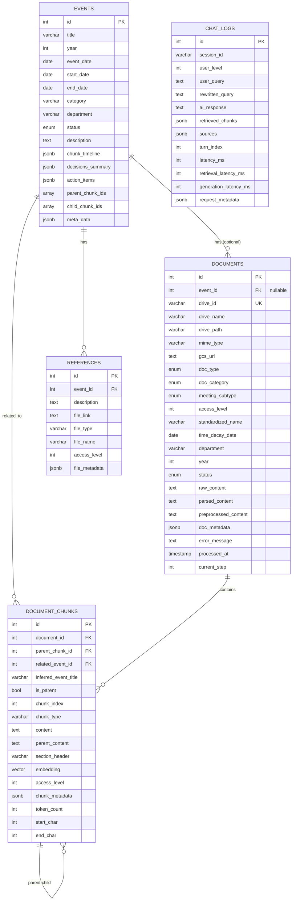

# Council-AI Database Schema

> **Version:** 2.0.0  
> **Database:** PostgreSQL 16 + pgvector  
> **Last Updated:** 2026-02-02

이 문서는 Council-AI의 RAG 시스템을 위한 PostgreSQL + pgvector 데이터베이스 스키마를 설명합니다.

---

## ER 다이어그램



---

## Events (이벤트/행사)

학생회 행사/사업을 중심으로 문서를 조직하는 최상위 단위입니다.

| Column              | Type                 | Nullable | Description                             |
| ------------------- | -------------------- | -------- | --------------------------------------- |
| `id`                | `SERIAL PRIMARY KEY` | ❌       | 고유 ID                                 |
| `title`             | `VARCHAR(500)`       | ❌       | 행사명 (예: "2025 새내기 배움터")       |
| `year`              | `INTEGER`            | ❌       | 행사 연도 (indexed)                     |
| `event_date`        | `DATE`               | ✅       | 행사 일자                               |
| `start_date`        | `DATE`               | ✅       | 시작일 (다일 행사)                      |
| `end_date`          | `DATE`               | ✅       | 종료일                                  |
| `category`          | `VARCHAR(100)`       | ✅       | 담당 국서 (문화국, 복지국 등) (indexed) |
| `department`        | `VARCHAR(100)`       | ✅       | 세부 담당                               |
| `status`            | `ENUM(EventStatus)`  | ❌       | planned/in_progress/completed/cancelled (indexed) |
| `description`       | `TEXT`               | ✅       | 행사 설명                               |
| `chunk_timeline`    | `JSONB`              | ✅       | 회의별 청크 ID 매핑                     |
| `decisions_summary` | `JSONB`              | ✅       | 회의별 결정 사항 요약                   |
| `action_items`      | `JSONB`              | ✅       | 액션 아이템 목록                        |
| `parent_chunk_ids`  | `INTEGER[]`          | ✅       | 관련 부모 청크 ID 배열                  |
| `child_chunk_ids`   | `INTEGER[]`          | ✅       | 관련 자식 청크 ID 배열                  |
| `meta_data`         | `JSONB`              | ✅       | 추가 메타데이터                         |
| `created_at`        | `TIMESTAMP`          | ❌       | 생성 시각 (auto)                        |
| `updated_at`        | `TIMESTAMP`          | ❌       | 수정 시각 (auto)                        |

### EventStatus Enum

```python
class EventStatus(str, Enum):
    PLANNED = "planned"
    IN_PROGRESS = "in_progress"
    COMPLETED = "completed"
    CANCELLED = "cancelled"
```

---

## Documents (문서)

Google Drive에서 수집된 개별 문서의 메타데이터를 저장합니다.

| Column                 | Type                    | Nullable | Description                                      |
| ---------------------- | ----------------------- | -------- | ------------------------------------------------ |
| `id`                   | `SERIAL PRIMARY KEY`    | ❌       | 고유 ID                                          |
| `event_id`             | `INTEGER FK`            | ✅       | 연관 이벤트 (chunk 레벨에서 결정 가능)           |
| `drive_id`             | `VARCHAR(255) UNIQUE`   | ❌       | Google Drive 파일 ID (indexed)                   |
| `drive_name`           | `VARCHAR(500)`          | ❌       | 원본 파일명                                      |
| `drive_path`           | `VARCHAR(1000)`         | ✅       | 폴더 경로                                        |
| `mime_type`            | `VARCHAR(255)`          | ✅       | MIME 타입                                        |
| `gcs_url`              | `TEXT`                  | ✅       | GCS 백업 URL                                     |
| `doc_type`             | `ENUM(DocumentType)`    | ❌       | 파일 형식 (indexed)                              |
| `doc_category`         | `ENUM(DocumentCategory)`| ❌       | 분류 (indexed)                                   |
| `meeting_subtype`      | `ENUM(MeetingSubtype)`  | ✅       | 회의 문서 세부 유형                              |
| `access_level`         | `INTEGER`               | ❌       | 접근 권한 1-4 (default: 3, indexed)              |
| `standardized_name`    | `VARCHAR(500)`          | ✅       | 표준화된 파일명                                  |
| `time_decay_date`      | `DATE`                  | ✅       | 시간 가중치 기준일 (indexed)                     |
| `department`           | `VARCHAR(100)`          | ✅       | 담당 국서                                        |
| `year`                 | `INTEGER`               | ✅       | 문서 연도 (indexed)                              |
| `status`               | `ENUM(DocumentStatus)`  | ❌       | 처리 상태 (indexed)                              |
| `raw_content`          | `TEXT`                  | ✅       | 원본 내용                                        |
| `parsed_content`       | `TEXT`                  | ✅       | 파싱된 HTML                                      |
| `preprocessed_content` | `TEXT`                  | ✅       | 전처리된 Markdown                                |
| `doc_metadata`         | `JSONB`                 | ✅       | 추가 메타데이터                                  |
| `error_message`        | `TEXT`                  | ✅       | 오류 메시지                                      |
| `processed_at`         | `TIMESTAMP`             | ✅       | 처리 완료 시각                                   |
| `current_step`         | `INTEGER`               | ✅       | 현재 파이프라인 단계 (1-7)                       |
| `created_at`           | `TIMESTAMP`             | ❌       | 생성 시각 (auto)                                 |
| `updated_at`           | `TIMESTAMP`             | ❌       | 수정 시각 (auto)                                 |

### DocumentType Enum

```python
class DocumentType(str, Enum):
    GOOGLE_DOC = "google_doc"
    GOOGLE_SHEET = "google_sheet"
    GOOGLE_SLIDE = "google_slide"
    PDF = "pdf"
    DOCX = "docx"
    XLSX = "xlsx"
    PPTX = "pptx"
    TXT = "txt"
    OTHER = "other"
```

### DocumentCategory Enum

```python
class DocumentCategory(str, Enum):
    MEETING_DOCUMENT = "meeting_document"  # 회의 서류
    WORK_DOCUMENT = "work_document"        # 업무 서류
    OTHER_DOCUMENT = "other_document"      # 기타
```

### MeetingSubtype Enum

```python
class MeetingSubtype(str, Enum):
    AGENDA = "agenda"    # 안건지
    MINUTES = "minutes"  # 속기록
    RESULT = "result"    # 결과지
```

### DocumentStatus Enum

```python
class DocumentStatus(str, Enum):
    PENDING = "pending"
    PROCESSING = "processing"
    COMPLETED = "completed"
    FAILED = "failed"
```

---

## Document Chunks (문서 청크)

Parent-Child 청킹 전략을 지원하는 벡터 임베딩 저장 테이블입니다.

| Column                     | Type                 | Nullable | Description                          |
| -------------------------- | -------------------- | -------- | ------------------------------------ |
| `id`                       | `SERIAL PRIMARY KEY` | ❌       | 고유 ID                              |
| `document_id`              | `INTEGER FK`         | ❌       | 원본 문서 (indexed)                  |
| `parent_chunk_id`          | `INTEGER FK (self)`  | ✅       | 부모 청크 (계층 관계, indexed)       |
| `related_event_id`         | `INTEGER FK`         | ✅       | 연관 이벤트 (indexed)                |
| `inferred_event_title`     | `VARCHAR(500)`       | ✅       | LLM 추론 이벤트 제목                 |
| `is_parent`                | `BOOLEAN`            | ❌       | 부모 청크 여부 (default: false, indexed) |
| `chunk_index`              | `INTEGER`            | ❌       | 청크 순서                            |
| `chunk_type`               | `VARCHAR(50)`        | ❌       | 청크 타입 (default: "text")          |
| `content`                  | `TEXT`               | ❌       | 청크 텍스트 내용                     |
| `parent_content`           | `TEXT`               | ✅       | 부모 청크 전체 내용 (검색용)         |
| `section_header`           | `VARCHAR(500)`       | ✅       | 섹션 헤더 (## 안건명)                |
| `embedding`                | `VECTOR(768)`        | ✅       | 벡터 임베딩 (Vertex AI)              |
| `access_level`             | `INTEGER`            | ✅       | 접근 권한 1-4 (indexed)              |
| `chunk_metadata`           | `JSONB`              | ✅       | 추가 메타데이터                      |
| `token_count`              | `INTEGER`            | ✅       | 토큰 수                              |
| `start_char`               | `INTEGER`            | ✅       | 시작 문자 위치                       |
| `end_char`                 | `INTEGER`            | ✅       | 끝 문자 위치                         |
| `created_at`               | `TIMESTAMP`          | ❌       | 생성 시각 (auto)                     |
| `updated_at`               | `TIMESTAMP`          | ❌       | 수정 시각 (auto)                     |

### 벡터 인덱스 (HNSW)

```sql
CREATE INDEX idx_chunks_embedding_hnsw
ON document_chunks
USING hnsw (embedding vector_cosine_ops)
WITH (m = 16, ef_construction = 64);
```

---

## Chat Logs (채팅 로그)

채팅 로그 저장 (장기 기억/감사용)

| Column                 | Type                 | Nullable | Description                          |
| ---------------------- | -------------------- | -------- | ------------------------------------ |
| `id`                   | `SERIAL PRIMARY KEY` | ❌       | 고유 ID                              |
| `session_id`           | `VARCHAR(100)`       | ❌       | 세션 ID (indexed)                    |
| `user_level`           | `INTEGER`            | ❌       | 사용자 접근 레벨 (default: 4, indexed) |
| `user_query`           | `TEXT`               | ❌       | 사용자 질문                          |
| `rewritten_query`      | `TEXT`               | ✅       | 재작성된 질문                        |
| `ai_response`          | `TEXT`               | ❌       | AI 응답                              |
| `retrieved_chunks`     | `JSONB`              | ✅       | 검색된 청크 목록                     |
| `sources`              | `JSONB`              | ✅       | 출처 정보                            |
| `turn_index`           | `INTEGER`            | ❌       | 대화 턴 순서 (default: 0, indexed)   |
| `latency_ms`           | `INTEGER`            | ✅       | 전체 응답 지연시간                   |
| `retrieval_latency_ms` | `INTEGER`            | ✅       | 검색 지연시간                        |
| `generation_latency_ms`| `INTEGER`            | ✅       | 생성 지연시간                        |
| `request_metadata`     | `JSONB`              | ✅       | 요청 메타데이터                      |
| `created_at`           | `TIMESTAMP`          | ❌       | 생성 시각 (auto)                     |
| `updated_at`           | `TIMESTAMP`          | ❌       | 수정 시각 (auto)                     |

---

## References (참조 파일)

Google Forms 등 직접 파싱 불가능한 외부 링크 저장

| Column          | Type                 | Nullable | Description                  |
| --------------- | -------------------- | -------- | ---------------------------- |
| `id`            | `SERIAL PRIMARY KEY` | ❌       | 고유 ID                      |
| `event_id`      | `INTEGER FK`         | ✅       | 연관 이벤트 (indexed)        |
| `description`   | `TEXT`               | ❌       | 설명                         |
| `file_link`     | `TEXT`               | ❌       | 파일/폼 링크                 |
| `file_type`     | `VARCHAR(50)`        | ✅       | 파일 타입                    |
| `file_name`     | `VARCHAR(500)`       | ✅       | 파일명                       |
| `access_level`  | `INTEGER`            | ❌       | 접근 권한 (default: 3)       |
| `file_metadata` | `JSONB`              | ✅       | 추가 메타데이터              |
| `created_at`    | `TIMESTAMP`          | ❌       | 생성 시각 (auto)             |
| `updated_at`    | `TIMESTAMP`          | ❌       | 수정 시각 (auto)             |

---

## Access Level (접근 권한)

| Level | Description         | 대상          |
| ----- | ------------------- | ------------- |
| 1     | 회장단 전용         | 회장, 부회장  |
| 2     | 국장단 접근 가능    | 국장급 이상   |
| 3     | 모든 국원 접근 가능 | 학생회 구성원 |
| 4     | 일반 대중 공개      | 모든 학생     |

---

## N:M 관계: Event ↔ Chunk

> [!IMPORTANT]
> Event-Document는 1:N 관계지만, **Event-Chunk는 N:M** 처럼 동작합니다.
> 하나의 문서(예: 속기록)에 여러 행사 관련 안건이 포함될 수 있기 때문입니다.

```python
# Event 모델
related_chunks = relationship(
    "DocumentChunk",
    back_populates="related_event",
    foreign_keys="DocumentChunk.related_event_id",
)

# DocumentChunk 모델
related_event_id = Column(Integer, ForeignKey("events.id"), nullable=True)
related_event = relationship("Event", back_populates="related_chunks")
```

---

## 변경 이력

| 버전 | 날짜 | 변경 내용 |
|------|------|-----------|
| 1.0.0 | 2025-01-31 | 초기 작성 |
| 2.0.0 | 2026-02-02 | 실제 코드 기반 전체 업데이트, ChatLog 추가 컬럼 반영, 인덱스 정보 추가 |
