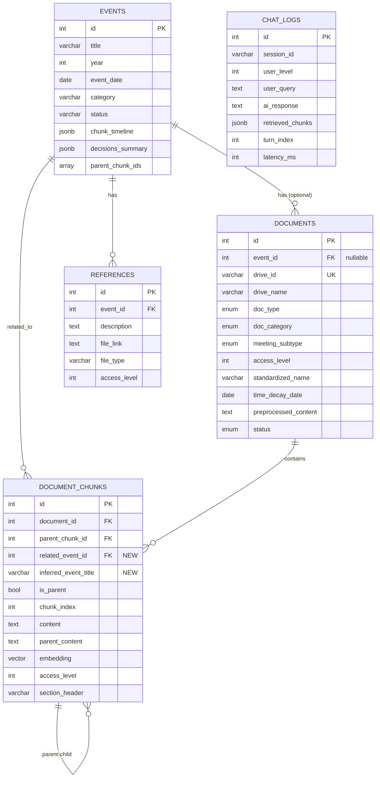

# Council-AI Database Schema

이 문서는 Council-AI의 RAG 시스템을 위한 PostgreSQL + pgvector 데이터베이스 스키마를 설명합니다.

> [!IMPORTANT]
> **2025-01-31 업데이트:** N:M 관계 구현을 위해 `DocumentChunk` 레벨에서 Event 매핑 추가. `ChatLog` 테이블 신규 생성.

## ER 다이어그램



---

## Events (이벤트/행사)

학생회 행사/사업을 중심으로 문서를 조직하는 최상위 단위입니다.

| Column              | Type                 | Description                             |
| ------------------- | -------------------- | --------------------------------------- |
| `id`                | `SERIAL PRIMARY KEY` | 고유 ID                                 |
| `title`             | `VARCHAR(500)`       | 행사명 (예: "2025 새내기 배움터")       |
| `year`              | `INTEGER`            | 행사 연도                               |
| `event_date`        | `DATE`               | 행사 일자                               |
| `start_date`        | `DATE`               | 시작일 (다일 행사)                      |
| `end_date`          | `DATE`               | 종료일                                  |
| `category`          | `VARCHAR(100)`       | 담당 국서 (문화국, 복지국 등)           |
| `department`        | `VARCHAR(100)`       | 세부 담당                               |
| `status`            | `ENUM`               | planned/in_progress/completed/cancelled |
| `chunk_timeline`    | `JSONB`              | 회의별 청크 ID 매핑                     |
| `decisions_summary` | `JSONB`              | 회의별 결정 사항 요약                   |
| `action_items`      | `JSONB`              | 액션 아이템 목록                        |
| `parent_chunk_ids`  | `INTEGER[]`          | 관련 부모 청크 ID 배열                  |
| `created_at`        | `TIMESTAMP`          | 생성 시각                               |
| `updated_at`        | `TIMESTAMP`          | 수정 시각                               |

### Relationships

```python
# Event → Chunks (N:M 관계 지원)
related_chunks: Mapped[list["DocumentChunk"]] = relationship(
    "DocumentChunk",
    back_populates="related_event",
    foreign_keys="DocumentChunk.related_event_id",
)
```

---

## Documents (문서)

Google Drive에서 수집된 개별 문서의 메타데이터를 저장합니다.

| Column                 | Type                  | Description                                      |
| ---------------------- | --------------------- | ------------------------------------------------ |
| `id`                   | `SERIAL PRIMARY KEY`  | 고유 ID                                          |
| `event_id`             | `INTEGER FK`          | 연관 이벤트 **(nullable - chunk 레벨에서 결정)** |
| `drive_id`             | `VARCHAR(255) UNIQUE` | Google Drive 파일 ID                             |
| `drive_name`           | `VARCHAR(500)`        | 원본 파일명                                      |
| `drive_path`           | `VARCHAR(1000)`       | 폴더 경로                                        |
| `mime_type`            | `VARCHAR(255)`        | MIME 타입                                        |
| `gcs_url`              | `TEXT`                | GCS 백업 URL                                     |
| `doc_type`             | `ENUM`                | 파일 형식 (google_doc, pdf, docx 등)             |
| `doc_category`         | `ENUM`                | 분류 (meeting_document, work_document, other)    |
| `meeting_subtype`      | `ENUM`                | 회의 문서 세부 유형 (agenda, minutes, result)    |
| `access_level`         | `INTEGER`             | 접근 권한 (1-4)                                  |
| `standardized_name`    | `VARCHAR(500)`        | 표준화된 파일명                                  |
| `time_decay_date`      | `DATE`                | 시간 가중치 기준일                               |
| `department`           | `VARCHAR(100)`        | 담당 국서                                        |
| `year`                 | `INTEGER`             | 문서 연도                                        |
| `status`               | `ENUM`                | 처리 상태 (pending → completed)                  |
| `raw_content`          | `TEXT`                | 원본 내용                                        |
| `parsed_content`       | `TEXT`                | 파싱된 HTML                                      |
| `preprocessed_content` | `TEXT`                | 전처리된 Markdown                                |
| `metadata`             | `JSONB`               | 추가 메타데이터                                  |
| `error_message`        | `TEXT`                | 오류 메시지                                      |
| `processed_at`         | `TIMESTAMP`           | 처리 완료 시각                                   |

> [!NOTE]
> `event_id`는 document 레벨에서 optional입니다. 실제 Event 연결은 Chunk 레벨에서 LLM이 안건을 분석하여 결정합니다.

### Access Level (접근 권한)

| Level | Description         | 대상          |
| ----- | ------------------- | ------------- |
| 1     | 회장단 전용         | 회장, 부회장  |
| 2     | 국장단 접근 가능    | 국장급 이상   |
| 3     | 모든 국원 접근 가능 | 학생회 구성원 |
| 4     | 일반 대중 공개      | 모든 학생     |

---

## Document Chunks (문서 청크)

Parent-Child 청킹 전략을 지원하는 벡터 임베딩 저장 테이블입니다.

| Column                     | Type                 | Description                          |
| -------------------------- | -------------------- | ------------------------------------ |
| `id`                       | `SERIAL PRIMARY KEY` | 고유 ID                              |
| `document_id`              | `INTEGER FK`         | 원본 문서                            |
| `parent_chunk_id`          | `INTEGER FK (self)`  | 부모 청크 (계층 관계)                |
| **`related_event_id`**     | `INTEGER FK`         | **🆕 연관 이벤트 (chunk 레벨 매핑)** |
| **`inferred_event_title`** | `VARCHAR(500)`       | **🆕 LLM 추론 이벤트 제목**          |
| `is_parent`                | `BOOLEAN`            | 부모 청크 여부                       |
| `chunk_index`              | `INTEGER`            | 청크 순서                            |
| `chunk_type`               | `VARCHAR(50)`        | text, table, image_caption           |
| `content`                  | `TEXT`               | 청크 내용                            |
| `parent_content`           | `TEXT`               | 부모 청크 전체 내용                  |
| `section_header`           | `VARCHAR(500)`       | 섹션 헤더 (안건명)                   |
| `embedding`                | `VECTOR(768)`        | Vertex AI 임베딩                     |
| `access_level`             | `INTEGER`            | 접근 권한 (문서 상속)                |
| `metadata`                 | `JSONB`              | 추가 메타데이터                      |
| `token_count`              | `INTEGER`            | 토큰 수                              |

### ⭐ N:M Relationship (Chunk-Level Event Mapping)

하나의 회의록에 여러 행사에 대한 안건이 포함될 수 있습니다:

```
📄 [안건지] 제7차 국장단회의.docx
├── 🔷 안건 1: 새터 예산 검토 → Event: "2025 새내기 배움터"
├── 🔷 안건 2: 축제 가수 섭외 → Event: "2025 대동제"
└── 🔷 안건 3: MT 장소 선정 → Event: "2025 봄 MT"
```

**처리 흐름:**

1. Step 5 (Chunking): 안건별로 Parent chunk 생성
2. Step 6 (Enrichment): LLM이 안건 내용 분석 → `inferred_event_title` 저장
3. Event Matching: 기존 Event 검색 → `related_event_id` 연결

### Parent-Child Chunking Strategy

```
# 보고안건 (Parent: 전체 보고안건 섹션)
    ├── Child 1: "축제 준비가 순조롭게..."
    ├── Child 2: "현재까지 진행된 사항..."
    └── Child 3: "예산 집행률은..."

## 논의안건 1. 축제 가수 섭외 (Parent: 개별 안건)
    ├── Child 1: "가수 후보 리스트..."
    ├── Child 2: "예산은 300만원으로..."
    └── Child 3: "투표 결과..."
```

### HNSW Index

```sql
CREATE INDEX idx_chunks_embedding_hnsw
ON document_chunks
USING hnsw (embedding vector_cosine_ops)
WITH (m = 16, ef_construction = 64);

-- 🆕 Event 조회 최적화
CREATE INDEX idx_chunks_related_event
ON document_chunks (related_event_id)
WHERE related_event_id IS NOT NULL;
```

---

## Chat Logs (대화 기록) 🆕

RAG Chat 대화 기록을 저장합니다. Redis로 단기 컨텍스트, DB로 장기 분석용.

| Column                  | Type                 | Description            |
| ----------------------- | -------------------- | ---------------------- |
| `id`                    | `SERIAL PRIMARY KEY` | 고유 ID                |
| `session_id`            | `VARCHAR(100)`       | 세션 ID (indexed)      |
| `user_level`            | `INTEGER`            | 사용자 접근 레벨 (1-4) |
| `user_query`            | `TEXT`               | 원본 질문              |
| `rewritten_query`       | `TEXT`               | 재작성된 질문          |
| `ai_response`           | `TEXT`               | AI 응답                |
| `retrieved_chunks`      | `JSONB`              | 검색된 청크 정보       |
| `sources`               | `JSONB`              | 인용 출처 목록         |
| `turn_index`            | `INTEGER`            | 대화 턴 인덱스         |
| `latency_ms`            | `INTEGER`            | 전체 응답 시간         |
| `retrieval_latency_ms`  | `INTEGER`            | 검색 시간              |
| `generation_latency_ms` | `INTEGER`            | 생성 시간              |
| `request_metadata`      | `JSONB`              | 요청 메타데이터        |
| `created_at`            | `TIMESTAMP`          | 생성 시각              |

**활용 목적:**

- 대화 흐름 분석 및 개선
- 자주 묻는 질문 파악
- 응답 품질 모니터링
- 사용자 행동 분석

---

## References (참조 링크)

개인정보가 포함된 민감한 파일의 링크만 저장합니다 (임베딩 X).

| Column         | Type                 | Description                 |
| -------------- | -------------------- | --------------------------- |
| `id`           | `SERIAL PRIMARY KEY` | 고유 ID                     |
| `event_id`     | `INTEGER FK`         | 연관 이벤트                 |
| `description`  | `TEXT`               | 파일 설명                   |
| `file_link`    | `TEXT`               | 파일 링크 (Google Forms 등) |
| `file_type`    | `VARCHAR(50)`        | gform, gsheet 등            |
| `file_name`    | `VARCHAR(500)`       | 파일명                      |
| `access_level` | `INTEGER`            | 접근 권한                   |
| `metadata`     | `JSONB`              | 추가 메타데이터             |

**예시 사용처:**

- Google Forms (행사 신청서)
- 학생 명단이 포함된 스프레드시트
- 개인정보가 포함된 자료

---

## Alembic Migration

최신 마이그레이션: `001_chunk_event_mapping.py`

```python
# 추가된 컬럼
op.add_column('document_chunks',
    sa.Column('related_event_id', sa.Integer(),
              sa.ForeignKey('events.id'), nullable=True))
op.add_column('document_chunks',
    sa.Column('inferred_event_title', sa.String(500), nullable=True))

# 신규 테이블
op.create_table('chat_logs', ...)
```
