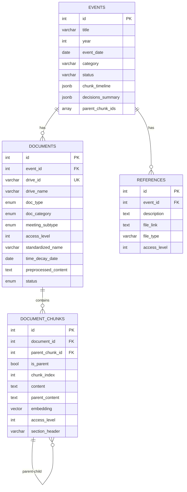

# Council-AI Database Schema

이 문서는 Council-AI의 RAG 시스템을 위한 PostgreSQL + pgvector 데이터베이스 스키마를 설명합니다.

## 테이블 개요



---

## Events (이벤트/행사)

학생회 행사/사업을 중심으로 문서를 조직하는 최상위 단위입니다.

| Column | Type | Description |
|--------|------|-------------|
| `id` | `SERIAL PRIMARY KEY` | 고유 ID |
| `title` | `VARCHAR(500)` | 행사명 (예: "2025 새내기 배움터") |
| `year` | `INTEGER` | 행사 연도 |
| `event_date` | `DATE` | 행사 일자 |
| `start_date` | `DATE` | 시작일 (다일 행사) |
| `end_date` | `DATE` | 종료일 |
| `category` | `VARCHAR(100)` | 담당 국서 (문화국, 복지국 등) |
| `department` | `VARCHAR(100)` | 세부 담당 |
| `status` | `ENUM` | planned/in_progress/completed/cancelled |
| `chunk_timeline` | `JSONB` | 회의별 청크 ID 매핑 |
| `decisions_summary` | `JSONB` | 회의별 결정 사항 요약 |
| `action_items` | `JSONB` | 액션 아이템 목록 |
| `parent_chunk_ids` | `INTEGER[]` | 관련 부모 청크 ID 배열 |
| `created_at` | `TIMESTAMP` | 생성 시각 |
| `updated_at` | `TIMESTAMP` | 수정 시각 |

### chunk_timeline 구조

회의명을 키로 하여 해당 회의에서 논의된 안건(부모 청크 ID)을 추적합니다:

```json
{
    "2차 국장단 회의": [101, 102],
    "3차 회의": [103, 104, 105],
    "4차 회의": [106]
}
```

---

## Documents (문서)

Google Drive에서 수집된 개별 문서의 메타데이터를 저장합니다.

| Column | Type | Description |
|--------|------|-------------|
| `id` | `SERIAL PRIMARY KEY` | 고유 ID |
| `event_id` | `INTEGER FK` | 연관 이벤트 |
| `drive_id` | `VARCHAR(255) UNIQUE` | Google Drive 파일 ID |
| `drive_name` | `VARCHAR(500)` | 원본 파일명 |
| `drive_path` | `VARCHAR(1000)` | 폴더 경로 |
| `mime_type` | `VARCHAR(255)` | MIME 타입 |
| `gcs_url` | `TEXT` | GCS 백업 URL |
| `doc_type` | `ENUM` | 파일 형식 (google_doc, pdf, docx 등) |
| `doc_category` | `ENUM` | 분류 (meeting_document, work_document, other) |
| `meeting_subtype` | `ENUM` | 회의 문서 세부 유형 (agenda, minutes, result) |
| `access_level` | `INTEGER` | 접근 권한 (1-4) |
| `standardized_name` | `VARCHAR(500)` | 표준화된 파일명 |
| `time_decay_date` | `DATE` | 시간 가중치 기준일 |
| `department` | `VARCHAR(100)` | 담당 국서 |
| `year` | `INTEGER` | 문서 연도 |
| `status` | `ENUM` | 처리 상태 (pending → completed) |
| `raw_content` | `TEXT` | 원본 내용 |
| `parsed_content` | `TEXT` | 파싱된 HTML |
| `preprocessed_content` | `TEXT` | 전처리된 Markdown |
| `metadata` | `JSONB` | 추가 메타데이터 |
| `error_message` | `TEXT` | 오류 메시지 |
| `processed_at` | `TIMESTAMP` | 처리 완료 시각 |

### Access Level (접근 권한)

| Level | Description | 대상 |
|-------|-------------|------|
| 1 | 회장단 전용 | 회장, 부회장 |
| 2 | 국장단 접근 가능 | 국장급 이상 |
| 3 | 모든 국원 접근 가능 | 학생회 구성원 |
| 4 | 일반 대중 공개 | 모든 학생 |

### Meeting Subtype & Reliability

문서의 **신뢰도**는 `meeting_subtype`으로 결정됩니다:

| Subtype | Reliability Score | Description |
|---------|-------------------|-------------|
| `result` | 3 (최고) | 결과지 - 최종 확정 사항 |
| `minutes` | 2 (중간) | 속기록 - 논의 내용 |
| `agenda` | 1 (낮음) | 안건지 - 제안/계획 사항 |

---

## Document Chunks (문서 청크)

Parent-Child 청킹 전략을 지원하는 벡터 임베딩 저장 테이블입니다.

| Column | Type | Description |
|--------|------|-------------|
| `id` | `SERIAL PRIMARY KEY` | 고유 ID |
| `document_id` | `INTEGER FK` | 원본 문서 |
| `parent_chunk_id` | `INTEGER FK (self)` | 부모 청크 (계층 관계) |
| `is_parent` | `BOOLEAN` | 부모 청크 여부 |
| `chunk_index` | `INTEGER` | 청크 순서 |
| `chunk_type` | `VARCHAR(50)` | text, table, image_caption |
| `content` | `TEXT` | 청크 내용 |
| `parent_content` | `TEXT` | 부모 청크 전체 내용 |
| `section_header` | `VARCHAR(500)` | 섹션 헤더 (안건명) |
| `embedding` | `VECTOR(768)` | Vertex AI 임베딩 |
| `access_level` | `INTEGER` | 접근 권한 (문서 상속) |
| `metadata` | `JSONB` | 추가 메타데이터 |
| `token_count` | `INTEGER` | 토큰 수 |

### Parent-Child Chunking Strategy

```
# 보고안건 (Parent: 전체 보고안건 섹션)
    ├── Child 1: "축제 준비가 순조롭게..."
    ├── Child 2: "현재까지 진행된 사항..."
    └── Child 3: "예산 집행률은..."
    
## 논의안건 1. 축제 가수 섭외 (Parent: 개별 안건)
    ├── Child 1: "가수 후보 리스트..."
    ├── Child 2: "예산은 300만원으로..."
    └── Child 3: "투표 결과..."
```

**검색 흐름:**
1. Query → Child 청크 벡터 검색 (높은 정밀도)
2. 매칭된 Child의 `parent_content` 반환 (전체 맥락)
3. LLM이 parent_content를 사용해 답변 생성

### HNSW Index

```sql
CREATE INDEX idx_chunks_embedding_hnsw 
ON document_chunks 
USING hnsw (embedding vector_cosine_ops)
WITH (m = 16, ef_construction = 64);
```

---

## References (참조 링크)

개인정보가 포함된 민감한 파일의 링크만 저장합니다 (임베딩 X).

| Column | Type | Description |
|--------|------|-------------|
| `id` | `SERIAL PRIMARY KEY` | 고유 ID |
| `event_id` | `INTEGER FK` | 연관 이벤트 |
| `description` | `TEXT` | 파일 설명 |
| `file_link` | `TEXT` | 파일 링크 (Google Forms 등) |
| `file_type` | `VARCHAR(50)` | gform, gsheet 등 |
| `file_name` | `VARCHAR(500)` | 파일명 |
| `access_level` | `INTEGER` | 접근 권한 |
| `metadata` | `JSONB` | 추가 메타데이터 |

**예시 사용처:**
- Google Forms (행사 신청서)
- 학생 명단이 포함된 스프레드시트
- 개인정보가 포함된 자료
