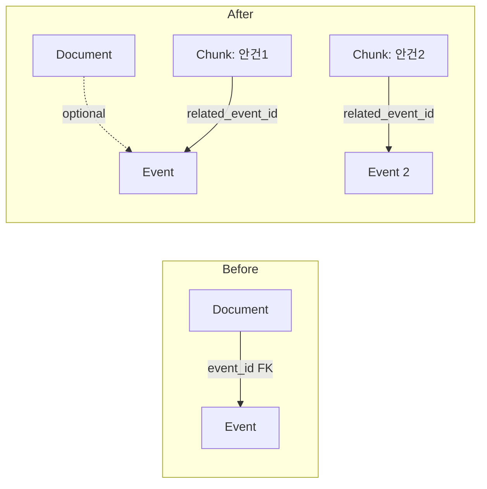

# Council-AI API & Schema Implementation Walkthrough

## Summary

Successfully implemented the API specification, DB schema changes, and Celery tasks per the approved implementation plan.

## Changes Made

### 1. Database Models (5 files)

| File | Changes |
|------|---------|
| [document.py](file:///c:/Users/imtae/madcamp/2025Winter_4th/backend/app/models/document.py) | Made `event_id` explicitly nullable with documentation explaining chunk-level event mapping |
| [embedding.py](file:///c:/Users/imtae/madcamp/2025Winter_4th/backend/app/models/embedding.py) | Added `related_event_id` FK, `inferred_event_title` field, `related_event` relationship |
| [event.py](file:///c:/Users/imtae/madcamp/2025Winter_4th/backend/app/models/event.py) | Added `related_chunks` relationship for bidirectional chunk-event mapping |
| [chat.py](file:///c:/Users/imtae/madcamp/2025Winter_4th/backend/app/models/chat.py) | **NEW** - ChatLog model for conversation history storage |
| [__init__.py](file:///c:/Users/imtae/madcamp/2025Winter_4th/backend/app/models/__init__.py) | Added ChatLog export |

### 2. Alembic Migration Setup (4 files)

| File | Description |
|------|-------------|
| [alembic.ini](file:///c:/Users/imtae/madcamp/2025Winter_4th/backend/alembic.ini) | Alembic configuration |
| [alembic/env.py](file:///c:/Users/imtae/madcamp/2025Winter_4th/backend/alembic/env.py) | Migration environment with app settings |
| [alembic/script.py.mako](file:///c:/Users/imtae/madcamp/2025Winter_4th/backend/alembic/script.py.mako) | Migration template |
| [001_chunk_event_mapping.py](file:///c:/Users/imtae/madcamp/2025Winter_4th/backend/alembic/versions/001_chunk_event_mapping.py) | Initial migration: chunk event mapping + chat_logs table |

### 3. Pydantic Schemas (7 files)

| File | Description |
|------|-------------|
| [chat.py](file:///c:/Users/imtae/madcamp/2025Winter_4th/backend/app/schemas/chat.py) | **NEW** - ChatRequest/Response, ChatOptions, SourceReference |
| [task.py](file:///c:/Users/imtae/madcamp/2025Winter_4th/backend/app/schemas/task.py) | **NEW** - TaskStatus, TaskStatusResponse, TaskResult |
| [handover.py](file:///c:/Users/imtae/madcamp/2025Winter_4th/backend/app/schemas/handover.py) | **NEW** - HandoverGenerateRequest/Response |
| [calendar.py](file:///c:/Users/imtae/madcamp/2025Winter_4th/backend/app/schemas/calendar.py) | Added CalendarSyncRequest/Response |
| [minutes.py](file:///c:/Users/imtae/madcamp/2025Winter_4th/backend/app/schemas/minutes.py) | Updated with MeetingInfo, OutputConfig |
| [rag.py](file:///c:/Users/imtae/madcamp/2025Winter_4th/backend/app/schemas/rag.py) | Updated IngestRequest with IngestOptions |
| [__init__.py](file:///c:/Users/imtae/madcamp/2025Winter_4th/backend/app/schemas/__init__.py) | Updated exports |

### 4. API Endpoints (7 files)

| File | Endpoints |
|------|-----------|
| [chat.py](file:///c:/Users/imtae/madcamp/2025Winter_4th/backend/app/api/v1/chat.py) | **NEW** - `POST /chat`, `GET /chat/history/{session_id}` |
| [handover.py](file:///c:/Users/imtae/madcamp/2025Winter_4th/backend/app/api/v1/handover.py) | **NEW** - `POST /handover/generate` |
| [tasks.py](file:///c:/Users/imtae/madcamp/2025Winter_4th/backend/app/api/v1/tasks.py) | **NEW** - `GET /tasks/{task_id}`, `DELETE /tasks/{task_id}` |
| [rag.py](file:///c:/Users/imtae/madcamp/2025Winter_4th/backend/app/api/v1/rag.py) | Updated `POST /rag/ingest/folder` |
| [minutes.py](file:///c:/Users/imtae/madcamp/2025Winter_4th/backend/app/api/v1/minutes.py) | Updated `POST /minutes/generate` |
| [calendar.py](file:///c:/Users/imtae/madcamp/2025Winter_4th/backend/app/api/v1/calendar.py) | Added `POST /calendar/sync` |
| [router.py](file:///c:/Users/imtae/madcamp/2025Winter_4th/backend/app/api/v1/router.py) | Added all new routers |

### 5. Celery Tasks (3 files)

| File | Tasks |
|------|-------|
| [features.py](file:///c:/Users/imtae/madcamp/2025Winter_4th/backend/app/tasks/features.py) | **NEW** - [generate_minutes](file:///c:/Users/imtae/madcamp/2025Winter_4th/backend/app/tasks/features.py#33-148), [sync_calendar](file:///c:/Users/imtae/madcamp/2025Winter_4th/backend/app/api/v1/calendar.py#19-70), [generate_handover](file:///c:/Users/imtae/madcamp/2025Winter_4th/backend/app/api/v1/handover.py#14-72) |
| [pipeline.py](file:///c:/Users/imtae/madcamp/2025Winter_4th/backend/app/tasks/pipeline.py) | Updated [ingest_folder](file:///c:/Users/imtae/madcamp/2025Winter_4th/backend/app/api/v1/rag.py#17-71) (removed event_hints), [run_full_pipeline](file:///c:/Users/imtae/madcamp/2025Winter_4th/backend/app/tasks/pipeline.py#29-173) |
| [__init__.py](file:///c:/Users/imtae/madcamp/2025Winter_4th/backend/app/tasks/__init__.py) | Updated exports |

---

## Key Design Decisions

### N:M Event-Document Relationship



> [!IMPORTANT]
> Event mapping moved to **Chunk level** during Step 6 (Enrichment), not at ingestion time. This supports documents containing multiple agenda items for different events.

### Calendar ID as API Parameter

- Supports **multiple calendars** per organization
- Each API request specifies target `calendar_id`
- No need for environment variable configuration per calendar

### Async Processing Architecture

All long-running operations use Celery tasks:

| Feature | Estimated Time | Task |
|---------|---------------|------|
| Smart Minutes | 30s-2m | [generate_minutes](file:///c:/Users/imtae/madcamp/2025Winter_4th/backend/app/tasks/features.py#33-148) |
| Calendar Sync | 5-10s | [sync_calendar](file:///c:/Users/imtae/madcamp/2025Winter_4th/backend/app/api/v1/calendar.py#19-70) |
| Handover Generation | 2-5m | [generate_handover](file:///c:/Users/imtae/madcamp/2025Winter_4th/backend/app/api/v1/handover.py#14-72) |
| Folder Ingestion | Variable | [ingest_folder](file:///c:/Users/imtae/madcamp/2025Winter_4th/backend/app/api/v1/rag.py#17-71) |

---

## API Summary

| Method | Endpoint | Description |
|--------|----------|-------------|
| POST | `/api/v1/chat` | RAG Chat with multi-turn context |
| GET | `/api/v1/chat/history/{session_id}` | Get chat history |
| POST | `/api/v1/rag/ingest/folder` | Ingest Drive folder |
| POST | `/api/v1/rag/search` | Direct vector search |
| GET | `/api/v1/rag/documents` | List indexed documents |
| POST | `/api/v1/minutes/generate` | Smart Minutes generation |
| GET | `/api/v1/minutes/{task_id}/status` | Minutes task status |
| POST | `/api/v1/calendar/sync` | Sync from result doc |
| POST/GET/DELETE | `/api/v1/calendar/events` | Calendar CRUD |
| POST | `/api/v1/handover/generate` | Handover document generation |
| GET | `/api/v1/tasks/{task_id}` | Celery task status |
| DELETE | `/api/v1/tasks/{task_id}` | Cancel task |

---

## Next Steps

1. **Run Alembic Migration:**
   ```bash
   cd backend
   pip install alembic
   alembic upgrade head
   ```

2. **Implement Service Classes:**
   - `GoogleDocsService` for Docs API integration
   - `GoogleCalendarService` for Calendar API integration
   - Redis client for chat session storage

3. **Complete TODO Implementations:**
   - API endpoints have placeholder logic marked with `# TODO:`
   - Celery tasks have placeholder implementations ready for service integration

4. **Testing:**
   - Run `pytest` to verify model imports
   - Test API endpoints with sample requests
