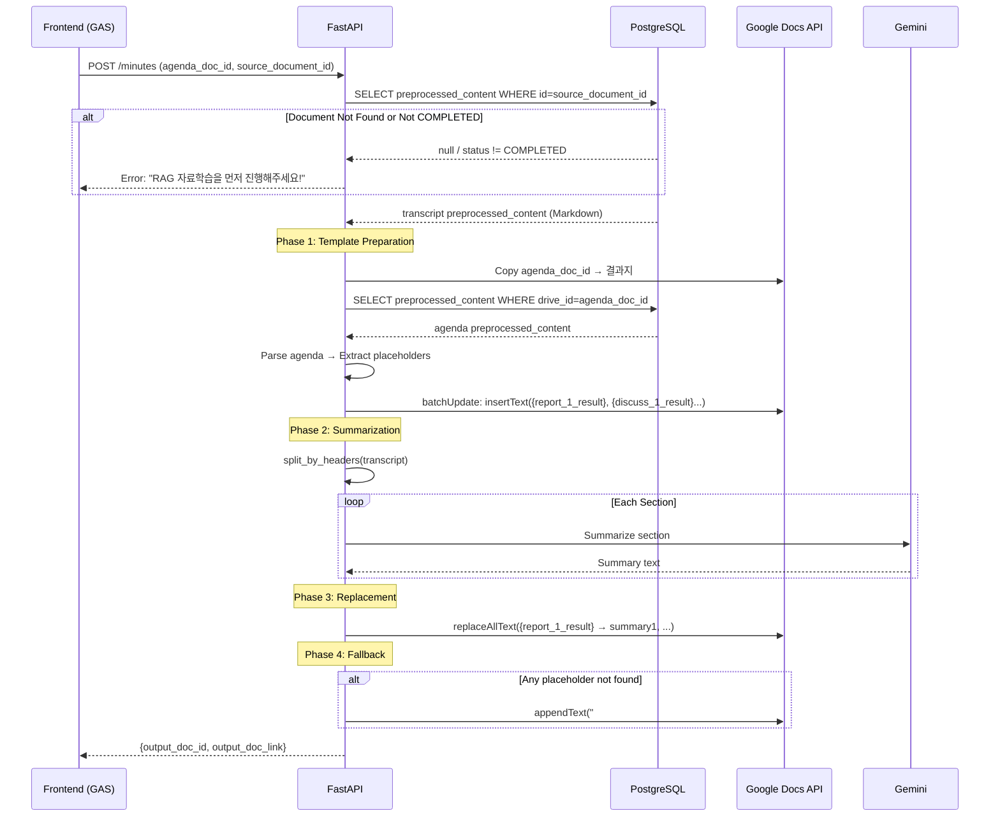

# Smart Minutes 전면 재설계 구현 계획서

> **Version:** 2.0.0  
> **Status:** 🔴 Critical Refactoring Required  
> **Date:** 2026-02-05

---

## 1. 현재 상태 분석 결과 (Context Investigation)

### 1.1 DB Schema 확인 ✅
- `documents.preprocessed_content` (TEXT, nullable) - Step 4에서 LLM이 구조화한 Markdown
- 헤더 구조: `# 보고안건`, `## 논의안건 1. 제목` 형태
- [meeting_subtype](file:///c:/Users/imtae/madcamp/2025Winter_4th/backend/app/pipeline/step_02_classify.py#205-223): AGENDA(안건지), MINUTES(속기록), RESULT(결과지) 구분

### 1.2 Pipeline Output 구조 ✅
Step 4 ([step_04_preprocess.py](file:///c:/Users/imtae/madcamp/2025Winter_4th/backend/app/pipeline/step_04_preprocess.py))가 생성하는 Markdown 형식:
```markdown
# 보고안건
## 보고안건 1. 학생회장단 활동보고
(안건 내용...)

# 논의안건  
## 논의안건 1. 2025 컴밤 장소 선정
(안건 내용...)

## 논의안건 2. MT 참가비 책정
(안건 내용...)
```

### 1.3 현재 [features.py](file:///c:/Users/imtae/madcamp/2025Winter_4th/backend/app/tasks/features.py) 문제점 🔴

| Line | 문제 코드 | 문제 설명 |
|------|----------|----------|
| 121-122 | `docs_service.get_document_text(transcript_doc_id)` | Google Docs API 직접 호출 (Deprecated) |
| 132 | [split_by_headers(transcript_content)](file:///c:/Users/imtae/madcamp/2025Winter_4th/backend/app/services/text_utils.py#48-121) | 비구조화 텍스트에 적용 → 파싱 실패 |
| 190 | [build_placeholder_map(sections, summaries)](file:///c:/Users/imtae/madcamp/2025Winter_4th/backend/app/services/text_utils.py#296-360) | 안건지에 Placeholder가 없어서 치환 불가 |
| - | Placeholder Injection 부재 | 결과지 템플릿에 `{report_1_result}` 삽입 로직 없음 |

---

## 2. 제안된 아키텍처 (TO-BE)



---

## 3. 상세 구현 계획

### Phase 0: DTO 업데이트 ([features_dto.py](file:///c:/Users/imtae/madcamp/2025Winter_4th/backend/app/schemas/features_dto.py))

#### [MODIFY] [features_dto.py](file:///c:/Users/imtae/madcamp/2025Winter_4th/backend/app/schemas/features_dto.py)

```python
class MinutesGenerationRequest(BaseModel):
    agenda_doc_id: str  # 유지
    source_document_id: int  # 필수로 변경 (Optional → Required)
    # transcript_doc_id: DEPRECATED → 삭제
    # transcript_text: DEPRECATED → 삭제
    meeting_name: str
    meeting_date: date
    output_folder_id: str | None = None
    output_doc_id: str | None = None  # 사전 생성된 결과지 ID (권장)
    user_level: int = Field(default=2, ge=1, le=4)
    user_email: str | None = None
```

---

### Phase 1: DB Access + RAG Validation

#### [MODIFY] [features.py](file:///c:/Users/imtae/madcamp/2025Winter_4th/backend/app/tasks/features.py) - [generate_minutes](file:///c:/Users/imtae/madcamp/2025Winter_4th/backend/app/tasks/features.py#33-210)

```python
# 🔴 삭제 대상
# elif transcript_doc_id:
#     transcript_content = docs_service.get_document_text(transcript_doc_id)
#     logger.info("Loaded transcript from Google Docs (deprecated)")

# ✅ 신규 로직
async def _fetch_document_from_db(doc_id: int) -> tuple[str, str]:
    """Fetch preprocessed_content from DB."""
    async with async_session_factory() as db:
        result = await db.execute(
            select(Document).where(Document.id == doc_id)
        )
        doc = result.scalar_one_or_none()
        
        if not doc:
            raise ValueError(f"문서 ID {doc_id}를 찾을 수 없습니다. RAG 자료학습을 먼저 진행해주세요!")
        if doc.status != DocumentStatus.COMPLETED:
            raise ValueError(f"문서 ID {doc_id}가 아직 처리되지 않았습니다 (상태: {doc.status}). RAG 자료학습이 완료될 때까지 기다려주세요!")
        if not doc.preprocessed_content:
            raise ValueError(f"문서 ID {doc_id}의 전처리 내용이 비어있습니다. RAG 파이프라인을 확인해주세요!")
            
        return doc.preprocessed_content, doc.drive_id

transcript_content, transcript_drive_id = run_async(_fetch_document_from_db(source_document_id))
```

---

### Phase 2: Template Preparation (Placeholder Injection)

#### [NEW] Helper Function in [features.py](file:///c:/Users/imtae/madcamp/2025Winter_4th/backend/app/tasks/features.py)

```python
def _inject_placeholders_to_result_doc(
    docs_service: GoogleDocsService,
    result_doc_id: str,
    agenda_preprocessed: str,
) -> list[str]:
    """
    Parse agenda preprocessed_content and inject placeholders into result doc.
    
    Returns:
        List of injected placeholder keys
    """
    from app.services.text_utils import split_by_headers
    
    sections = split_by_headers(agenda_preprocessed, max_level=2)
    placeholders_inserted = []
    
    # Build insertText requests
    requests = []
    for section in sections:
        agenda_type = section.agenda_type  # report, discuss, other
        agenda_num = section.agenda_number
        
        if agenda_type and agenda_num:
            placeholder = f"\n{{{agenda_type}_{agenda_num}_result}}\n"
            placeholders_inserted.append(f"{{{agenda_type}_{agenda_num}_result}}")
            
            # Find location to insert (after section title in the doc)
            # Use Google Docs API findLocation or search for title
            requests.append({
                "insertText": {
                    "location": {"endOfSegmentLocation": {"segmentId": ""}},  # Simplified
                    "text": placeholder
                }
            })
    
    if requests:
        docs_service.batch_update(result_doc_id, requests)
    
    return placeholders_inserted
```

> [!IMPORTANT]
> 실제 구현에서는 Google Docs API의 `batchUpdate`를 사용하여 각 안건 제목 직후에 Placeholder를 삽입해야 합니다.

---

### Phase 3: Summarization (기존 로직 유지 + 개선)

```python
# 속기록 preprocessed_content에서 각 섹션 추출
transcript_sections = split_by_headers(transcript_content, max_level=2)

summaries = []
for section in transcript_sections:
    result = gemini.summarize_agenda_section(
        section_content=section.content,
        section_title=section.title,
        agenda_type=section.agenda_type or "other",
    )
    summaries.append({
        "placeholder_key": f"{{{section.agenda_type}_{section.agenda_number}_result}}",
        "summary": result.get("summary", "요약 없음"),
        **result
    })
```

---

### Phase 4: Replacement + Fallback

```python
def _replace_with_fallback(
    docs_service: GoogleDocsService,
    result_doc_id: str,
    replacements: dict[str, str],
) -> list[str]:
    """
    Replace placeholders. If any fail, append to document end.
    
    Returns:
        List of failed placeholder keys (fallback applied)
    """
    failed_placeholders = []
    
    for placeholder, summary in replacements.items():
        result = docs_service.replace_text(result_doc_id, {placeholder: summary})
        
        # Check if replacement count is 0
        replies = result.get("replies", [])
        if replies and replies[0].get("replaceAllText", {}).get("occurrencesChanged", 0) == 0:
            failed_placeholders.append(placeholder)
            
            # Fallback: Append to end of document
            fallback_text = f"\n\n## [누락된 요약] {placeholder}\n{summary}\n"
            docs_service.append_text(result_doc_id, fallback_text)
            
            logger.warning(
                "Placeholder not found, using fallback",
                placeholder=placeholder,
            )
    
    return failed_placeholders
```

---

## 4. [text_utils.py](file:///c:/Users/imtae/madcamp/2025Winter_4th/backend/app/services/text_utils.py) 업그레이드

#### [MODIFY] [text_utils.py](file:///c:/Users/imtae/madcamp/2025Winter_4th/backend/app/services/text_utils.py)

### 변경 1: [split_by_headers](file:///c:/Users/imtae/madcamp/2025Winter_4th/backend/app/services/text_utils.py#48-121) 안건 타입 추출 강화

```python
@property
def agenda_type(self) -> str | None:
    """Extract agenda type from header."""
    title_lower = self.title.lower()
    
    # 패턴 1: "# 보고안건" 스타일 (H1)
    if self.header_level == 1:
        if "보고" in self.title:
            return "report"
        elif "논의" in self.title:
            return "discuss"
        elif "의결" in self.title:
            return "decision"
        elif "기타" in self.title:
            return "other"
    
    # 패턴 2: "## 보고안건 1. 제목" 스타일 (H2)
    if self.header_level == 2:
        if "보고안건" in self.title:
            return "report"
        elif "논의안건" in self.title:
            return "discuss"
        elif "의결안건" in self.title:
            return "decision"
        elif "기타안건" in self.title:
            return "other"
    
    return None

@property  
def agenda_number(self) -> int | None:
    """Extract agenda item number (e.g., '논의안건 2. 제목' -> 2)."""
    # 패턴: "N." 또는 "N)" 또는 단독 "N"
    match = re.search(r'(\d+)[.)\s]', self.title)
    return int(match.group(1)) if match else None
```

---

## 5. 중괄호 문법 통일 (Syntax Audit)

### 수정 대상 파일

| 파일 | 현재 | 변경 | 비고 |
|------|------|------|------|
| `text_utils.py:340` | `{{{agenda_type}_{num}_result}}}` | `{{{agenda_type}_{num}_result}}}` | ✅ Python f-string 정상 (단일 `{}` 생성) |
| `document.py:141-146` | `{{요약}}` | `{요약}` | ❌ 수정 필요 |
| `gemini.py:97-103` | `{{...}}` | 유지 | ✅ LLM 프롬프트용 예시 (JSON) |
| `minutes_control.py:42-47` | `{{report_N_result}}` | `{report_N_result}` | ❌ 수정 필요 (문서 주석) |

> [!NOTE]
> Python f-string에서 `{{{var}}}` = 리터럴 `{` + 변수값 + 리터럴 `}` → 최종 출력: `{value}`  
> 따라서 [text_utils.py](file:///c:/Users/imtae/madcamp/2025Winter_4th/backend/app/services/text_utils.py)의 현재 코드는 정상입니다.

---

## 6. 검증 계획

### 6.1 단위 테스트
```python
def test_split_by_headers_with_preprocessed_content():
    """Test split_by_headers with actual preprocessed_content format."""
    content = """# 보고안건

## 보고안건 1. 학생회장단 활동보고
보고 내용...

# 논의안건

## 논의안건 1. 컴씨 장소 선정
토론 내용...
"""
    sections = split_by_headers(content, max_level=2)
    
    assert len(sections) == 4
    assert sections[1].agenda_type == "report"
    assert sections[1].agenda_number == 1
    assert sections[3].agenda_type == "discuss"
    assert sections[3].agenda_number == 1
```

### 6.2 통합 테스트
1. DB에 COMPLETED 상태의 속기록 문서 준비
2. `/api/v1/minutes` 호출 with `source_document_id`
3. 결과지 Google Docs 확인:
   - Placeholder 삽입 여부
   - 요약 치환 여부
   - Fallback 동작 여부

---

## 7. 변경 파일 목록

| 파일 | 액션 | 설명 |
|------|------|------|
| [features_dto.py](file:///c:/Users/imtae/madcamp/2025Winter_4th/backend/app/schemas/features_dto.py) | MODIFY | `source_document_id` 필수화, deprecated 필드 제거 |
| [features.py](file:///c:/Users/imtae/madcamp/2025Winter_4th/backend/app/tasks/features.py) | REWRITE | 4-Phase 로직 전면 재구현 |
| [text_utils.py](file:///c:/Users/imtae/madcamp/2025Winter_4th/backend/app/services/text_utils.py) | MODIFY | [agenda_type](file:///c:/Users/imtae/madcamp/2025Winter_4th/backend/app/services/text_utils.py#28-40), [agenda_number](file:///c:/Users/imtae/madcamp/2025Winter_4th/backend/app/services/text_utils.py#41-46) 추출 강화 |
| [document.py](file:///c:/Users/imtae/madcamp/2025Winter_4th/backend/app/models/document.py) | MODIFY | 중괄호 문법 수정 |
| [minutes_control.py](file:///c:/Users/imtae/madcamp/2025Winter_4th/backend/app/api/v1/minutes_control.py) | MODIFY | 주석 중괄호 수정 |
| `google/docs.py` | MODIFY | `append_text`, `batch_update` 메서드 추가 필요 |

---

## 8. 위험 요소 및 대응

| 위험 | 대응 방안 |
|------|----------|
| Google Docs API batchUpdate 복잡성 | `insertText` 대신 `replaceAllText` 패턴 사용 검토 |
| Placeholder 위치 찾기 실패 | Fallback 로직으로 문서 끝에 추가 |
| 속기록에 안건 구조 없음 | H1만 사용 시 전체를 단일 섹션으로 처리 |
