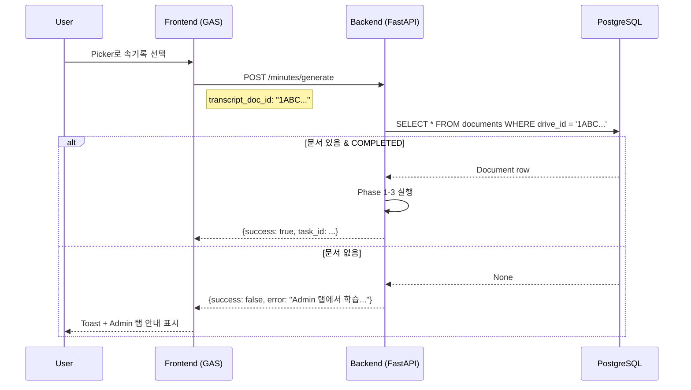

# Smart Minutes v2.1 UX Improvement & Untitled Bug Fix

## 작업 요약

**목표:** Smart Minutes 기능의 UX 개선 및 시스템 안정성 확보

| 구분 | v2.0 (Before) | v2.1 (After) |
|------|---------------|--------------|
| 속기록 선택 | RAG Selectbox (Untitled 표시) | **Google Drive Picker** |
| Backend 입력 | `source_document_id: int` (DB ID) | `transcript_doc_id: str` (Drive ID) |
| RAG 미학습 시 | 404 에러 (불친절) | **명확한 에러 메시지 + Admin 탭 안내** |
| 파일명 저장 | Untitled로 저장 | **Drive API 이름 사용** |

---

## 수정된 파일

### Frontend (GAS)

#### [Sidebar.html](file:///c:/Users/imtae/madcamp/2025Winter_4th/frontend/src/Sidebar.html)
- RAG Selectbox UI 제거
- Google Drive Picker 버튼 복원
- "Admin 탭 이동" 안내 UI 유지

#### [Utils.gs](file:///c:/Users/imtae/madcamp/2025Winter_4th/frontend/src/Utils.gs)
- [apiGenerateMinutes()](file:///c:/Users/imtae/madcamp/2025Winter_4th/frontend/src/Utils.gs#222-284) v2.1로 수정
- `transcript_doc_id` (Drive ID) 전송
- `source_document_id` 필드 제거

#### [Scripts.html](file:///c:/Users/imtae/madcamp/2025Winter_4th/frontend/src/Scripts.html)
- [generateMinutes()](file:///c:/Users/imtae/madcamp/2025Winter_4th/frontend/src/Scripts.html#652-748) 함수 수정
- RAG 에러 시 Admin 탭 안내 가이드 표시
- `loadRagDocuments()` 함수 제거

---

### Backend

#### [features_dto.py](file:///c:/Users/imtae/madcamp/2025Winter_4th/backend/app/schemas/features_dto.py)
- [MinutesGenerationRequest](file:///c:/Users/imtae/madcamp/2025Winter_4th/backend/app/schemas/features_dto.py#53-112) v2.1로 변경
- `transcript_doc_id: str` 필수 필드로 복원
- `source_document_id`, `agenda_document_id` 제거

```diff
-source_document_id: int = Field(...)
-agenda_document_id: int | None = Field(...)
-transcript_doc_id: str | None = Field(..., deprecated=True)
+transcript_doc_id: str = Field(...)  # Google Drive ID from Picker
```

#### [features.py](file:///c:/Users/imtae/madcamp/2025Winter_4th/backend/app/tasks/features.py)
- 함수 시그니처 v2.1로 변경
- Phase 0: [drive_id](file:///c:/Users/imtae/madcamp/2025Winter_4th/backend/app/tasks/features.py#111-153)로 DB 조회 (기존 [id](file:///c:/Users/imtae/madcamp/2025Winter_4th/frontend/src/Code.gs#83-93)로 조회 → [drive_id](file:///c:/Users/imtae/madcamp/2025Winter_4th/backend/app/tasks/features.py#111-153)로 변경)
- 명확한 에러 메시지 반환 (Admin 탭 안내 포함)

```python
# v2.1: Fetch transcript by drive_id (from Picker)
transcript_content, transcript_name, transcript_db_id = run_async(
    _fetch_document_by_drive_id(transcript_doc_id)
)
```

**에러 메시지 예시:**
- 문서 없음: "📛 해당 문서가 RAG 자료학습 되지 않았습니다.\n\nAdmin 탭에서 먼저 자료학습을 진행해주세요!"
- 학습 중: "📛 문서 '{name}'이(가) 아직 학습 중입니다.\n\n현재 상태: PROCESSING\n잠시 후 다시 시도하거나, Admin 탭에서 상태를 확인해주세요."

---

### Untitled 버그 수정

#### [step_01_ingest.py](file:///c:/Users/imtae/madcamp/2025Winter_4th/backend/app/pipeline/step_01_ingest.py)

**Root Cause:**
- `rclone lsjson`에서 반환된 [Name](file:///c:/Users/imtae/madcamp/2025Winter_4th/frontend/src/Code.gs#134-142) 필드가 DB 저장 시 사용되지 않음
- `file_info["name"]`이 로컬 파일명 기반으로 설정되어 일부 케이스에서 "Untitled" 발생

**Fix:**
1. [_fetch_drive_metadata()](file:///c:/Users/imtae/madcamp/2025Winter_4th/backend/app/pipeline/step_01_ingest.py#159-236) 반환 형식 변경:
   ```python
   # Before: {"path": "drive_id"}
   # After:  {"path": {"id": "drive_id", "name": "Original Name"}}
   ```

2. [register_files_to_db()](file:///c:/Users/imtae/madcamp/2025Winter_4th/backend/app/pipeline/step_01_ingest.py#237-327)에서 Drive API 이름 사용:
   ```python
   drive_meta = drive_id_map.get(file_path)
   if drive_meta and isinstance(drive_meta, dict):
       drive_id = drive_meta.get("id")
       file_name = drive_meta.get("name")  # Drive API name (not local)
   ```

---

## 검증 계획

### 로컬 테스트
```bash
# Backend 단위 테스트
cd backend
python -m pytest tests/unit/test_text_utils.py -v --tb=short
```

### 서버 배포 후 테스트

1. **Celery Worker 재시작**
   ```bash
   sudo supervisorctl restart celery-worker
   ```

2. **E2E 테스트 시나리오**
   - Sidebar에서 Picker로 속기록 선택
   - (Case A) RAG 학습된 문서 → 결과지 정상 생성
   - (Case B) RAG 미학습 문서 → "Admin 탭에서 학습" 에러 메시지 확인
   - Admin 탭에서 RAG 학습 후 다시 시도

3. **Untitled 버그 검증**
   - Admin 탭에서 새 폴더로 RAG 학습 실행
   - 문서 목록에서 파일명이 "Untitled"가 아닌 실제 이름으로 표시되는지 확인

---

## 아키텍처 변경


