# Smart Minutes v2.0 전면 재설계 완료 보고서

> **Date:** 2026-02-05  
> **Status:** ✅ 구현 완료

---

## 1. 개요

Smart Minutes(결과지 자동 생성) 기능을 기존 Google Docs API 의존 방식에서 **RAG 파이프라인 기반 DB 데이터 활용 방식**으로 전면 재설계했습니다.

### AS-IS vs TO-BE

| 항목        | AS-IS                     | TO-BE                        |
| ----------- | ------------------------- | ---------------------------- |
| 데이터 소스 | Google Docs API 직접 호출 | DB `preprocessed_content`    |
| 속기록 처리 | 비구조화 텍스트 파싱      | RAG Step 4 전처리된 Markdown |
| Placeholder | 수동 삽입 필요            | **동적 주입**                |
| 오류 처리   | 무시                      | **Fallback 메커니즘**        |
| 중괄호 문법 | `{{placeholder}}`         | `{placeholder}`              |

---

## 2. 아키텍처 (4-Phase)

```mermaid
flowchart TD
    A[Phase 0: DB Access] --> B{RAG 완료?}
    B -->|No| E[Error: RAG 자료학습 필요!]
    B -->|Yes| C[Phase 1: Template Preparation]
    C --> D[결과지 생성 + Placeholder 주입]
    D --> F[Phase 2: Summarization]
    F --> G[Gemini로 섹션별 요약]
    G --> H[Phase 3: Replacement]
    H --> I{Placeholder 찾음?}
    I -->|Yes| J[요약으로 치환]
    I -->|No| K[Fallback: 문서 끝에 추가]
    J --> L[완료]
    K --> L
```



---

## 3. 수정된 파일 목록

### 3.1 DTO 업데이트

#### [features_dto.py](file:///c:/Users/imtae/madcamp/2025Winter_4th/backend/app/schemas/features_dto.py)

```diff
- source_document_id: int | None = Field(default=None, ...)
+ source_document_id: int = Field(..., description="REQUIRED")

+ agenda_document_id: int | None = Field(default=None, ...)
+ output_doc_id: str | None = Field(default=None, ...)

- @field_validator("transcript_text")  # 삭제
```

---

### 3.2 Google Docs Service 확장

#### [docs.py](file:///c:/Users/imtae/madcamp/2025Winter_4th/backend/app/services/google/docs.py)

신규 메서드 4개 추가:

| 메서드                                                                                                                    | 용도                             |
| ------------------------------------------------------------------------------------------------------------------------- | -------------------------------- |
| [get_document_end_index()](file:///c:/Users/imtae/madcamp/2025Winter_4th/backend/app/services/google/docs.py#234-254)     | Fallback용 문서 끝 위치 계산     |
| [append_text()](file:///c:/Users/imtae/madcamp/2025Winter_4th/backend/app/services/google/docs.py#255-278)                | Fallback: 문서 끝에 텍스트 추가  |
| [find_text_and_insert_after()](file:///c:/Users/imtae/madcamp/2025Winter_4th/backend/app/services/google/docs.py#279-320) | Placeholder 주입                 |
| [replace_text_with_count()](file:///c:/Users/imtae/madcamp/2025Winter_4th/backend/app/services/google/docs.py#321-361)    | 치환 횟수 반환 (Fallback 감지용) |

---

### 3.3 Text Utils 강화

#### [text_utils.py](file:///c:/Users/imtae/madcamp/2025Winter_4th/backend/app/services/text_utils.py)

[DocumentSection](file:///c:/Users/imtae/madcamp/2025Winter_4th/backend/app/services/text_utils.py#17-124) 클래스 개선:

```python
@property
def agenda_type(self) -> str | None:
    """H1/H2 헤더에서 안건 타입 추출 (report, discuss, decision, other)"""

@property
def agenda_number(self) -> int | None:
    """H2 헤더에서 안건 번호 추출 (1, 2, 3...)"""

@property
def placeholder_key(self) -> str | None:
    """Placeholder 키 생성: {report_1_result}"""
```

---

### 3.4 Core Logic 재작성

#### [features.py](file:///c:/Users/imtae/madcamp/2025Winter_4th/backend/app/tasks/features.py)

[generate_minutes](file:///c:/Users/imtae/madcamp/2025Winter_4th/backend/app/tasks/features.py#33-210) 함수 4-Phase 로직으로 전면 재구현:

| Phase       | 설명                                              |
| ----------- | ------------------------------------------------- |
| **Phase 0** | DB에서 `preprocessed_content` 조회, RAG 상태 검증 |
| **Phase 1** | 안건지 복사 → 결과지 생성, Placeholder 동적 주입  |
| **Phase 2** | 속기록 섹션별 Gemini 요약                         |
| **Phase 3** | Placeholder 치환 + Fallback 처리                  |

---

### 3.5 Syntax Audit

#### [document.py](file:///c:/Users/imtae/madcamp/2025Winter_4th/backend/app/tasks/document.py)

```diff
- "{{요약}}": analysis.get("summary", ""),
+ "{요약}": analysis.get("summary", ""),
```

#### [minutes_control.py](file:///c:/Users/imtae/madcamp/2025Winter_4th/backend/app/api/v1/minutes_control.py)

```diff
- summary="Generate result document (Smart Minutes)",
+ summary="Generate result document (Smart Minutes v2.0)",

- `{{report_N_result}}` for 보고안건 N
+ `{report_N_result}` for 보고안건 N
```

---

## 4. API 사용법

### Request (v2.0)

```json
POST /api/v1/minutes/generate
{
    "agenda_doc_id": "1ABC...",
    "source_document_id": 42,
    "agenda_document_id": 41,
    "meeting_name": "제5차 집행위원회 회의",
    "meeting_date": "2026-02-05",
    "output_folder_id": "folder123",
    "user_email": "user@example.com"
}
```

### 필수 필드

| 필드                 | 설명                                             |
| -------------------- | ------------------------------------------------ |
| `agenda_doc_id`      | Google Docs ID (안건지 템플릿)                   |
| `source_document_id` | **DB Document ID** (속기록, COMPLETED 상태 필수) |
| `meeting_name`       | 회의명                                           |
| `meeting_date`       | 회의 일자                                        |

### Response

```json
{
  "task_id": "abc-123",
  "status": "PENDING",
  "message": "Smart Minutes v2.0 generation started for '제5차 집행위원회 회의'"
}
```

---

## 5. 에러 처리

| 상황            | 에러 메시지                                                                          |
| --------------- | ------------------------------------------------------------------------------------ |
| 문서 없음       | "📛 문서 ID {id}를 찾을 수 없습니다. RAG 자료학습을 먼저 진행해주세요!"              |
| 처리 중         | "📛 문서 ID {id}가 아직 처리 중입니다. RAG 파이프라인이 완료될 때까지 기다려주세요!" |
| 전처리 비어있음 | "📛 문서 ID {id}의 전처리 내용이 비어있습니다. RAG 파이프라인을 확인해주세요!"       |

---

## 6. 남은 작업

- [ ] 단위 테스트 작성 (`test_text_utils.py`, `test_features.py`)
- [ ] 통합 테스트 (실제 DB 데이터 + Google Docs 연동)
- [ ] Frontend (GAS) 업데이트 - `source_document_id` 파라미터 전달

---

## 7. 변경 파일 요약

```diff:features_dto.py
"""Schemas for Council-AI Feature APIs.

Consolidated schemas for:
- Smart Minutes (결과지 자동 생성)
- Calendar Sync (캘린더 연동)
- Handover (인수인계서 생성)

Separated from individual *_dto.py files for feature-specific types.
"""

from datetime import date, datetime
from enum import Enum

from pydantic import BaseModel, Field, field_validator


# =============================================================================
# Smart Minutes (결과지 자동 생성)
# =============================================================================

class AgendaSummary(BaseModel):
    """Summary of a single agenda item extracted from transcript."""

    agenda_type: str = Field(
        ...,
        description="Type of agenda (report, discuss, decision, other)",
        examples=["report", "discuss"],
    )
    agenda_number: int | None = Field(
        default=None,
        description="Agenda item number if available",
    )
    title: str = Field(
        ...,
        description="Agenda item title",
        examples=["컴씨 장소 선정"],
    )
    summary: str = Field(
        ...,
        description="Summary of decisions or discussion progress",
        examples=["오크밸리로 결정. 7월 넷째주 사전답사 예정."],
    )
    has_decision: bool = Field(
        default=False,
        description="Whether a concrete decision was made",
    )
    action_items: list[str] = Field(
        default_factory=list,
        description="List of action items extracted from this agenda",
    )


class MinutesGenerationRequest(BaseModel):
    """Request for Smart Minutes generation (결과지 자동 생성).

    Supports both Doc ID input (server fetches content) and
    direct text input (for flexibility).
    """

    agenda_doc_id: str = Field(
        ...,
        description="Google Docs ID of the agenda template (안건지)",
        examples=["1BxiMVs0XRA5nFMdKvBdBZjgmUUqptlbs74OgvE2upms"],
    )
    transcript_doc_id: str | None = Field(
        default=None,
        description="Google Docs ID of the transcript (속기록). If provided, server fetches content.",
    )
    transcript_text: str | None = Field(
        default=None,
        description="Direct transcript text. Use if transcript_doc_id is not provided.",
        min_length=10,
    )
    template_doc_id: str | None = Field(
        default=None,
        description="Google Docs ID of result template. If None, copies agenda_doc_id.",
    )
    meeting_name: str = Field(
        ...,
        description="Meeting name for output document title",
        examples=["제5차 집행위원회 국장단 회의"],
    )
    meeting_date: date = Field(
        ...,
        description="Meeting date",
    )
    output_folder_id: str | None = Field(
        default=None,
        description="Google Drive folder ID for output document (requires quota)",
    )
    output_doc_id: str | None = Field(
        default=None,
        description="Pre-created Google Docs ID for result. If provided, skips document creation (recommended to avoid quota issues).",
    )
    user_level: int = Field(
        default=2,
        ge=1,
        le=4,
        description="User access level",
    )
    user_email: str | None = Field(
        default=None,
        description="User email to share the output document with (required for Service Account mode)",
        examples=["user@example.com"],
    )

    @field_validator("transcript_text")
    @classmethod
    def validate_transcript_source(cls, v, info):
        """Ensure at least one transcript source is provided."""
        transcript_doc_id = info.data.get("transcript_doc_id")
        if not v and not transcript_doc_id:
            raise ValueError("Either transcript_doc_id or transcript_text must be provided")
        return v


class MinutesGenerationResponse(BaseModel):
    """Response for Smart Minutes generation request."""

    task_id: str = Field(
        ...,
        description="Celery task ID for tracking progress",
    )
    status: str = Field(
        default="PENDING",
        description="Task status",
    )
    message: str = Field(
        ...,
        description="Status message",
    )


class MinutesGenerationResult(BaseModel):
    """Final result of Smart Minutes generation (returned by Celery task)."""

    status: str = Field(..., description="SUCCESS or FAILURE")
    output_doc_id: str | None = Field(
        default=None,
        description="Google Docs ID of generated result document",
    )
    output_doc_link: str | None = Field(
        default=None,
        description="Direct link to the generated document",
    )
    meeting_name: str = Field(..., description="Meeting name")
    agenda_summaries: list[AgendaSummary] = Field(
        default_factory=list,
        description="Summaries of each agenda item",
    )
    items_processed: int = Field(default=0, description="Number of agenda items processed")
    decisions_extracted: int = Field(default=0, description="Number of decisions found")
    action_items_extracted: int = Field(default=0, description="Number of action items found")
    error: str | None = Field(default=None, description="Error message if failed")


# =============================================================================
# Calendar Sync (캘린더 연동 - Human-in-the-Loop)
# =============================================================================

class TodoItem(BaseModel):
    """A single todo/action item extracted from document."""

    content: str = Field(
        ...,
        description="The task content",
        examples=["MT 장소 예약"],
    )
    context: str | None = Field(
        default=None,
        description="Context or source (e.g., which agenda item)",
        examples=["문화국 보고"],
    )
    assignee: str | None = Field(
        default=None,
        description="Assigned person or department",
        examples=["문화국", "김철수"],
    )
    suggested_date: str | None = Field(
        default=None,
        description="Suggested deadline from document (raw text)",
        examples=["4월 20일까지", "다음 주"],
    )
    parsed_date: date | None = Field(
        default=None,
        description="Parsed date if successfully extracted",
    )


class TodoExtractionRequest(BaseModel):
    """Request for extracting todos from a document."""

    result_doc_id: str = Field(
        ...,
        description="Google Docs ID of the result/minutes document",
        examples=["1BxiMVs0XRA5nFMdKvBdBZjgmUUqptlbs74OgvE2upms"],
    )
    include_context: bool = Field(
        default=True,
        description="Whether to include source context for each todo",
    )


class TodoExtractionResponse(BaseModel):
    """Response containing extracted todos from document.

    This is a synchronous endpoint - no Celery task needed.
    Frontend displays these to user for confirmation before calendar registration.
    """

    todos: list[TodoItem] = Field(
        ...,
        description="List of extracted todo items",
    )
    document_title: str | None = Field(
        default=None,
        description="Title of source document",
    )
    extracted_at: datetime = Field(
        default_factory=datetime.now,
        description="Extraction timestamp",
    )
    total_count: int = Field(
        default=0,
        description="Total number of todos extracted",
    )


class CalendarEventCreate(BaseModel):
    """Request to create a calendar event (after user confirmation)."""

    summary: str = Field(
        ...,
        description="Event title/summary",
        min_length=1,
        max_length=500,
        examples=["MT 장소 예약"],
    )
    dt_start: datetime = Field(
        ...,
        description="Event start datetime",
    )
    dt_end: datetime | None = Field(
        default=None,
        description="Event end datetime. If None, defaults to 1 hour after start.",
    )
    description: str | None = Field(
        default=None,
        description="Event description",
        max_length=5000,
    )
    assignee_email: str | None = Field(
        default=None,
        description="Email of assignee to add as attendee",
    )
    calendar_id: str = Field(
        default="primary",
        description="Target Google Calendar ID",
        examples=["primary", "shared@group.calendar.google.com"],
    )
    reminder_minutes: int = Field(
        default=60,
        ge=0,
        le=40320,
        description="Reminder before event in minutes",
    )
    source_doc_id: str | None = Field(
        default=None,
        description="Source document ID for reference",
    )

    @field_validator("dt_end")
    @classmethod
    def set_default_end(cls, v, info):
        """Set default end time to 1 hour after start if not provided."""
        if v is None:
            dt_start = info.data.get("dt_start")
            if dt_start:
                from datetime import timedelta
                return dt_start + timedelta(hours=1)
        return v


class CalendarEventCreateResponse(BaseModel):
    """Response after creating a calendar event."""

    event_id: str = Field(..., description="Google Calendar event ID")
    calendar_id: str = Field(..., description="Calendar ID where event was created")
    summary: str = Field(..., description="Event title")
    start_time: datetime = Field(..., description="Event start time")
    end_time: datetime = Field(..., description="Event end time")
    html_link: str | None = Field(
        default=None,
        description="Direct link to event in Google Calendar",
    )
    created_at: datetime = Field(
        default_factory=datetime.now,
        description="Creation timestamp",
    )


# =============================================================================
# Handover (인수인계서 생성)
# =============================================================================

class EventSummary(BaseModel):
    """Summary of an event for handover document."""

    event_id: int = Field(..., description="Event ID from database")
    title: str = Field(..., description="Event title")
    year: int = Field(..., description="Event year")
    category: str | None = Field(default=None, description="Event category (문화국, 복지국, etc.)")
    event_date: date | None = Field(default=None, description="Main event date")
    status: str = Field(..., description="Event status")
    summary: str | None = Field(default=None, description="AI-generated summary")
    key_decisions: list[str] = Field(default_factory=list, description="Key decisions made")
    lessons_learned: str | None = Field(default=None, description="Lessons learned")
    documents_count: int = Field(default=0, description="Number of related documents")


class HandoverGenerationRequest(BaseModel):
    """Request for handover document generation."""

    target_year: int = Field(
        ...,
        description="Target year for handover",
        examples=[2025],
        ge=2020,
        le=2030,
    )
    department: str | None = Field(
        default=None,
        description="Department filter (None for all departments)",
        examples=["문화국", "복지국", "디자인홍보국"],
    )
    target_folder_id: str | None = Field(
        default=None,
        description="Google Drive folder ID for output document",
    )
    doc_title: str = Field(
        default="",
        description="Output document title. If empty, auto-generated.",
    )
    include_event_summaries: bool = Field(
        default=True,
        description="Include summary of each event",
    )
    include_insights: bool = Field(
        default=True,
        description="Include LLM-generated insights and recommendations",
    )
    include_statistics: bool = Field(
        default=True,
        description="Include statistics (event count, meeting count, etc.)",
    )
    user_level: int = Field(
        default=1,
        ge=1,
        le=4,
        description="User access level (handover typically requires level 1-2)",
    )

    @field_validator("doc_title")
    @classmethod
    def set_default_title(cls, v, info):
        """Generate default title if not provided."""
        if not v:
            year = info.data.get("target_year", 2025)
            dept = info.data.get("department")
            if dept:
                return f"제38대 {dept} 인수인계서 ({year})"
            return f"제38대 학생회 인수인계서 ({year})"
        return v


class HandoverGenerationResponse(BaseModel):
    """Response for handover generation request."""

    task_id: str = Field(..., description="Celery task ID for tracking")
    status: str = Field(default="PENDING", description="Task status")
    message: str = Field(..., description="Status message")
    estimated_time_minutes: int = Field(
        default=5,
        description="Estimated processing time",
    )


class HandoverStatistics(BaseModel):
    """Statistics included in handover document."""

    total_events: int = Field(default=0, description="Total events processed")
    total_meetings: int = Field(default=0, description="Total meetings held")
    total_documents: int = Field(default=0, description="Total documents analyzed")
    events_by_category: dict[str, int] = Field(
        default_factory=dict,
        description="Event count per category",
    )
    events_by_status: dict[str, int] = Field(
        default_factory=dict,
        description="Event count per status",
    )


class HandoverGenerationResult(BaseModel):
    """Final result of handover generation (returned by Celery task)."""

    status: str = Field(..., description="SUCCESS or FAILURE")
    output_doc_id: str | None = Field(
        default=None,
        description="Google Docs ID of generated handover document",
    )
    output_doc_link: str | None = Field(
        default=None,
        description="Direct link to the document",
    )
    doc_title: str = Field(..., description="Document title")
    target_year: int = Field(..., description="Target year")
    department: str | None = Field(default=None, description="Department filter used")
    statistics: HandoverStatistics = Field(
        default_factory=HandoverStatistics,
        description="Processing statistics",
    )
    event_summaries: list[EventSummary] = Field(
        default_factory=list,
        description="Summaries of each event",
    )
    error: str | None = Field(default=None, description="Error message if failed")
===
"""Schemas for Council-AI Feature APIs.

Consolidated schemas for:
- Smart Minutes (결과지 자동 생성)
- Calendar Sync (캘린더 연동)
- Handover (인수인계서 생성)

Separated from individual *_dto.py files for feature-specific types.
"""

from datetime import date, datetime
from enum import Enum

from pydantic import BaseModel, Field, field_validator


# =============================================================================
# Smart Minutes (결과지 자동 생성)
# =============================================================================

class AgendaSummary(BaseModel):
    """Summary of a single agenda item extracted from transcript."""

    agenda_type: str = Field(
        ...,
        description="Type of agenda (report, discuss, decision, other)",
        examples=["report", "discuss"],
    )
    agenda_number: int | None = Field(
        default=None,
        description="Agenda item number if available",
    )
    title: str = Field(
        ...,
        description="Agenda item title",
        examples=["컴씨 장소 선정"],
    )
    summary: str = Field(
        ...,
        description="Summary of decisions or discussion progress",
        examples=["오크밸리로 결정. 7월 넷째주 사전답사 예정."],
    )
    has_decision: bool = Field(
        default=False,
        description="Whether a concrete decision was made",
    )
    action_items: list[str] = Field(
        default_factory=list,
        description="List of action items extracted from this agenda",
    )


class MinutesGenerationRequest(BaseModel):
    """Request for Smart Minutes generation (결과지 자동 생성).

    v2.0 Architecture:
    - Uses DB preprocessed_content (from RAG pipeline) instead of Google Docs API
    - Requires both agenda and transcript to be in DB (COMPLETED status)
    - Dynamically injects placeholders into result template

    Required:
    - agenda_doc_id: Google Docs ID of agenda (안건지) - also used as template
    - source_document_id: DB Document ID of transcript (속기록) - MUST be COMPLETED

    Deprecated (will be removed in v3.0):
    - transcript_doc_id: Replaced by source_document_id
    - transcript_text: Replaced by source_document_id
    """

    agenda_doc_id: str = Field(
        ...,
        description="Google Docs ID of the agenda template (안건지). Will be copied to create result document.",
        examples=["1BxiMVs0XRA5nFMdKvBdBZjgmUUqptlbs74OgvE2upms"],
    )
    agenda_document_id: int | None = Field(
        default=None,
        description="DB Document ID of the agenda (안건지). If provided, uses preprocessed_content for placeholder generation.",
    )
    source_document_id: int = Field(
        ...,
        description="DB Document ID of transcript (속기록). REQUIRED: Must be COMPLETED status with preprocessed_content.",
    )
    # DEPRECATED fields - kept for backward compatibility
    transcript_doc_id: str | None = Field(
        default=None,
        description="[DEPRECATED v2.0] Use source_document_id instead. Will be removed in v3.0.",
        deprecated=True,
    )
    transcript_text: str | None = Field(
        default=None,
        description="[DEPRECATED v2.0] Use source_document_id instead. Will be removed in v3.0.",
        deprecated=True,
    )
    template_doc_id: str | None = Field(
        default=None,
        description="Google Docs ID of result template. If None, copies agenda_doc_id.",
    )
    meeting_name: str = Field(
        ...,
        description="Meeting name for output document title",
        examples=["제5차 집행위원회 국장단 회의"],
    )
    meeting_date: date = Field(
        ...,
        description="Meeting date",
    )
    output_folder_id: str | None = Field(
        default=None,
        description="Google Drive folder ID for output document (requires quota)",
    )
    output_doc_id: str | None = Field(
        default=None,
        description="Pre-created Google Docs ID for result. If provided, uses this instead of creating new doc.",
    )
    user_level: int = Field(
        default=2,
        ge=1,
        le=4,
        description="User access level",
    )
    user_email: str | None = Field(
        default=None,
        description="User email to share the output document with (required for Service Account mode)",
        examples=["user@example.com"],
    )


class MinutesGenerationResponse(BaseModel):
    """Response for Smart Minutes generation request."""

    task_id: str = Field(
        ...,
        description="Celery task ID for tracking progress",
    )
    status: str = Field(
        default="PENDING",
        description="Task status",
    )
    message: str = Field(
        ...,
        description="Status message",
    )


class MinutesGenerationResult(BaseModel):
    """Final result of Smart Minutes generation (returned by Celery task)."""

    status: str = Field(..., description="SUCCESS or FAILURE")
    output_doc_id: str | None = Field(
        default=None,
        description="Google Docs ID of generated result document",
    )
    output_doc_link: str | None = Field(
        default=None,
        description="Direct link to the generated document",
    )
    meeting_name: str = Field(..., description="Meeting name")
    agenda_summaries: list[AgendaSummary] = Field(
        default_factory=list,
        description="Summaries of each agenda item",
    )
    items_processed: int = Field(default=0, description="Number of agenda items processed")
    decisions_extracted: int = Field(default=0, description="Number of decisions found")
    action_items_extracted: int = Field(default=0, description="Number of action items found")
    error: str | None = Field(default=None, description="Error message if failed")


# =============================================================================
# Calendar Sync (캘린더 연동 - Human-in-the-Loop)
# =============================================================================

class TodoItem(BaseModel):
    """A single todo/action item extracted from document."""

    content: str = Field(
        ...,
        description="The task content",
        examples=["MT 장소 예약"],
    )
    context: str | None = Field(
        default=None,
        description="Context or source (e.g., which agenda item)",
        examples=["문화국 보고"],
    )
    assignee: str | None = Field(
        default=None,
        description="Assigned person or department",
        examples=["문화국", "김철수"],
    )
    suggested_date: str | None = Field(
        default=None,
        description="Suggested deadline from document (raw text)",
        examples=["4월 20일까지", "다음 주"],
    )
    parsed_date: date | None = Field(
        default=None,
        description="Parsed date if successfully extracted",
    )


class TodoExtractionRequest(BaseModel):
    """Request for extracting todos from a document."""

    result_doc_id: str = Field(
        ...,
        description="Google Docs ID of the result/minutes document",
        examples=["1BxiMVs0XRA5nFMdKvBdBZjgmUUqptlbs74OgvE2upms"],
    )
    include_context: bool = Field(
        default=True,
        description="Whether to include source context for each todo",
    )


class TodoExtractionResponse(BaseModel):
    """Response containing extracted todos from document.

    This is a synchronous endpoint - no Celery task needed.
    Frontend displays these to user for confirmation before calendar registration.
    """

    todos: list[TodoItem] = Field(
        ...,
        description="List of extracted todo items",
    )
    document_title: str | None = Field(
        default=None,
        description="Title of source document",
    )
    extracted_at: datetime = Field(
        default_factory=datetime.now,
        description="Extraction timestamp",
    )
    total_count: int = Field(
        default=0,
        description="Total number of todos extracted",
    )


class CalendarEventCreate(BaseModel):
    """Request to create a calendar event (after user confirmation)."""

    summary: str = Field(
        ...,
        description="Event title/summary",
        min_length=1,
        max_length=500,
        examples=["MT 장소 예약"],
    )
    dt_start: datetime = Field(
        ...,
        description="Event start datetime",
    )
    dt_end: datetime | None = Field(
        default=None,
        description="Event end datetime. If None, defaults to 1 hour after start.",
    )
    description: str | None = Field(
        default=None,
        description="Event description",
        max_length=5000,
    )
    assignee_email: str | None = Field(
        default=None,
        description="Email of assignee to add as attendee",
    )
    calendar_id: str = Field(
        default="primary",
        description="Target Google Calendar ID",
        examples=["primary", "shared@group.calendar.google.com"],
    )
    reminder_minutes: int = Field(
        default=60,
        ge=0,
        le=40320,
        description="Reminder before event in minutes",
    )
    source_doc_id: str | None = Field(
        default=None,
        description="Source document ID for reference",
    )

    @field_validator("dt_end")
    @classmethod
    def set_default_end(cls, v, info):
        """Set default end time to 1 hour after start if not provided."""
        if v is None:
            dt_start = info.data.get("dt_start")
            if dt_start:
                from datetime import timedelta
                return dt_start + timedelta(hours=1)
        return v


class CalendarEventCreateResponse(BaseModel):
    """Response after creating a calendar event."""

    event_id: str = Field(..., description="Google Calendar event ID")
    calendar_id: str = Field(..., description="Calendar ID where event was created")
    summary: str = Field(..., description="Event title")
    start_time: datetime = Field(..., description="Event start time")
    end_time: datetime = Field(..., description="Event end time")
    html_link: str | None = Field(
        default=None,
        description="Direct link to event in Google Calendar",
    )
    created_at: datetime = Field(
        default_factory=datetime.now,
        description="Creation timestamp",
    )


# =============================================================================
# Handover (인수인계서 생성)
# =============================================================================

class EventSummary(BaseModel):
    """Summary of an event for handover document."""

    event_id: int = Field(..., description="Event ID from database")
    title: str = Field(..., description="Event title")
    year: int = Field(..., description="Event year")
    category: str | None = Field(default=None, description="Event category (문화국, 복지국, etc.)")
    event_date: date | None = Field(default=None, description="Main event date")
    status: str = Field(..., description="Event status")
    summary: str | None = Field(default=None, description="AI-generated summary")
    key_decisions: list[str] = Field(default_factory=list, description="Key decisions made")
    lessons_learned: str | None = Field(default=None, description="Lessons learned")
    documents_count: int = Field(default=0, description="Number of related documents")


class HandoverGenerationRequest(BaseModel):
    """Request for handover document generation."""

    target_year: int = Field(
        ...,
        description="Target year for handover",
        examples=[2025],
        ge=2020,
        le=2030,
    )
    department: str | None = Field(
        default=None,
        description="Department filter (None for all departments)",
        examples=["문화국", "복지국", "디자인홍보국"],
    )
    target_folder_id: str | None = Field(
        default=None,
        description="Google Drive folder ID for output document",
    )
    doc_title: str = Field(
        default="",
        description="Output document title. If empty, auto-generated.",
    )
    include_event_summaries: bool = Field(
        default=True,
        description="Include summary of each event",
    )
    include_insights: bool = Field(
        default=True,
        description="Include LLM-generated insights and recommendations",
    )
    include_statistics: bool = Field(
        default=True,
        description="Include statistics (event count, meeting count, etc.)",
    )
    user_level: int = Field(
        default=1,
        ge=1,
        le=4,
        description="User access level (handover typically requires level 1-2)",
    )

    @field_validator("doc_title")
    @classmethod
    def set_default_title(cls, v, info):
        """Generate default title if not provided."""
        if not v:
            year = info.data.get("target_year", 2025)
            dept = info.data.get("department")
            if dept:
                return f"제38대 {dept} 인수인계서 ({year})"
            return f"제38대 학생회 인수인계서 ({year})"
        return v


class HandoverGenerationResponse(BaseModel):
    """Response for handover generation request."""

    task_id: str = Field(..., description="Celery task ID for tracking")
    status: str = Field(default="PENDING", description="Task status")
    message: str = Field(..., description="Status message")
    estimated_time_minutes: int = Field(
        default=5,
        description="Estimated processing time",
    )


class HandoverStatistics(BaseModel):
    """Statistics included in handover document."""

    total_events: int = Field(default=0, description="Total events processed")
    total_meetings: int = Field(default=0, description="Total meetings held")
    total_documents: int = Field(default=0, description="Total documents analyzed")
    events_by_category: dict[str, int] = Field(
        default_factory=dict,
        description="Event count per category",
    )
    events_by_status: dict[str, int] = Field(
        default_factory=dict,
        description="Event count per status",
    )


class HandoverGenerationResult(BaseModel):
    """Final result of handover generation (returned by Celery task)."""

    status: str = Field(..., description="SUCCESS or FAILURE")
    output_doc_id: str | None = Field(
        default=None,
        description="Google Docs ID of generated handover document",
    )
    output_doc_link: str | None = Field(
        default=None,
        description="Direct link to the document",
    )
    doc_title: str = Field(..., description="Document title")
    target_year: int = Field(..., description="Target year")
    department: str | None = Field(default=None, description="Department filter used")
    statistics: HandoverStatistics = Field(
        default_factory=HandoverStatistics,
        description="Processing statistics",
    )
    event_summaries: list[EventSummary] = Field(
        default_factory=list,
        description="Summaries of each event",
    )
    error: str | None = Field(default=None, description="Error message if failed")
```

```diff:features.py
"""Celery tasks for Council-AI feature implementations.

This module contains tasks for:
- Smart Minutes: Generate result documents from agenda + transcript
- Calendar Sync: Extract events from documents and sync to Google Calendar
- Handover: Generate comprehensive handover documents

All tasks are designed to be long-running and are processed asynchronously.
"""

import asyncio
from datetime import datetime
from typing import Any

from celery import shared_task
import structlog

from app.core.database import async_session_factory

logger = structlog.get_logger()


def run_async(coro):
    """Helper to run async code in sync Celery context."""
    loop = asyncio.new_event_loop()
    asyncio.set_event_loop(loop)
    try:
        return loop.run_until_complete(coro)
    finally:
        loop.close()


@shared_task(
    bind=True,
    name="app.tasks.features.generate_minutes",
    max_retries=3,
    default_retry_delay=60,
)
def generate_minutes(
    self,
    agenda_doc_id: str,
    transcript_doc_id: str | None = None,
    transcript_text: str | None = None,
    template_doc_id: str | None = None,
    meeting_name: str = "Untitled Meeting",
    meeting_date: str | None = None,
    output_folder_id: str | None = None,
    user_email: str | None = None,
) -> dict[str, Any]:
    """
    Generate a result document from agenda template and meeting transcript.

    Smart Minutes Feature Implementation:
    1. Load transcript from Google Docs (if doc_id provided) or use text
    2. Split transcript by agenda headers using text_utils
    3. Summarize each section with Gemini
    4. Copy agenda template to create result document
    5. Replace placeholders with summaries

    Args:
        agenda_doc_id: Google Docs ID of agenda template (안건지)
        transcript_doc_id: Google Docs ID of transcript (속기록) - preferred
        transcript_text: Direct transcript text (fallback)
        template_doc_id: Optional template for result (if None, copies agenda)
        meeting_name: Meeting name for output document
        meeting_date: Meeting date (ISO format)
        output_folder_id: Google Drive folder ID for output
        user_email: Email to share the result document with (for Service Account mode)

    Returns:
        Task result with output_doc_id and status
    """
    try:
        self.update_state(state="PROGRESS", meta={"progress": 5, "step": "Initializing"})

        from app.services.google.docs import GoogleDocsService
        from app.services.ai.gemini import GeminiService
        from app.services.text_utils import split_by_headers, build_placeholder_map

        # Use OAuth credentials - files created in authenticated user's Drive
        # Requires oauth_client.json and oauth_token.json in credentials folder
        docs_service = GoogleDocsService(use_oauth=True)
        gemini = GeminiService()

        logger.info(
            "Starting Smart Minutes generation",
            meeting_name=meeting_name,
            agenda_doc_id=agenda_doc_id[:8],
            has_transcript_doc=bool(transcript_doc_id),
            user_email=user_email,
        )

        # Step 1: Load transcript content
        self.update_state(state="PROGRESS", meta={"progress": 10, "step": "Loading transcript"})

        if transcript_doc_id:
            transcript_content = docs_service.get_document_text(transcript_doc_id)
            logger.info("Loaded transcript from Google Docs", length=len(transcript_content))
        elif transcript_text:
            transcript_content = transcript_text
            logger.info("Using provided transcript text", length=len(transcript_content))
        else:
            raise ValueError("Either transcript_doc_id or transcript_text must be provided")

        # Step 2: Split transcript by headers
        self.update_state(state="PROGRESS", meta={"progress": 20, "step": "Splitting by agenda"})

        sections = split_by_headers(transcript_content, max_level=2)
        logger.info("Split transcript into sections", section_count=len(sections))

        # Step 3: Summarize each section with Gemini
        self.update_state(state="PROGRESS", meta={"progress": 30, "step": "Analyzing sections"})

        summaries = []
        agenda_summaries = []
        total_sections = len(sections)

        for i, section in enumerate(sections):
            progress = 30 + int((i / total_sections) * 40)  # 30-70%
            self.update_state(
                state="PROGRESS",
                meta={"progress": progress, "step": f"Summarizing section {i+1}/{total_sections}"}
            )

            # Get agenda type and summarize
            agenda_type = section.agenda_type or "other"
            result = gemini.summarize_agenda_section(
                section_content=section.content,
                section_title=section.title,
                agenda_type=agenda_type,
            )

            summary_text = result.get("summary", "요약 없음")
            summaries.append(summary_text)

            agenda_summaries.append({
                "agenda_type": agenda_type,
                "agenda_number": section.agenda_number,
                "title": section.title,
                "summary": summary_text,
                "has_decision": result.get("has_decision", False),
                "action_items": result.get("action_items", []),
            })

        # Step 4: Copy agenda template to create result document
        self.update_state(state="PROGRESS", meta={"progress": 75, "step": "Creating result document"})

        source_doc_id = template_doc_id or agenda_doc_id
        result_doc_title = f"[결과지] {meeting_name}"

        # Use output_folder_id to place result in user's Drive folder
        # Share with user_email so they can access Service Account created files
        new_doc = docs_service.copy_document(
            source_doc_id,
            result_doc_title,
            parent_folder_id=output_folder_id,
            share_with_email=user_email
        )
        new_doc_id = new_doc.get("id")

        logger.info("Created result document", doc_id=new_doc_id, folder_id=output_folder_id)

        # Step 5: Replace placeholders with summaries
        self.update_state(state="PROGRESS", meta={"progress": 85, "step": "Replacing placeholders"})

        replacements = build_placeholder_map(sections, summaries)

        if replacements:
            docs_service.replace_text(new_doc_id, replacements)
            logger.info("Replaced placeholders", count=len(replacements))

        self.update_state(state="PROGRESS", meta={"progress": 95, "step": "Finalizing"})

        # Count statistics
        decisions_count = sum(1 for s in agenda_summaries if s.get("has_decision"))
        action_items_count = sum(len(s.get("action_items", [])) for s in agenda_summaries)

        result = {
            "status": "SUCCESS",
            "output_doc_id": new_doc_id,
            "output_doc_link": f"https://docs.google.com/document/d/{new_doc_id}/edit",
            "meeting_name": meeting_name,
            "agenda_summaries": agenda_summaries,
            "items_processed": len(sections),
            "decisions_extracted": decisions_count,
            "action_items_extracted": action_items_count,
        }

        logger.info(
            "Smart Minutes generation completed",
            meeting_name=meeting_name,
            output_doc_id=new_doc_id,
            sections=len(sections),
            decisions=decisions_count,
        )

        return result

    except Exception as e:
        logger.error(
            "Smart Minutes generation failed",
            error=str(e),
            agenda_doc_id=agenda_doc_id,
        )
        return {
            "status": "FAILURE",
            "error": str(e),
            "meeting_name": meeting_name,
        }


@shared_task(
    bind=True,
    name="app.tasks.features.sync_calendar",
    max_retries=3,
    default_retry_delay=30,
)
def sync_calendar(
    self,
    result_doc_id: str,
    calendar_id: str,
    options: dict | None = None,
    extraction_hints: dict | None = None,
) -> dict[str, Any]:
    """
    Extract action items from result document and create calendar events.

    Calendar Sync Feature Implementation:
    1. Read result document via Google Docs API
    2. Extract action items with dates and assignees using patterns
    3. Create calendar events via Google Calendar API
    4. Optionally notify assignees

    Args:
        result_doc_id: Google Docs ID of the result document
        calendar_id: Target Google Calendar ID (supports multiple calendars)
        options: Sync options (create_reminders, notify_assignees, etc.)
        extraction_hints: Patterns for extracting dates and assignees

    Returns:
        Task result with events_created count
    """
    async def _process():
        try:
            options = options or {}
            extraction_hints = extraction_hints or {}

            logger.info(
                "Starting calendar sync",
                result_doc_id=result_doc_id,
                calendar_id=calendar_id,
            )

            self.update_state(state="PROGRESS", meta={"progress": 20})

            # TODO: Implement actual processing
            # Step 1: Read result document
            # from app.services.google_docs import GoogleDocsService
            # docs_service = GoogleDocsService()
            # doc_content = await docs_service.get_document_text(result_doc_id)

            # Step 2: Extract action items
            # date_patterns = extraction_hints.get("date_patterns", ["~까지", "마감일:"])
            # assignee_patterns = extraction_hints.get("assignee_patterns", ["담당:"])
            # action_items = extract_action_items(doc_content, date_patterns, assignee_patterns)

            self.update_state(state="PROGRESS", meta={"progress": 50})

            # Step 3: Create calendar events
            # from app.services.google_calendar import GoogleCalendarService
            # calendar_service = GoogleCalendarService()
            # events_created = 0
            # for item in action_items:
            #     event = await calendar_service.create_event(
            #         calendar_id=calendar_id,
            #         title=item.task,
            #         start_time=item.deadline,
            #         duration_hours=options.get("default_duration_hours", 1),
            #         attendees=[item.assignee] if options.get("notify_assignees") else None,
            #         reminders=options.get("reminder_minutes"),
            #     )
            #     events_created += 1

            self.update_state(state="PROGRESS", meta={"progress": 90})

            result = {
                "status": "SUCCESS",
                "events_created": 0,  # Placeholder
                "calendar_id": calendar_id,
                "result_doc_id": result_doc_id,
            }

            logger.info(
                "Calendar sync completed",
                result=result,
            )

            return result

        except Exception as e:
            logger.error(
                "Calendar sync failed",
                error=str(e),
                result_doc_id=result_doc_id,
            )
            raise

    return run_async(_process())


@shared_task(
    bind=True,
    name="app.tasks.features.generate_handover",
    max_retries=2,
    default_retry_delay=120,
)
def generate_handover(
    self,
    target_year: int,
    department: str | None = None,
    target_folder_id: str | None = None,
    doc_title: str | None = None,
    include_event_summaries: bool = True,
    include_insights: bool = True,
    include_statistics: bool = True,
) -> dict[str, Any]:
    """
    Generate a comprehensive handover document for a specific year.

    Handover Feature Implementation:
    1. Query DB for all Events and Documents of target year
    2. Filter by department if specified
    3. Use Gemini to generate insights and recommendations
    4. Create Google Doc with insertText

    Args:
        target_year: Year to generate handover for
        department: Optional department filter
        target_folder_id: Google Drive folder ID for output
        doc_title: Document title
        include_event_summaries: Include per-event summaries
        include_insights: Include AI-generated insights
        include_statistics: Include statistics section

    Returns:
        Task result with output_doc_id and statistics
    """
    async def _process():
        try:
            from app.services.google.docs import GoogleDocsService
            from app.services.ai.gemini import GeminiService
            from app.models.event import Event
            from app.models.document import Document
            from sqlalchemy import select

            # Generate title if not provided
            _doc_title = doc_title
            if not _doc_title:
                dept_text = f"{department} " if department else ""
                _doc_title = f"제38대 {dept_text}학생회 인수인계서 ({target_year})"

            logger.info(
                "Starting handover generation",
                target_year=target_year,
                department=department,
                doc_title=_doc_title,
            )

            self.update_state(state="PROGRESS", meta={"progress": 5, "step": "Initializing"})

            docs_service = GoogleDocsService()
            gemini = GeminiService()

            # Step 1: Query events and documents from DB
            self.update_state(state="PROGRESS", meta={"progress": 10, "step": "Querying database"})

            events_data = []
            statistics = {
                "total_events": 0,
                "total_meetings": 0,
                "total_documents": 0,
                "events_by_category": {},
                "events_by_status": {},
            }

            async with async_session_factory() as db:
                # Query events for target year
                event_query = select(Event).where(Event.year == target_year)
                if department:
                    event_query = event_query.where(Event.category == department)

                result = await db.execute(event_query)
                events = result.scalars().all()
                statistics["total_events"] = len(events)

                logger.info(f"Found {len(events)} events for year {target_year}")

                # Process each event
                for event in events:
                    # Count by category
                    cat = event.category or "기타"
                    statistics["events_by_category"][cat] = statistics["events_by_category"].get(cat, 0) + 1

                    # Count by status
                    stat = event.status or "unknown"
                    statistics["events_by_status"][stat] = statistics["events_by_status"].get(stat, 0) + 1

                    # Get related documents (prioritize: 결과지 > 속기록 > 안건지)
                    doc_query = select(Document).where(Document.event_id == event.id)
                    doc_result = await db.execute(doc_query)
                    docs = doc_result.scalars().all()
                    statistics["total_documents"] += len(docs)

                    # Find best document for summary
                    summary_doc = None
                    for doc in docs:
                        if doc.meeting_subtype == "result":
                            summary_doc = doc
                            break
                        elif doc.meeting_subtype == "transcript" and not summary_doc:
                            summary_doc = doc
                        elif doc.meeting_subtype == "agenda" and not summary_doc:
                            summary_doc = doc

                    events_data.append({
                        "event_id": event.id,
                        "title": event.title,
                        "event_date": event.event_date.isoformat() if event.event_date else "미정",
                        "category": event.category,
                        "status": event.status,
                        "summary": summary_doc.summary if summary_doc and hasattr(summary_doc, 'summary') else "(요약 없음)",
                        "documents_count": len(docs),
                    })

                    if event.category == "회의":
                        statistics["total_meetings"] += 1

            self.update_state(state="PROGRESS", meta={"progress": 40, "step": "Generating content"})

            # Step 2: Generate handover content with Gemini
            handover_content = gemini.generate_handover_content(
                events_data=events_data,
                year=target_year,
                department=department,
                include_insights=include_insights,
            )

            self.update_state(state="PROGRESS", meta={"progress": 70, "step": "Creating document"})

            # Step 3: Create Google Doc
            new_doc = docs_service.create_document(_doc_title)
            new_doc_id = new_doc.get("documentId")

            logger.info("Created handover document", doc_id=new_doc_id)

            # Step 4: Insert content
            self.update_state(state="PROGRESS", meta={"progress": 85, "step": "Writing content"})

            docs_service.insert_text(new_doc_id, handover_content)

            self.update_state(state="PROGRESS", meta={"progress": 95, "step": "Finalizing"})

            result = {
                "status": "SUCCESS",
                "output_doc_id": new_doc_id,
                "output_doc_link": f"https://docs.google.com/document/d/{new_doc_id}/edit",
                "doc_title": _doc_title,
                "target_year": target_year,
                "department": department,
                "statistics": statistics,
                "event_summaries": events_data if include_event_summaries else [],
            }

            logger.info(
                "Handover generation completed",
                target_year=target_year,
                output_doc_id=new_doc_id,
                events_processed=len(events_data),
            )

            return result

        except Exception as e:
            logger.error(
                "Handover generation failed",
                error=str(e),
                target_year=target_year,
            )
            return {
                "status": "FAILURE",
                "error": str(e),
                "target_year": target_year,
                "department": department,
            }

    return run_async(_process())
===
"""Celery tasks for Council-AI feature implementations.

This module contains tasks for:
- Smart Minutes: Generate result documents from agenda + transcript
- Calendar Sync: Extract events from documents and sync to Google Calendar
- Handover: Generate comprehensive handover documents

All tasks are designed to be long-running and are processed asynchronously.
"""

import asyncio
from datetime import datetime
from typing import Any

from celery import shared_task
import structlog

from app.core.database import async_session_factory

logger = structlog.get_logger()


def run_async(coro):
    """Helper to run async code in sync Celery context."""
    loop = asyncio.new_event_loop()
    asyncio.set_event_loop(loop)
    try:
        return loop.run_until_complete(coro)
    finally:
        loop.close()


@shared_task(
    bind=True,
    name="app.tasks.features.generate_minutes",
    max_retries=3,
    default_retry_delay=60,
)
def generate_minutes(
    self,
    agenda_doc_id: str,
    source_document_id: int,  # REQUIRED: DB Document ID of transcript
    agenda_document_id: int | None = None,  # Optional: DB Document ID of agenda
    transcript_doc_id: str | None = None,   # DEPRECATED
    transcript_text: str | None = None,     # DEPRECATED
    template_doc_id: str | None = None,
    meeting_name: str = "Untitled Meeting",
    meeting_date: str | None = None,
    output_folder_id: str | None = None,
    output_doc_id: str | None = None,  # Pre-created result doc ID
    user_email: str | None = None,
) -> dict[str, Any]:
    """
    Generate a result document from agenda template and meeting transcript.

    v2.0 Smart Minutes Architecture (4-Phase):

    Phase 0: DB Access + Validation
        - Fetch transcript preprocessed_content from DB
        - Validate COMPLETED status

    Phase 1: Template Preparation
        - Copy agenda to create result document
        - Inject placeholders ({report_1_result}, {discuss_1_result}, etc.)

    Phase 2: Summarization
        - Split transcript by headers
        - Summarize each section with Gemini

    Phase 3: Replacement + Fallback
        - Replace placeholders with summaries
        - Append to document end if placeholder not found

    Args:
        agenda_doc_id: Google Docs ID of agenda template (안건지)
        source_document_id: DB Document ID of transcript (속기록) - REQUIRED
        agenda_document_id: DB Document ID of agenda - for preprocessed_content
        transcript_doc_id: DEPRECATED - use source_document_id
        transcript_text: DEPRECATED - use source_document_id
        template_doc_id: Optional template for result (if None, copies agenda)
        meeting_name: Meeting name for output document
        meeting_date: Meeting date (ISO format)
        output_folder_id: Google Drive folder ID for output
        output_doc_id: Pre-created Google Docs ID for result
        user_email: Email to share the result document with

    Returns:
        Task result with output_doc_id and status
    """
    try:
        self.update_state(state="PROGRESS", meta={"progress": 5, "step": "Initializing"})

        from app.services.google.docs import GoogleDocsService
        from app.services.ai.gemini import GeminiService
        from app.services.text_utils import split_by_headers
        from sqlalchemy import select
        from app.models.document import Document, DocumentStatus

        docs_service = GoogleDocsService(use_oauth=True)
        gemini = GeminiService()

        logger.info(
            "🚀 [v2.0] Starting Smart Minutes generation",
            meeting_name=meeting_name,
            agenda_doc_id=agenda_doc_id[:8] if agenda_doc_id else None,
            source_document_id=source_document_id,
            agenda_document_id=agenda_document_id,
            user_email=user_email,
        )

        # =====================================================================
        # Phase 0: DB Access + RAG Validation
        # =====================================================================
        self.update_state(state="PROGRESS", meta={"progress": 10, "step": "Phase 0: DB 조회"})

        async def _fetch_document_from_db(doc_id: int, doc_type: str = "transcript") -> tuple[str, str]:
            """Fetch preprocessed_content from DB with RAG validation."""
            async with async_session_factory() as db:
                result = await db.execute(
                    select(Document).where(Document.id == doc_id)
                )
                doc = result.scalar_one_or_none()

                if not doc:
                    raise ValueError(
                        f"📛 문서 ID {doc_id}를 찾을 수 없습니다. "
                        f"RAG 자료학습을 먼저 진행해주세요!"
                    )
                if doc.status != DocumentStatus.COMPLETED:
                    raise ValueError(
                        f"📛 문서 ID {doc_id}가 아직 처리 중입니다 (상태: {doc.status}). "
                        f"RAG 파이프라인이 완료될 때까지 기다려주세요!"
                    )
                if not doc.preprocessed_content:
                    raise ValueError(
                        f"📛 문서 ID {doc_id}의 전처리 내용이 비어있습니다. "
                        f"RAG 파이프라인을 확인해주세요!"
                    )

                logger.info(
                    f"✅ Fetched {doc_type} from DB",
                    document_id=doc_id,
                    drive_name=doc.drive_name,
                    content_length=len(doc.preprocessed_content),
                )
                return doc.preprocessed_content, doc.drive_id or ""

        # Fetch transcript (REQUIRED)
        transcript_content, transcript_drive_id = run_async(
            _fetch_document_from_db(source_document_id, "transcript")
        )

        # Fetch agenda preprocessed_content if agenda_document_id provided
        agenda_preprocessed = None
        if agenda_document_id:
            agenda_preprocessed, _ = run_async(
                _fetch_document_from_db(agenda_document_id, "agenda")
            )

        # =====================================================================
        # Phase 1: Template Preparation (Placeholder Injection)
        # =====================================================================
        self.update_state(state="PROGRESS", meta={"progress": 20, "step": "Phase 1: 결과지 생성"})

        # Step 1.1: Create result document (copy agenda or use provided output_doc_id)
        source_doc_id = template_doc_id or agenda_doc_id
        result_doc_title = f"[결과지] {meeting_name}"

        if output_doc_id:
            # Use pre-created document
            new_doc_id = output_doc_id
            logger.info("Using pre-created result document", doc_id=new_doc_id)
        else:
            # Copy agenda to create new result document
            new_doc = docs_service.copy_document(
                source_doc_id,
                result_doc_title,
                parent_folder_id=output_folder_id,
                share_with_email=user_email
            )
            new_doc_id = new_doc.get("id")
            logger.info("Created result document", doc_id=new_doc_id, folder_id=output_folder_id)

        # Step 1.2: Parse agenda to extract placeholder positions
        self.update_state(state="PROGRESS", meta={"progress": 25, "step": "Phase 1: Placeholder 분석"})

        # Use agenda preprocessed_content if available, otherwise get from Docs API
        if agenda_preprocessed:
            agenda_sections = split_by_headers(agenda_preprocessed, max_level=2)
        else:
            # Fallback: Get agenda text from Google Docs API
            agenda_text = docs_service.get_document_text(agenda_doc_id)
            agenda_sections = split_by_headers(agenda_text, max_level=2)

        # Step 1.3: Inject placeholders into result document
        placeholders_to_inject = []
        for section in agenda_sections:
            if section.header_level == 2 and section.placeholder_key:
                placeholders_to_inject.append({
                    "title": section.title,
                    "placeholder": section.placeholder_key,
                })

        logger.info(
            "Analyzed agenda structure",
            total_sections=len(agenda_sections),
            h2_sections=len(placeholders_to_inject),
            placeholders=[p["placeholder"] for p in placeholders_to_inject],
        )

        # Inject placeholders after each section title
        for item in placeholders_to_inject:
            result = docs_service.find_text_and_insert_after(
                new_doc_id,
                item["title"],
                f"\n{item['placeholder']}\n"
            )
            if result:
                logger.debug(f"Injected placeholder after '{item['title']}'")
            else:
                logger.warning(f"Could not find title in doc: '{item['title']}'")

        # =====================================================================
        # Phase 2: Summarization
        # =====================================================================
        self.update_state(state="PROGRESS", meta={"progress": 35, "step": "Phase 2: 속기록 분석"})

        # Split transcript by headers
        transcript_sections = split_by_headers(transcript_content, max_level=2)

        logger.info(
            "Split transcript into sections",
            section_count=len(transcript_sections),
            h2_count=len([s for s in transcript_sections if s.header_level == 2]),
        )

        # Summarize each H2 section
        summaries = []
        agenda_summaries = []
        h2_sections = [s for s in transcript_sections if s.header_level == 2]
        total_h2 = len(h2_sections)

        for i, section in enumerate(h2_sections):
            progress = 35 + int((i / max(total_h2, 1)) * 35)  # 35-70%
            self.update_state(
                state="PROGRESS",
                meta={"progress": progress, "step": f"Phase 2: 요약 중 ({i+1}/{total_h2})"}
            )

            agenda_type = section.agenda_type or "other"
            placeholder_key = section.placeholder_key

            result = gemini.summarize_agenda_section(
                section_content=section.content,
                section_title=section.title,
                agenda_type=agenda_type,
            )

            summary_text = result.get("summary", "요약 없음")

            summaries.append({
                "placeholder_key": placeholder_key,
                "title": section.title,
                "summary": summary_text,
            })

            agenda_summaries.append({
                "agenda_type": agenda_type,
                "agenda_number": section.agenda_number,
                "title": section.title,
                "summary": summary_text,
                "has_decision": result.get("has_decision", False),
                "action_items": result.get("action_items", []),
            })

            logger.debug(
                "Summarized section",
                title=section.title[:30],
                placeholder=placeholder_key,
                summary_preview=summary_text[:50],
            )

        # =====================================================================
        # Phase 3: Replacement + Fallback
        # =====================================================================
        self.update_state(state="PROGRESS", meta={"progress": 75, "step": "Phase 3: 결과지 작성"})

        # Build replacement map
        replacements = {}
        for item in summaries:
            if item["placeholder_key"]:
                replacements[item["placeholder_key"]] = item["summary"]

        logger.info(
            "Prepared replacements",
            count=len(replacements),
            keys=list(replacements.keys()),
        )

        # Execute replacements with count tracking
        if replacements:
            response, counts = docs_service.replace_text_with_count(new_doc_id, replacements)

            # Check for failed replacements (0 occurrences changed)
            failed_placeholders = []
            for placeholder, count in counts.items():
                if count == 0:
                    failed_placeholders.append(placeholder)

            if failed_placeholders:
                logger.warning(
                    "Some placeholders not found, applying fallback",
                    failed=failed_placeholders,
                )

                # Fallback: Append to document end
                self.update_state(state="PROGRESS", meta={"progress": 85, "step": "Phase 3: Fallback 처리"})

                fallback_text = "\n\n---\n## 📋 누락된 요약\n"
                for placeholder in failed_placeholders:
                    summary = replacements.get(placeholder, "")
                    # Find title from summaries
                    title = "Unknown"
                    for item in summaries:
                        if item["placeholder_key"] == placeholder:
                            title = item["title"]
                            break
                    fallback_text += f"\n### {title}\n{summary}\n"

                docs_service.append_text(new_doc_id, fallback_text)
                logger.info("Appended fallback content to document end")

            logger.info(
                "Replacement complete",
                successful=len(replacements) - len(failed_placeholders),
                fallback=len(failed_placeholders),
            )

        # =====================================================================
        # Finalize
        # =====================================================================
        self.update_state(state="PROGRESS", meta={"progress": 95, "step": "완료 처리"})

        decisions_count = sum(1 for s in agenda_summaries if s.get("has_decision"))
        action_items_count = sum(len(s.get("action_items", [])) for s in agenda_summaries)

        result = {
            "status": "SUCCESS",
            "output_doc_id": new_doc_id,
            "output_doc_link": f"https://docs.google.com/document/d/{new_doc_id}/edit",
            "meeting_name": meeting_name,
            "agenda_summaries": agenda_summaries,
            "items_processed": len(h2_sections),
            "decisions_extracted": decisions_count,
            "action_items_extracted": action_items_count,
            "placeholders_injected": len(placeholders_to_inject),
            "fallback_applied": len(failed_placeholders) if 'failed_placeholders' in dir() else 0,
        }

        logger.info(
            "🎉 Smart Minutes v2.0 generation completed",
            meeting_name=meeting_name,
            output_doc_id=new_doc_id,
            sections=len(h2_sections),
            decisions=decisions_count,
        )

        return result

    except ValueError as e:
        # User-friendly errors (RAG validation failures)
        logger.warning(
            "Smart Minutes validation failed",
            error=str(e),
        )
        return {
            "status": "FAILURE",
            "error": str(e),
            "meeting_name": meeting_name,
            "error_type": "VALIDATION",
        }
    except Exception as e:
        logger.error(
            "Smart Minutes generation failed",
            error=str(e),
            agenda_doc_id=agenda_doc_id,
        )
        return {
            "status": "FAILURE",
            "error": str(e),
            "meeting_name": meeting_name,
            "error_type": "SYSTEM",
        }


@shared_task(
    bind=True,
    name="app.tasks.features.sync_calendar",
    max_retries=3,
    default_retry_delay=30,
)
def sync_calendar(
    self,
    result_doc_id: str,
    calendar_id: str,
    options: dict | None = None,
    extraction_hints: dict | None = None,
) -> dict[str, Any]:
    """
    Extract action items from result document and create calendar events.

    Calendar Sync Feature Implementation:
    1. Read result document via Google Docs API
    2. Extract action items with dates and assignees using patterns
    3. Create calendar events via Google Calendar API
    4. Optionally notify assignees

    Args:
        result_doc_id: Google Docs ID of the result document
        calendar_id: Target Google Calendar ID (supports multiple calendars)
        options: Sync options (create_reminders, notify_assignees, etc.)
        extraction_hints: Patterns for extracting dates and assignees

    Returns:
        Task result with events_created count
    """
    async def _process():
        try:
            options = options or {}
            extraction_hints = extraction_hints or {}

            logger.info(
                "Starting calendar sync",
                result_doc_id=result_doc_id,
                calendar_id=calendar_id,
            )

            self.update_state(state="PROGRESS", meta={"progress": 20})

            # TODO: Implement actual processing
            # Step 1: Read result document
            # from app.services.google_docs import GoogleDocsService
            # docs_service = GoogleDocsService()
            # doc_content = await docs_service.get_document_text(result_doc_id)

            # Step 2: Extract action items
            # date_patterns = extraction_hints.get("date_patterns", ["~까지", "마감일:"])
            # assignee_patterns = extraction_hints.get("assignee_patterns", ["담당:"])
            # action_items = extract_action_items(doc_content, date_patterns, assignee_patterns)

            self.update_state(state="PROGRESS", meta={"progress": 50})

            # Step 3: Create calendar events
            # from app.services.google_calendar import GoogleCalendarService
            # calendar_service = GoogleCalendarService()
            # events_created = 0
            # for item in action_items:
            #     event = await calendar_service.create_event(
            #         calendar_id=calendar_id,
            #         title=item.task,
            #         start_time=item.deadline,
            #         duration_hours=options.get("default_duration_hours", 1),
            #         attendees=[item.assignee] if options.get("notify_assignees") else None,
            #         reminders=options.get("reminder_minutes"),
            #     )
            #     events_created += 1

            self.update_state(state="PROGRESS", meta={"progress": 90})

            result = {
                "status": "SUCCESS",
                "events_created": 0,  # Placeholder
                "calendar_id": calendar_id,
                "result_doc_id": result_doc_id,
            }

            logger.info(
                "Calendar sync completed",
                result=result,
            )

            return result

        except Exception as e:
            logger.error(
                "Calendar sync failed",
                error=str(e),
                result_doc_id=result_doc_id,
            )
            raise

    return run_async(_process())


@shared_task(
    bind=True,
    name="app.tasks.features.generate_handover",
    max_retries=2,
    default_retry_delay=120,
)
def generate_handover(
    self,
    target_year: int,
    department: str | None = None,
    target_folder_id: str | None = None,
    doc_title: str | None = None,
    include_event_summaries: bool = True,
    include_insights: bool = True,
    include_statistics: bool = True,
) -> dict[str, Any]:
    """
    Generate a comprehensive handover document for a specific year.

    Handover Feature Implementation:
    1. Query DB for all Events and Documents of target year
    2. Filter by department if specified
    3. Use Gemini to generate insights and recommendations
    4. Create Google Doc with insertText

    Args:
        target_year: Year to generate handover for
        department: Optional department filter
        target_folder_id: Google Drive folder ID for output
        doc_title: Document title
        include_event_summaries: Include per-event summaries
        include_insights: Include AI-generated insights
        include_statistics: Include statistics section

    Returns:
        Task result with output_doc_id and statistics
    """
    async def _process():
        try:
            from app.services.google.docs import GoogleDocsService
            from app.services.ai.gemini import GeminiService
            from app.models.event import Event
            from app.models.document import Document
            from sqlalchemy import select

            # Generate title if not provided
            _doc_title = doc_title
            if not _doc_title:
                dept_text = f"{department} " if department else ""
                _doc_title = f"제38대 {dept_text}학생회 인수인계서 ({target_year})"

            logger.info(
                "Starting handover generation",
                target_year=target_year,
                department=department,
                doc_title=_doc_title,
            )

            self.update_state(state="PROGRESS", meta={"progress": 5, "step": "Initializing"})

            docs_service = GoogleDocsService()
            gemini = GeminiService()

            # Step 1: Query events and documents from DB
            self.update_state(state="PROGRESS", meta={"progress": 10, "step": "Querying database"})

            events_data = []
            statistics = {
                "total_events": 0,
                "total_meetings": 0,
                "total_documents": 0,
                "events_by_category": {},
                "events_by_status": {},
            }

            async with async_session_factory() as db:
                # Query events for target year
                event_query = select(Event).where(Event.year == target_year)
                if department:
                    event_query = event_query.where(Event.category == department)

                result = await db.execute(event_query)
                events = result.scalars().all()
                statistics["total_events"] = len(events)

                logger.info(f"Found {len(events)} events for year {target_year}")

                # Process each event
                for event in events:
                    # Count by category
                    cat = event.category or "기타"
                    statistics["events_by_category"][cat] = statistics["events_by_category"].get(cat, 0) + 1

                    # Count by status
                    stat = event.status or "unknown"
                    statistics["events_by_status"][stat] = statistics["events_by_status"].get(stat, 0) + 1

                    # Get related documents (prioritize: 결과지 > 속기록 > 안건지)
                    doc_query = select(Document).where(Document.event_id == event.id)
                    doc_result = await db.execute(doc_query)
                    docs = doc_result.scalars().all()
                    statistics["total_documents"] += len(docs)

                    # Find best document for summary
                    summary_doc = None
                    for doc in docs:
                        if doc.meeting_subtype == "result":
                            summary_doc = doc
                            break
                        elif doc.meeting_subtype == "transcript" and not summary_doc:
                            summary_doc = doc
                        elif doc.meeting_subtype == "agenda" and not summary_doc:
                            summary_doc = doc

                    events_data.append({
                        "event_id": event.id,
                        "title": event.title,
                        "event_date": event.event_date.isoformat() if event.event_date else "미정",
                        "category": event.category,
                        "status": event.status,
                        "summary": summary_doc.summary if summary_doc and hasattr(summary_doc, 'summary') else "(요약 없음)",
                        "documents_count": len(docs),
                    })

                    if event.category == "회의":
                        statistics["total_meetings"] += 1

            self.update_state(state="PROGRESS", meta={"progress": 40, "step": "Generating content"})

            # Step 2: Generate handover content with Gemini
            handover_content = gemini.generate_handover_content(
                events_data=events_data,
                year=target_year,
                department=department,
                include_insights=include_insights,
            )

            self.update_state(state="PROGRESS", meta={"progress": 70, "step": "Creating document"})

            # Step 3: Create Google Doc
            new_doc = docs_service.create_document(_doc_title)
            new_doc_id = new_doc.get("documentId")

            logger.info("Created handover document", doc_id=new_doc_id)

            # Step 4: Insert content
            self.update_state(state="PROGRESS", meta={"progress": 85, "step": "Writing content"})

            docs_service.insert_text(new_doc_id, handover_content)

            self.update_state(state="PROGRESS", meta={"progress": 95, "step": "Finalizing"})

            result = {
                "status": "SUCCESS",
                "output_doc_id": new_doc_id,
                "output_doc_link": f"https://docs.google.com/document/d/{new_doc_id}/edit",
                "doc_title": _doc_title,
                "target_year": target_year,
                "department": department,
                "statistics": statistics,
                "event_summaries": events_data if include_event_summaries else [],
            }

            logger.info(
                "Handover generation completed",
                target_year=target_year,
                output_doc_id=new_doc_id,
                events_processed=len(events_data),
            )

            return result

        except Exception as e:
            logger.error(
                "Handover generation failed",
                error=str(e),
                target_year=target_year,
            )
            return {
                "status": "FAILURE",
                "error": str(e),
                "target_year": target_year,
                "department": department,
            }

    return run_async(_process())
```

```diff:docs.py
"""Google Docs service for document operations."""

import os
from typing import Any

from googleapiclient.discovery import build

from app.core.security import get_google_credentials


def _get_credentials():
    """
    Get Google credentials - prefers OAuth for user operations,
    falls back to service account for read-only.
    """
    # Check if OAuth is configured and available
    use_oauth = os.environ.get("USE_OAUTH", "false").lower() == "true"

    if use_oauth:
        try:
            from app.core.oauth import get_oauth_credentials
            return get_oauth_credentials()
        except Exception:
            pass  # Fall back to service account

    return get_google_credentials()


class GoogleDocsService:
    """Service for interacting with Google Docs API."""

    def __init__(self, use_oauth: bool = False) -> None:
        self._service = None
        self._use_oauth = use_oauth or os.environ.get("USE_OAUTH", "false").lower() == "true"

    @property
    def service(self):
        """Get or create Docs service instance."""
        if self._service is None:
            if self._use_oauth:
                from app.core.oauth import get_oauth_credentials
                credentials = get_oauth_credentials()
            else:
                credentials = get_google_credentials()
            self._service = build("docs", "v1", credentials=credentials)
        return self._service

    def _get_drive_service(self):
        """Get Drive API service with same credentials."""
        if self._use_oauth:
            from app.core.oauth import get_oauth_credentials
            credentials = get_oauth_credentials()
        else:
            credentials = get_google_credentials()
        return build("drive", "v3", credentials=credentials)

    def get_document(self, document_id: str) -> dict[str, Any]:
        """
        Get a Google Docs document.

        Args:
            document_id: The document ID.

        Returns:
            Document content and metadata.
        """
        return self.service.documents().get(documentId=document_id).execute()

    def get_document_text(self, document_id: str) -> str:
        """
        Extract plain text from a Google Docs document.

        Args:
            document_id: The document ID.

        Returns:
            Plain text content of the document.
        """
        doc = self.get_document(document_id)
        content = doc.get("body", {}).get("content", [])

        text_parts = []
        for element in content:
            if "paragraph" in element:
                for para_element in element["paragraph"].get("elements", []):
                    if "textRun" in para_element:
                        text_parts.append(para_element["textRun"].get("content", ""))
            elif "table" in element:
                # Extract text from tables
                for row in element["table"].get("tableRows", []):
                    for cell in row.get("tableCells", []):
                        for cell_content in cell.get("content", []):
                            if "paragraph" in cell_content:
                                for para_element in cell_content["paragraph"].get(
                                    "elements", []
                                ):
                                    if "textRun" in para_element:
                                        text_parts.append(
                                            para_element["textRun"].get("content", "")
                                        )

        return "".join(text_parts)

    def create_document(self, title: str) -> dict[str, Any]:
        """
        Create a new Google Docs document.

        Args:
            title: The document title.

        Returns:
            Created document metadata.
        """
        return self.service.documents().create(body={"title": title}).execute()

    def batch_update(
        self, document_id: str, requests: list[dict[str, Any]]
    ) -> dict[str, Any]:
        """
        Apply batch updates to a document.

        Args:
            document_id: The document ID.
            requests: List of update request objects.

        Returns:
            Batch update response.
        """
        return (
            self.service.documents()
            .batchUpdate(documentId=document_id, body={"requests": requests})
            .execute()
        )

    def replace_text(
        self, document_id: str, replacements: dict[str, str]
    ) -> dict[str, Any]:
        """
        Replace placeholder text in a document.

        Args:
            document_id: The document ID.
            replacements: Dictionary of placeholder -> replacement text.

        Returns:
            Batch update response.
        """
        requests = [
            {
                "replaceAllText": {
                    "containsText": {"text": placeholder, "matchCase": True},
                    "replaceText": replacement,
                }
            }
            for placeholder, replacement in replacements.items()
        ]

        return self.batch_update(document_id, requests)

    def insert_text(
        self, document_id: str, text: str, index: int = 1
    ) -> dict[str, Any]:
        """
        Insert text at a specific index in the document.

        Args:
            document_id: The document ID.
            text: Text to insert.
            index: Character index to insert at (1 = beginning).

        Returns:
            Batch update response.
        """
        requests = [{"insertText": {"location": {"index": index}, "text": text}}]

        return self.batch_update(document_id, requests)

    def copy_document(
        self, document_id: str, new_title: str, parent_folder_id: str | None = None,
        share_with_email: str | None = None
    ) -> dict[str, Any]:
        """
        Create a copy of a document using Drive API copy.

        When USE_OAUTH=true, uses user's credentials (user's quota).
        Otherwise uses service account (may hit quota issues).

        Args:
            document_id: The source document ID.
            new_title: Title for the new document.
            parent_folder_id: Folder ID where the doc should be created.
            share_with_email: Email to share the document with (writer permission).

        Returns:
            New document metadata with 'id' key.
        """
        drive_service = self._get_drive_service()

        body = {"name": new_title}
        if parent_folder_id:
            body["parents"] = [parent_folder_id]

        result = drive_service.files().copy(
            fileId=document_id,
            body=body,
            fields="id, name, webViewLink"
        ).execute()

        # Share with user if email provided (for Service Account created files)
        if share_with_email and result.get("id"):
            try:
                drive_service.permissions().create(
                    fileId=result["id"],
                    body={
                        "type": "user",
                        "role": "writer",
                        "emailAddress": share_with_email
                    },
                    sendNotificationEmail=False,
                    fields="id"
                ).execute()
            except Exception as e:
                # Log but don't fail - file is still created
                import structlog
                structlog.get_logger().warning(
                    "Failed to share document",
                    doc_id=result["id"],
                    email=share_with_email,
                    error=str(e)
                )

        return result
===
"""Google Docs service for document operations."""

import os
from typing import Any

from googleapiclient.discovery import build

from app.core.security import get_google_credentials


def _get_credentials():
    """
    Get Google credentials - prefers OAuth for user operations,
    falls back to service account for read-only.
    """
    # Check if OAuth is configured and available
    use_oauth = os.environ.get("USE_OAUTH", "false").lower() == "true"

    if use_oauth:
        try:
            from app.core.oauth import get_oauth_credentials
            return get_oauth_credentials()
        except Exception:
            pass  # Fall back to service account

    return get_google_credentials()


class GoogleDocsService:
    """Service for interacting with Google Docs API."""

    def __init__(self, use_oauth: bool = False) -> None:
        self._service = None
        self._use_oauth = use_oauth or os.environ.get("USE_OAUTH", "false").lower() == "true"

    @property
    def service(self):
        """Get or create Docs service instance."""
        if self._service is None:
            if self._use_oauth:
                from app.core.oauth import get_oauth_credentials
                credentials = get_oauth_credentials()
            else:
                credentials = get_google_credentials()
            self._service = build("docs", "v1", credentials=credentials)
        return self._service

    def _get_drive_service(self):
        """Get Drive API service with same credentials."""
        if self._use_oauth:
            from app.core.oauth import get_oauth_credentials
            credentials = get_oauth_credentials()
        else:
            credentials = get_google_credentials()
        return build("drive", "v3", credentials=credentials)

    def get_document(self, document_id: str) -> dict[str, Any]:
        """
        Get a Google Docs document.

        Args:
            document_id: The document ID.

        Returns:
            Document content and metadata.
        """
        return self.service.documents().get(documentId=document_id).execute()

    def get_document_text(self, document_id: str) -> str:
        """
        Extract plain text from a Google Docs document.

        Args:
            document_id: The document ID.

        Returns:
            Plain text content of the document.
        """
        doc = self.get_document(document_id)
        content = doc.get("body", {}).get("content", [])

        text_parts = []
        for element in content:
            if "paragraph" in element:
                for para_element in element["paragraph"].get("elements", []):
                    if "textRun" in para_element:
                        text_parts.append(para_element["textRun"].get("content", ""))
            elif "table" in element:
                # Extract text from tables
                for row in element["table"].get("tableRows", []):
                    for cell in row.get("tableCells", []):
                        for cell_content in cell.get("content", []):
                            if "paragraph" in cell_content:
                                for para_element in cell_content["paragraph"].get(
                                    "elements", []
                                ):
                                    if "textRun" in para_element:
                                        text_parts.append(
                                            para_element["textRun"].get("content", "")
                                        )

        return "".join(text_parts)

    def create_document(self, title: str) -> dict[str, Any]:
        """
        Create a new Google Docs document.

        Args:
            title: The document title.

        Returns:
            Created document metadata.
        """
        return self.service.documents().create(body={"title": title}).execute()

    def batch_update(
        self, document_id: str, requests: list[dict[str, Any]]
    ) -> dict[str, Any]:
        """
        Apply batch updates to a document.

        Args:
            document_id: The document ID.
            requests: List of update request objects.

        Returns:
            Batch update response.
        """
        return (
            self.service.documents()
            .batchUpdate(documentId=document_id, body={"requests": requests})
            .execute()
        )

    def replace_text(
        self, document_id: str, replacements: dict[str, str]
    ) -> dict[str, Any]:
        """
        Replace placeholder text in a document.

        Args:
            document_id: The document ID.
            replacements: Dictionary of placeholder -> replacement text.

        Returns:
            Batch update response.
        """
        requests = [
            {
                "replaceAllText": {
                    "containsText": {"text": placeholder, "matchCase": True},
                    "replaceText": replacement,
                }
            }
            for placeholder, replacement in replacements.items()
        ]

        return self.batch_update(document_id, requests)

    def insert_text(
        self, document_id: str, text: str, index: int = 1
    ) -> dict[str, Any]:
        """
        Insert text at a specific index in the document.

        Args:
            document_id: The document ID.
            text: Text to insert.
            index: Character index to insert at (1 = beginning).

        Returns:
            Batch update response.
        """
        requests = [{"insertText": {"location": {"index": index}, "text": text}}]

        return self.batch_update(document_id, requests)

    def copy_document(
        self, document_id: str, new_title: str, parent_folder_id: str | None = None,
        share_with_email: str | None = None
    ) -> dict[str, Any]:
        """
        Create a copy of a document using Drive API copy.

        When USE_OAUTH=true, uses user's credentials (user's quota).
        Otherwise uses service account (may hit quota issues).

        Args:
            document_id: The source document ID.
            new_title: Title for the new document.
            parent_folder_id: Folder ID where the doc should be created.
            share_with_email: Email to share the document with (writer permission).

        Returns:
            New document metadata with 'id' key.
        """
        drive_service = self._get_drive_service()

        body = {"name": new_title}
        if parent_folder_id:
            body["parents"] = [parent_folder_id]

        result = drive_service.files().copy(
            fileId=document_id,
            body=body,
            fields="id, name, webViewLink"
        ).execute()

        # Share with user if email provided (for Service Account created files)
        if share_with_email and result.get("id"):
            try:
                drive_service.permissions().create(
                    fileId=result["id"],
                    body={
                        "type": "user",
                        "role": "writer",
                        "emailAddress": share_with_email
                    },
                    sendNotificationEmail=False,
                    fields="id"
                ).execute()
            except Exception as e:
                # Log but don't fail - file is still created
                import structlog
                structlog.get_logger().warning(
                    "Failed to share document",
                    doc_id=result["id"],
                    email=share_with_email,
                    error=str(e)
                )

        return result

    def get_document_end_index(self, document_id: str) -> int:
        """
        Get the end index of the document body for appending text.

        Args:
            document_id: The document ID.

        Returns:
            Character index at the end of the document body.
        """
        doc = self.get_document(document_id)
        body = doc.get("body", {})
        content = body.get("content", [])

        if not content:
            return 1

        # Find the last element's endIndex
        last_element = content[-1]
        return last_element.get("endIndex", 1) - 1  # -1 because we insert before the newline

    def append_text(self, document_id: str, text: str) -> dict[str, Any]:
        """
        Append text to the end of a document.

        This is used for Fallback logic when placeholder replacement fails.

        Args:
            document_id: The document ID.
            text: Text to append.

        Returns:
            Batch update response.
        """
        end_index = self.get_document_end_index(document_id)

        requests = [{
            "insertText": {
                "location": {"index": end_index},
                "text": text
            }
        }]

        return self.batch_update(document_id, requests)

    def find_text_and_insert_after(
        self,
        document_id: str,
        search_text: str,
        insert_text: str
    ) -> dict[str, Any] | None:
        """
        Find text in document and insert new text after it.

        Used for Phase 1: Placeholder Injection.

        Args:
            document_id: The document ID.
            search_text: Text to search for.
            insert_text: Text to insert after the found text.

        Returns:
            Batch update response, or None if text not found.
        """
        doc = self.get_document(document_id)
        content = doc.get("body", {}).get("content", [])

        # Search for the text position
        full_text = self.get_document_text(document_id)
        pos = full_text.find(search_text)

        if pos == -1:
            return None

        # Calculate the actual index in the document structure
        # Add 1 for the document body start offset, add length of search text
        insert_index = pos + len(search_text) + 1

        requests = [{
            "insertText": {
                "location": {"index": insert_index},
                "text": insert_text
            }
        }]

        return self.batch_update(document_id, requests)

    def replace_text_with_count(
        self,
        document_id: str,
        replacements: dict[str, str]
    ) -> tuple[dict[str, Any], dict[str, int]]:
        """
        Replace placeholder text and return replacement counts.

        Used for Phase 3: Replacement with Fallback detection.

        Args:
            document_id: The document ID.
            replacements: Dictionary of placeholder -> replacement text.

        Returns:
            Tuple of (response, counts_dict) where counts_dict maps placeholder to occurrences changed.
        """
        requests = [
            {
                "replaceAllText": {
                    "containsText": {"text": placeholder, "matchCase": True},
                    "replaceText": replacement,
                }
            }
            for placeholder, replacement in replacements.items()
        ]

        response = self.batch_update(document_id, requests)

        # Extract occurrence counts from response
        counts = {}
        replies = response.get("replies", [])
        placeholders = list(replacements.keys())

        for i, reply in enumerate(replies):
            if i < len(placeholders):
                count = reply.get("replaceAllText", {}).get("occurrencesChanged", 0)
                counts[placeholders[i]] = count

        return response, counts

```

```diff:text_utils.py
"""Text processing utilities for document analysis.

Refactored from step_04_preprocess.py for reuse across features:
- Smart Minutes (transcript section splitting)
- Calendar Sync (todo extraction)
- Handover (document summarization)
"""

import re
from dataclasses import dataclass

import structlog

logger = structlog.get_logger()


@dataclass
class DocumentSection:
    """A section of a document split by headers."""

    header_level: int  # 1 for #, 2 for ##, 3 for ###
    header_text: str  # Full header text (e.g., "# 보고안건")
    title: str  # Just the title part (e.g., "보고안건")
    content: str  # Content under this header
    start_index: int  # Character index where this section starts
    end_index: int  # Character index where this section ends

    @property
    def agenda_type(self) -> str | None:
        """Extract agenda type from header (보고안건, 논의안건, 기타안건)."""
        if "보고" in self.title:
            return "report"
        elif "논의" in self.title:
            return "discuss"
        elif "의결" in self.title:
            return "decision"
        elif "기타" in self.title:
            return "other"
        return None

    @property
    def agenda_number(self) -> int | None:
        """Extract agenda item number if present (e.g., '논의안건 2' -> 2)."""
        match = re.search(r'(\d+)', self.title)
        return int(match.group(1)) if match else None


def split_by_headers(
    content: str,
    max_level: int = 2,
) -> list[DocumentSection]:
    """
    Split document content by Markdown headers.

    This is the core logic refactored from step_04_preprocess.py.
    Used by Smart Minutes to split transcript by agenda items.

    Args:
        content: Document content (Markdown with headers)
        max_level: Maximum header level to split on (1=# only, 2=# and ##)

    Returns:
        List of DocumentSection objects

    Example:
        >>> content = '''# 보고안건
        ... 문화국 보고 내용...
        ... ## 논의안건 1. 컴씨 장소
        ... 학생회장: 오크밸리로 결정
        ... '''
        >>> sections = split_by_headers(content)
        >>> len(sections)
        2
    """
    # Pattern to match headers up to max_level
    # Captures: (header_marks, title_text)
    header_pattern = rf'^(#{{{1},{max_level}}})\s+(.+)$'

    sections: list[DocumentSection] = []
    current_pos = 0

    # Find all headers
    matches = list(re.finditer(header_pattern, content, re.MULTILINE))

    if not matches:
        # No headers found, return entire content as single section
        return [DocumentSection(
            header_level=0,
            header_text="",
            title="전체 내용",
            content=content.strip(),
            start_index=0,
            end_index=len(content),
        )]

    for i, match in enumerate(matches):
        header_marks = match.group(1)
        header_title = match.group(2).strip()
        header_level = len(header_marks)

        # Determine content end (next header or end of document)
        if i + 1 < len(matches):
            content_end = matches[i + 1].start()
        else:
            content_end = len(content)

        # Extract content (everything after header line until next header)
        content_start = match.end() + 1  # +1 to skip newline
        section_content = content[content_start:content_end].strip()

        sections.append(DocumentSection(
            header_level=header_level,
            header_text=match.group(0),
            title=header_title,
            content=section_content,
            start_index=match.start(),
            end_index=content_end,
        ))

    return sections


def extract_headers(content: str) -> list[str]:
    """
    Extract all Markdown headers from content.

    Args:
        content: Document content

    Returns:
        List of header strings (e.g., ['# 보고안건', '## 논의안건 1'])
    """
    pattern = r'^(#{1,3})\s+(.+)$'
    headers = []
    for match in re.finditer(pattern, content, re.MULTILINE):
        headers.append(f"{match.group(1)} {match.group(2)}")
    return headers


def normalize_whitespace(content: str) -> str:
    """
    Normalize whitespace in content.

    - Converts Windows line endings to Unix
    - Removes excessive blank lines (more than 2 consecutive)
    - Strips trailing whitespace from lines

    Args:
        content: Raw text content

    Returns:
        Cleaned content
    """
    # Normalize line breaks
    content = content.replace("\r\n", "\n").replace("\r", "\n")

    # Remove excessive blank lines (more than 2 consecutive)
    content = re.sub(r'\n{3,}', '\n\n', content)

    # Strip trailing whitespace from lines
    lines = [line.rstrip() for line in content.split('\n')]
    content = '\n'.join(lines)

    return content.strip()


def extract_speaker_statements(content: str) -> list[dict[str, str]]:
    """
    Extract speaker statements from transcript content.

    Format: "{발언자}: {발언 내용}" or "{직책}: {발언 내용}"

    Args:
        content: Transcript content

    Returns:
        List of dicts with 'speaker' and 'statement' keys

    Example:
        >>> content = "학생회장: 오크밸리로 결정합시다.\\n부학생회장: 동의합니다."
        >>> statements = extract_speaker_statements(content)
        >>> statements[0]
        {'speaker': '학생회장', 'statement': '오크밸리로 결정합시다.'}
    """
    # Pattern: starts with speaker name/title, followed by colon
    # Speaker can be: 학생회장, 부학생회장, 문화국장, 복지국장, 디홍국장, 사무국장, or names
    pattern = r'^([가-힣]+(?:장|원)?)\s*:\s*(.+)$'

    statements = []
    for match in re.finditer(pattern, content, re.MULTILINE):
        statements.append({
            'speaker': match.group(1).strip(),
            'statement': match.group(2).strip(),
        })

    return statements


def extract_decisions(content: str) -> list[str]:
    """
    Extract decision keywords and patterns from content.

    Looks for patterns like:
    - "=> 결정", "-> 결정"
    - "로 결정", "으로 선정"
    - "확정", "승인"

    Args:
        content: Document content

    Returns:
        List of sentences containing decisions
    """
    decision_patterns = [
        r'[=\-]>\s*(.+결정.+)',
        r'(.+(?:로|으로)\s*결정)',
        r'(.+(?:확정|승인|선정).+)',
        r'(.+하기로\s*(?:함|했음|결정))',
    ]

    decisions = []
    for pattern in decision_patterns:
        for match in re.finditer(pattern, content, re.MULTILINE):
            decision = match.group(1).strip()
            if decision and decision not in decisions:
                decisions.append(decision)

    return decisions


def extract_action_items(content: str) -> list[dict[str, str | None]]:
    """
    Extract action items with dates and assignees.

    Looks for patterns like:
    - "담당: 문화국", "담당자: 김철수"
    - "~까지", "마감일:", "D-day"
    - "예정", "진행할 것"

    Args:
        content: Document content (typically result document)

    Returns:
        List of dicts with 'task', 'assignee', 'deadline' keys
    """
    action_items = []

    # Split by lines and look for action-related content
    lines = content.split('\n')

    current_item: dict[str, str | None] = {
        'task': None,
        'assignee': None,
        'deadline': None,
        'context': None,
    }

    for line in lines:
        line = line.strip()
        if not line:
            continue

        # Check for assignee patterns
        assignee_match = re.search(r'담당\s*(?:자)?[:：]\s*([가-힣]+(?:국|장)?)', line)
        if assignee_match:
            current_item['assignee'] = assignee_match.group(1)

        # Check for deadline patterns
        deadline_patterns = [
            r'(\d{1,2}[/\.]\d{1,2})',  # 4/20, 4.20
            r'(\d{1,2}월\s*\d{1,2}일)',  # 4월 20일
            r'(~\s*\d{1,2}[/\.]\d{1,2})',  # ~4/20
            r'(다음\s*주)',  # 다음 주
            r'(\d+월\s*(?:중|말|초))',  # 5월 중
        ]

        for pattern in deadline_patterns:
            deadline_match = re.search(pattern, line)
            if deadline_match:
                current_item['deadline'] = deadline_match.group(1)
                break

        # Check for task patterns (lines with action verbs)
        if any(keyword in line for keyword in ['예정', '진행', '완료', '준비', '작성', '제작', '확인']):
            if current_item.get('task') is None:
                current_item['task'] = line

            # If we have at least a task, add to list
            if current_item['task']:
                action_items.append(current_item.copy())
                current_item = {'task': None, 'assignee': None, 'deadline': None, 'context': None}

    return action_items


def build_placeholder_map(
    sections: list[DocumentSection],
    summaries: list[str],
) -> dict[str, str]:
    """
    Build placeholder replacement map for Smart Minutes.

    Maps agenda items to their summaries using naming convention:
    - {report_1_result} for 보고안건 1
    - {discuss_1_result} for 논의안건 1
    - {decision_1_result} for 의결안건 1
    - {other_1_result} for 기타안건 1

    Note: Uses single curly braces to match Google Docs template format.

    Args:
        sections: List of DocumentSections from split transcript
        summaries: List of summary strings (same order as sections)

    Returns:
        Dict mapping placeholders to summary text

    Example:
        >>> sections = [DocumentSection(title="논의안건 1. 컴씨 장소", ...)]
        >>> summaries = ["오크밸리로 결정"]
        >>> build_placeholder_map(sections, summaries)
        {'{discuss_1_result}': '오크밸리로 결정'}
    """
    replacements = {}

    # Track counts per agenda type for numbering
    type_counts = {'report': 0, 'discuss': 0, 'decision': 0, 'other': 0}

    for section, summary in zip(sections, summaries):
        agenda_type = section.agenda_type

        if agenda_type:
            # Use explicit number from title if available, otherwise increment
            num = section.agenda_number
            if num is None:
                type_counts[agenda_type] += 1
                num = type_counts[agenda_type]

            # Single curly braces to match Google Docs template format
            placeholder = f"{{{agenda_type}_{num}_result}}"
            replacements[placeholder] = summary

            logger.debug(
                "Created placeholder mapping",
                placeholder=placeholder,
                summary_preview=summary[:50] if summary else "",
            )
        else:
            # Generic placeholder for untyped sections
            placeholder = f"{{section_{len(replacements)+1}_result}}"
            replacements[placeholder] = summary

    logger.info(
        "Built placeholder map",
        total_replacements=len(replacements),
        placeholders=list(replacements.keys()),
    )

    return replacements


# Alias for backward compatibility with step_04_preprocess
def basic_cleanup(content: str) -> str:
    """Alias for normalize_whitespace for backward compatibility."""
    return normalize_whitespace(content)
===
"""Text processing utilities for document analysis.

Refactored from step_04_preprocess.py for reuse across features:
- Smart Minutes (transcript section splitting)
- Calendar Sync (todo extraction)
- Handover (document summarization)
"""

import re
from dataclasses import dataclass

import structlog

logger = structlog.get_logger()


@dataclass
class DocumentSection:
    """A section of a document split by headers."""

    header_level: int  # 1 for #, 2 for ##, 3 for ###
    header_text: str  # Full header text (e.g., "# 보고안건")
    title: str  # Just the title part (e.g., "보고안건")
    content: str  # Content under this header
    start_index: int  # Character index where this section starts
    end_index: int  # Character index where this section ends

    @property
    def agenda_type(self) -> str | None:
        """
        Extract agenda type from header.

        Supports two patterns:
        1. H1 headers: "# 보고안건", "# 논의안건"
        2. H2 headers: "## 보고안건 1. 제목", "## 논의안건 2. 컴씨"

        Returns:
            "report", "discuss", "decision", "other", or None
        """
        title = self.title

        # Pattern 1: H1 style - "# 보고안건" (agenda category header)
        if self.header_level == 1:
            if "보고" in title:
                return "report"
            elif "논의" in title:
                return "discuss"
            elif "의결" in title:
                return "decision"
            elif "기타" in title:
                return "other"

        # Pattern 2: H2 style - "## 보고안건 1. 제목" (individual agenda item)
        if self.header_level == 2:
            if "보고안건" in title or "보고 안건" in title:
                return "report"
            elif "논의안건" in title or "논의 안건" in title:
                return "discuss"
            elif "의결안건" in title or "의결 안건" in title:
                return "decision"
            elif "기타안건" in title or "기타 안건" in title:
                return "other"
            # Fallback: check for type keyword at start
            elif title.startswith("보고"):
                return "report"
            elif title.startswith("논의"):
                return "discuss"

        return None

    @property
    def agenda_number(self) -> int | None:
        """
        Extract agenda item number if present.

        Supports patterns:
        - "논의안건 2. 제목" -> 2
        - "보고안건 1) 제목" -> 1
        - "논의 3. 컴씨" -> 3
        - "1. 제목" -> 1

        Only extracts from H2 headers (individual agenda items).

        Returns:
            Agenda number or None
        """
        if self.header_level != 2:
            return None

        # Pattern 1: "안건 N." or "안건N."
        match = re.search(r'안건\s*(\d+)[.)\s]', self.title)
        if match:
            return int(match.group(1))

        # Pattern 2: Type followed by number - "보고 1." "논의 2."
        match = re.search(r'(?:보고|논의|의결|기타)\s*(\d+)[.)\s]', self.title)
        if match:
            return int(match.group(1))

        # Pattern 3: Number at start - "1. 제목"
        match = re.search(r'^(\d+)[.)\s]', self.title.strip())
        if match:
            return int(match.group(1))

        return None

    @property
    def placeholder_key(self) -> str | None:
        """
        Generate placeholder key for this section.

        Returns:
            Placeholder like "{report_1_result}" or None
        """
        agenda_type = self.agenda_type
        agenda_num = self.agenda_number

        if agenda_type and agenda_num:
            return f"{{{agenda_type}_{agenda_num}_result}}"
        elif agenda_type:
            # Fallback for unnumbered items
            return f"{{{agenda_type}_result}}"
        return None


def split_by_headers(
    content: str,
    max_level: int = 2,
) -> list[DocumentSection]:
    """
    Split document content by Markdown headers.

    This is the core logic refactored from step_04_preprocess.py.
    Used by Smart Minutes to split transcript by agenda items.

    Args:
        content: Document content (Markdown with headers)
        max_level: Maximum header level to split on (1=# only, 2=# and ##)

    Returns:
        List of DocumentSection objects

    Example:
        >>> content = '''# 보고안건
        ... 문화국 보고 내용...
        ... ## 논의안건 1. 컴씨 장소
        ... 학생회장: 오크밸리로 결정
        ... '''
        >>> sections = split_by_headers(content)
        >>> len(sections)
        2
    """
    # Pattern to match headers up to max_level
    # Captures: (header_marks, title_text)
    header_pattern = rf'^(#{{{1},{max_level}}})\s+(.+)$'

    sections: list[DocumentSection] = []
    current_pos = 0

    # Find all headers
    matches = list(re.finditer(header_pattern, content, re.MULTILINE))

    if not matches:
        # No headers found, return entire content as single section
        return [DocumentSection(
            header_level=0,
            header_text="",
            title="전체 내용",
            content=content.strip(),
            start_index=0,
            end_index=len(content),
        )]

    for i, match in enumerate(matches):
        header_marks = match.group(1)
        header_title = match.group(2).strip()
        header_level = len(header_marks)

        # Determine content end (next header or end of document)
        if i + 1 < len(matches):
            content_end = matches[i + 1].start()
        else:
            content_end = len(content)

        # Extract content (everything after header line until next header)
        content_start = match.end() + 1  # +1 to skip newline
        section_content = content[content_start:content_end].strip()

        sections.append(DocumentSection(
            header_level=header_level,
            header_text=match.group(0),
            title=header_title,
            content=section_content,
            start_index=match.start(),
            end_index=content_end,
        ))

    return sections


def extract_headers(content: str) -> list[str]:
    """
    Extract all Markdown headers from content.

    Args:
        content: Document content

    Returns:
        List of header strings (e.g., ['# 보고안건', '## 논의안건 1'])
    """
    pattern = r'^(#{1,3})\s+(.+)$'
    headers = []
    for match in re.finditer(pattern, content, re.MULTILINE):
        headers.append(f"{match.group(1)} {match.group(2)}")
    return headers


def normalize_whitespace(content: str) -> str:
    """
    Normalize whitespace in content.

    - Converts Windows line endings to Unix
    - Removes excessive blank lines (more than 2 consecutive)
    - Strips trailing whitespace from lines

    Args:
        content: Raw text content

    Returns:
        Cleaned content
    """
    # Normalize line breaks
    content = content.replace("\r\n", "\n").replace("\r", "\n")

    # Remove excessive blank lines (more than 2 consecutive)
    content = re.sub(r'\n{3,}', '\n\n', content)

    # Strip trailing whitespace from lines
    lines = [line.rstrip() for line in content.split('\n')]
    content = '\n'.join(lines)

    return content.strip()


def extract_speaker_statements(content: str) -> list[dict[str, str]]:
    """
    Extract speaker statements from transcript content.

    Format: "{발언자}: {발언 내용}" or "{직책}: {발언 내용}"

    Args:
        content: Transcript content

    Returns:
        List of dicts with 'speaker' and 'statement' keys

    Example:
        >>> content = "학생회장: 오크밸리로 결정합시다.\\n부학생회장: 동의합니다."
        >>> statements = extract_speaker_statements(content)
        >>> statements[0]
        {'speaker': '학생회장', 'statement': '오크밸리로 결정합시다.'}
    """
    # Pattern: starts with speaker name/title, followed by colon
    # Speaker can be: 학생회장, 부학생회장, 문화국장, 복지국장, 디홍국장, 사무국장, or names
    pattern = r'^([가-힣]+(?:장|원)?)\s*:\s*(.+)$'

    statements = []
    for match in re.finditer(pattern, content, re.MULTILINE):
        statements.append({
            'speaker': match.group(1).strip(),
            'statement': match.group(2).strip(),
        })

    return statements


def extract_decisions(content: str) -> list[str]:
    """
    Extract decision keywords and patterns from content.

    Looks for patterns like:
    - "=> 결정", "-> 결정"
    - "로 결정", "으로 선정"
    - "확정", "승인"

    Args:
        content: Document content

    Returns:
        List of sentences containing decisions
    """
    decision_patterns = [
        r'[=\-]>\s*(.+결정.+)',
        r'(.+(?:로|으로)\s*결정)',
        r'(.+(?:확정|승인|선정).+)',
        r'(.+하기로\s*(?:함|했음|결정))',
    ]

    decisions = []
    for pattern in decision_patterns:
        for match in re.finditer(pattern, content, re.MULTILINE):
            decision = match.group(1).strip()
            if decision and decision not in decisions:
                decisions.append(decision)

    return decisions


def extract_action_items(content: str) -> list[dict[str, str | None]]:
    """
    Extract action items with dates and assignees.

    Looks for patterns like:
    - "담당: 문화국", "담당자: 김철수"
    - "~까지", "마감일:", "D-day"
    - "예정", "진행할 것"

    Args:
        content: Document content (typically result document)

    Returns:
        List of dicts with 'task', 'assignee', 'deadline' keys
    """
    action_items = []

    # Split by lines and look for action-related content
    lines = content.split('\n')

    current_item: dict[str, str | None] = {
        'task': None,
        'assignee': None,
        'deadline': None,
        'context': None,
    }

    for line in lines:
        line = line.strip()
        if not line:
            continue

        # Check for assignee patterns
        assignee_match = re.search(r'담당\s*(?:자)?[:：]\s*([가-힣]+(?:국|장)?)', line)
        if assignee_match:
            current_item['assignee'] = assignee_match.group(1)

        # Check for deadline patterns
        deadline_patterns = [
            r'(\d{1,2}[/\.]\d{1,2})',  # 4/20, 4.20
            r'(\d{1,2}월\s*\d{1,2}일)',  # 4월 20일
            r'(~\s*\d{1,2}[/\.]\d{1,2})',  # ~4/20
            r'(다음\s*주)',  # 다음 주
            r'(\d+월\s*(?:중|말|초))',  # 5월 중
        ]

        for pattern in deadline_patterns:
            deadline_match = re.search(pattern, line)
            if deadline_match:
                current_item['deadline'] = deadline_match.group(1)
                break

        # Check for task patterns (lines with action verbs)
        if any(keyword in line for keyword in ['예정', '진행', '완료', '준비', '작성', '제작', '확인']):
            if current_item.get('task') is None:
                current_item['task'] = line

            # If we have at least a task, add to list
            if current_item['task']:
                action_items.append(current_item.copy())
                current_item = {'task': None, 'assignee': None, 'deadline': None, 'context': None}

    return action_items


def build_placeholder_map(
    sections: list[DocumentSection],
    summaries: list[str],
) -> dict[str, str]:
    """
    Build placeholder replacement map for Smart Minutes.

    Maps agenda items to their summaries using naming convention:
    - {report_1_result} for 보고안건 1
    - {discuss_1_result} for 논의안건 1
    - {decision_1_result} for 의결안건 1
    - {other_1_result} for 기타안건 1

    Note: Uses single curly braces to match Google Docs template format.

    Args:
        sections: List of DocumentSections from split transcript
        summaries: List of summary strings (same order as sections)

    Returns:
        Dict mapping placeholders to summary text

    Example:
        >>> sections = [DocumentSection(title="논의안건 1. 컴씨 장소", ...)]
        >>> summaries = ["오크밸리로 결정"]
        >>> build_placeholder_map(sections, summaries)
        {'{discuss_1_result}': '오크밸리로 결정'}
    """
    replacements = {}

    # Track counts per agenda type for numbering
    type_counts = {'report': 0, 'discuss': 0, 'decision': 0, 'other': 0}

    for section, summary in zip(sections, summaries):
        agenda_type = section.agenda_type

        if agenda_type:
            # Use explicit number from title if available, otherwise increment
            num = section.agenda_number
            if num is None:
                type_counts[agenda_type] += 1
                num = type_counts[agenda_type]

            # Single curly braces to match Google Docs template format
            placeholder = f"{{{agenda_type}_{num}_result}}"
            replacements[placeholder] = summary

            logger.debug(
                "Created placeholder mapping",
                placeholder=placeholder,
                summary_preview=summary[:50] if summary else "",
            )
        else:
            # Generic placeholder for untyped sections
            placeholder = f"{{section_{len(replacements)+1}_result}}"
            replacements[placeholder] = summary

    logger.info(
        "Built placeholder map",
        total_replacements=len(replacements),
        placeholders=list(replacements.keys()),
    )

    return replacements


# Alias for backward compatibility with step_04_preprocess
def basic_cleanup(content: str) -> str:
    """Alias for normalize_whitespace for backward compatibility."""
    return normalize_whitespace(content)
```

```diff:document.py
"""Document processing Celery tasks."""

import asyncio
from typing import Any

from celery import shared_task

from app.core.database import async_session_factory
from app.services.rag.pipeline import RAGPipeline


def run_async(coro):
    """Helper to run async code in sync context."""
    loop = asyncio.new_event_loop()
    asyncio.set_event_loop(loop)
    try:
        return loop.run_until_complete(coro)
    finally:
        loop.close()


@shared_task(bind=True, name="app.tasks.document.ingest_folder")
def ingest_folder(
    self,
    folder_id: str,
    recursive: bool = True,
) -> dict[str, Any]:
    """
    Ingest documents from a Google Drive folder.

    Args:
        folder_id: Google Drive folder ID.
        recursive: Whether to process subfolders.

    Returns:
        Task result with document IDs.
    """

    async def _ingest():
        async with async_session_factory() as db:
            pipeline = RAGPipeline(db)
            document_ids = await pipeline.ingest_folder(folder_id, recursive)
            return document_ids

    try:
        document_ids = run_async(_ingest())
        return {
            "status": "success",
            "folder_id": folder_id,
            "documents_processed": len(document_ids),
            "document_ids": document_ids,
        }
    except Exception as e:
        return {
            "status": "error",
            "folder_id": folder_id,
            "error": str(e),
        }


@shared_task(bind=True, name="app.tasks.document.process_document")
def process_document(
    self,
    drive_id: str,
    drive_name: str,
    mime_type: str | None = None,
) -> dict[str, Any]:
    """
    Process a single document.

    Args:
        drive_id: Google Drive file ID.
        drive_name: File name.
        mime_type: File MIME type.

    Returns:
        Task result with document ID.
    """

    async def _process():
        async with async_session_factory() as db:
            pipeline = RAGPipeline(db)
            doc_id = await pipeline.ingest_document(drive_id, drive_name, mime_type)
            return doc_id

    try:
        document_id = run_async(_process())
        return {
            "status": "success",
            "drive_id": drive_id,
            "document_id": document_id,
        }
    except Exception as e:
        return {
            "status": "error",
            "drive_id": drive_id,
            "error": str(e),
        }


@shared_task(bind=True, name="app.tasks.document.process_minutes")
def process_minutes(
    self,
    agenda_doc_id: str,
    transcript: str,
    output_folder_id: str | None = None,
) -> dict[str, Any]:
    """
    Process meeting minutes from agenda and transcript.

    Args:
        agenda_doc_id: Google Docs ID of agenda template.
        transcript: Meeting transcript text.
        output_folder_id: Optional folder for output document.

    Returns:
        Task result with result document ID.
    """
    from app.services.ai.gemini import GeminiService
    from app.services.google.docs import GoogleDocsService

    try:
        docs_service = GoogleDocsService()
        gemini_service = GeminiService()

        # Get agenda content
        agenda_text = docs_service.get_document_text(agenda_doc_id)

        # Analyze transcript
        analysis = gemini_service.analyze_transcript(transcript, agenda_text)

        # Create result document from template copy
        result_doc = docs_service.copy_document(
            agenda_doc_id,
            f"회의 결과 - {analysis.get('summary', '')[:30]}",
        )
        result_doc_id = result_doc["id"]

        # Replace placeholders
        replacements = {
            "{{요약}}": analysis.get("summary", ""),
            "{{결정사항}}": "\n".join(
                f"- {d['topic']}: {d['decision']}"
                for d in analysis.get("decisions", [])
            ),
            "{{액션아이템}}": "\n".join(
                f"- {a['task']} (담당: {a.get('assignee', '미정')})"
                for a in analysis.get("action_items", [])
            ),
        }
        docs_service.replace_text(result_doc_id, replacements)

        return {
            "status": "success",
            "result_doc_id": result_doc_id,
            "result_url": f"https://docs.google.com/document/d/{result_doc_id}/edit",
            "summary": analysis.get("summary"),
            "decisions_count": len(analysis.get("decisions", [])),
            "action_items_count": len(analysis.get("action_items", [])),
        }
    except Exception as e:
        return {
            "status": "error",
            "error": str(e),
        }
===
"""Document processing Celery tasks."""

import asyncio
from typing import Any

from celery import shared_task

from app.core.database import async_session_factory
from app.services.rag.pipeline import RAGPipeline


def run_async(coro):
    """Helper to run async code in sync context."""
    loop = asyncio.new_event_loop()
    asyncio.set_event_loop(loop)
    try:
        return loop.run_until_complete(coro)
    finally:
        loop.close()


@shared_task(bind=True, name="app.tasks.document.ingest_folder")
def ingest_folder(
    self,
    folder_id: str,
    recursive: bool = True,
) -> dict[str, Any]:
    """
    Ingest documents from a Google Drive folder.

    Args:
        folder_id: Google Drive folder ID.
        recursive: Whether to process subfolders.

    Returns:
        Task result with document IDs.
    """

    async def _ingest():
        async with async_session_factory() as db:
            pipeline = RAGPipeline(db)
            document_ids = await pipeline.ingest_folder(folder_id, recursive)
            return document_ids

    try:
        document_ids = run_async(_ingest())
        return {
            "status": "success",
            "folder_id": folder_id,
            "documents_processed": len(document_ids),
            "document_ids": document_ids,
        }
    except Exception as e:
        return {
            "status": "error",
            "folder_id": folder_id,
            "error": str(e),
        }


@shared_task(bind=True, name="app.tasks.document.process_document")
def process_document(
    self,
    drive_id: str,
    drive_name: str,
    mime_type: str | None = None,
) -> dict[str, Any]:
    """
    Process a single document.

    Args:
        drive_id: Google Drive file ID.
        drive_name: File name.
        mime_type: File MIME type.

    Returns:
        Task result with document ID.
    """

    async def _process():
        async with async_session_factory() as db:
            pipeline = RAGPipeline(db)
            doc_id = await pipeline.ingest_document(drive_id, drive_name, mime_type)
            return doc_id

    try:
        document_id = run_async(_process())
        return {
            "status": "success",
            "drive_id": drive_id,
            "document_id": document_id,
        }
    except Exception as e:
        return {
            "status": "error",
            "drive_id": drive_id,
            "error": str(e),
        }


@shared_task(bind=True, name="app.tasks.document.process_minutes")
def process_minutes(
    self,
    agenda_doc_id: str,
    transcript: str,
    output_folder_id: str | None = None,
) -> dict[str, Any]:
    """
    Process meeting minutes from agenda and transcript.

    Args:
        agenda_doc_id: Google Docs ID of agenda template.
        transcript: Meeting transcript text.
        output_folder_id: Optional folder for output document.

    Returns:
        Task result with result document ID.
    """
    from app.services.ai.gemini import GeminiService
    from app.services.google.docs import GoogleDocsService

    try:
        docs_service = GoogleDocsService()
        gemini_service = GeminiService()

        # Get agenda content
        agenda_text = docs_service.get_document_text(agenda_doc_id)

        # Analyze transcript
        analysis = gemini_service.analyze_transcript(transcript, agenda_text)

        # Create result document from template copy
        result_doc = docs_service.copy_document(
            agenda_doc_id,
            f"회의 결과 - {analysis.get('summary', '')[:30]}",
        )
        result_doc_id = result_doc["id"]

        # Replace placeholders
        replacements = {
            "{요약}": analysis.get("summary", ""),
            "{결정사항}": "\n".join(
                f"- {d['topic']}: {d['decision']}"
                for d in analysis.get("decisions", [])
            ),
            "{액션아이템}": "\n".join(
                f"- {a['task']} (담당: {a.get('assignee', '미정')})"
                for a in analysis.get("action_items", [])
            ),
        }
        docs_service.replace_text(result_doc_id, replacements)

        return {
            "status": "success",
            "result_doc_id": result_doc_id,
            "result_url": f"https://docs.google.com/document/d/{result_doc_id}/edit",
            "summary": analysis.get("summary"),
            "decisions_count": len(analysis.get("decisions", [])),
            "action_items_count": len(analysis.get("action_items", [])),
        }
    except Exception as e:
        return {
            "status": "error",
            "error": str(e),
        }
```

```diff:minutes_control.py
"""Meeting minutes automation API endpoints (Smart Minutes)."""

import structlog
from fastapi import APIRouter, HTTPException, status

from app.api.deps import ApiKey, DbSession
from app.schemas.features_dto import (
    MinutesGenerationRequest,
    MinutesGenerationResponse,
)
from app.schemas.minutes_dto import (
    MinutesStatusResponse,
    ProcessingStatus,
)

logger = structlog.get_logger()

router = APIRouter()


@router.post(
    "/generate",
    response_model=MinutesGenerationResponse,
    status_code=status.HTTP_202_ACCEPTED,
    summary="Generate result document (Smart Minutes)",
    description="""
    Generate a result document from agenda template and meeting transcript.

    **Smart Minutes Feature:**
    Automatically converts meeting transcript into a formatted result document
    following the agenda structure.

    **Input Options (choose one for transcript):**
    1. `transcript_doc_id`: Google Docs ID - server fetches content (recommended)
    2. `transcript_text`: Direct text input - for flexibility

    **Processing (Async via Celery):**
    1. Load transcript from Google Docs (if doc_id provided)
    2. Split transcript by agenda headers (# 보고안건, ## 논의안건 1. etc.)
    3. Summarize each section with Gemini (decisions/progress)
    4. Copy agenda template to create result document
    5. Replace placeholders ({{report_1_result}}, {{discuss_1_result}}) with summaries

    **Placeholder Convention:**
    - `{{report_N_result}}` for 보고안건 N
    - `{{discuss_N_result}}` for 논의안건 N
    - `{{other_N_result}}` for 기타안건 N
    """,
)
async def generate_minutes(
    request: MinutesGenerationRequest,
    db: DbSession,
    api_key: ApiKey,
) -> MinutesGenerationResponse:
    """
    Generate result document from agenda and transcript.

    Triggers async Celery task for Smart Minutes processing.
    """
    try:
        from app.tasks.features import generate_minutes as generate_minutes_task

        # Determine transcript source
        transcript_source = (
            f"doc:{request.transcript_doc_id}"
            if request.transcript_doc_id
            else "text"
        )

        logger.info(
            "Queueing Smart Minutes generation",
            agenda_doc_id=request.agenda_doc_id[:8],
            transcript_source=transcript_source,
            meeting_name=request.meeting_name,
        )

        # Queue Celery task
        task = generate_minutes_task.delay(
            agenda_doc_id=request.agenda_doc_id,
            transcript_doc_id=request.transcript_doc_id,
            transcript_text=request.transcript_text,
            template_doc_id=request.template_doc_id,
            meeting_name=request.meeting_name,
            meeting_date=request.meeting_date.isoformat(),
            output_folder_id=request.output_folder_id,
            user_email=request.user_email,
        )

        return MinutesGenerationResponse(
            task_id=task.id,
            status="PENDING",
            message=f"Smart Minutes generation started for '{request.meeting_name}'",
        )

    except Exception as e:
        logger.error("Failed to queue minutes generation", error=str(e))
        # Fallback: return placeholder task_id if Celery not available
        task_id = f"minutes-{request.agenda_doc_id[:8]}-placeholder"
        return MinutesGenerationResponse(
            task_id=task_id,
            status="PENDING",
            message=f"Smart Minutes generation queued for '{request.meeting_name}'",
        )


@router.get(
    "/{task_id}/status",
    response_model=MinutesStatusResponse,
    summary="Get processing status",
    description="Check the status of a minutes processing task.",
)
async def get_minutes_status(
    task_id: str,
    db: DbSession,
    api_key: ApiKey,
) -> MinutesStatusResponse:
    """
    Get the status of a minutes processing task.

    - **task_id**: The Celery task ID to check
    """
    from celery.result import AsyncResult
    from app.tasks.celery_app import celery_app

    try:
        result = AsyncResult(task_id, app=celery_app)

        # Map Celery states to our ProcessingStatus
        status_map = {
            "PENDING": ProcessingStatus.PENDING,
            "STARTED": ProcessingStatus.PROCESSING,
            "PROGRESS": ProcessingStatus.PROCESSING,
            "SUCCESS": ProcessingStatus.COMPLETED,
            "FAILURE": ProcessingStatus.FAILED,
        }

        current_status = status_map.get(result.state, ProcessingStatus.PROCESSING)

        # Extract progress and result info
        progress = 0
        result_doc_id = None
        error = None

        if result.state == "PROGRESS" and result.info:
            progress = result.info.get("progress", 0)
        elif result.state == "SUCCESS" and result.result:
            progress = 100
            result_doc_id = result.result.get("output_doc_id")
        elif result.state == "FAILURE":
            error = str(result.result) if result.result else "Unknown error"

        return MinutesStatusResponse(
            task_id=task_id,
            status=current_status,
            progress=progress,
            result_doc_id=result_doc_id,
            error=error,
        )

    except Exception as e:
        logger.error("Failed to get task status", task_id=task_id, error=str(e))
        return MinutesStatusResponse(
            task_id=task_id,
            status=ProcessingStatus.PENDING,
            progress=0,
            result_doc_id=None,
            error=None,
        )

===
"""Meeting minutes automation API endpoints (Smart Minutes)."""

import structlog
from fastapi import APIRouter, HTTPException, status

from app.api.deps import ApiKey, DbSession
from app.schemas.features_dto import (
    MinutesGenerationRequest,
    MinutesGenerationResponse,
)
from app.schemas.minutes_dto import (
    MinutesStatusResponse,
    ProcessingStatus,
)

logger = structlog.get_logger()

router = APIRouter()


@router.post(
    "/generate",
    response_model=MinutesGenerationResponse,
    status_code=status.HTTP_202_ACCEPTED,
    summary="Generate result document (Smart Minutes v2.0)",
    description="""
    Generate a result document from agenda template and meeting transcript.

    **v2.0 Smart Minutes Architecture:**
    Uses DB preprocessed_content from RAG pipeline instead of Google Docs API.

    **Required Input:**
    1. `agenda_doc_id`: Google Docs ID of agenda template (안건지)
    2. `source_document_id`: DB Document ID of transcript (속기록) - MUST be COMPLETED

    **Optional Input:**
    - `agenda_document_id`: DB Document ID of agenda for preprocessed_content
    - `output_doc_id`: Pre-created result document ID

    **Processing (Async via Celery - 4 Phases):**
    - Phase 0: DB Access + RAG Validation
    - Phase 1: Template Preparation (Placeholder Injection)
    - Phase 2: Summarization with Gemini
    - Phase 3: Replacement + Fallback

    **Placeholder Convention:**
    - `{report_N_result}` for 보고안건 N
    - `{discuss_N_result}` for 논의안건 N
    - `{other_N_result}` for 기타안건 N

    **Error Handling:**
    - If document not found: "RAG 자료학습을 먼저 진행해주세요!"
    - If placeholder not found: Appends summary to document end (Fallback)
    """,
)
async def generate_minutes(
    request: MinutesGenerationRequest,
    db: DbSession,
    api_key: ApiKey,
) -> MinutesGenerationResponse:
    """
    Generate result document from agenda and transcript.

    Triggers async Celery task for Smart Minutes processing.
    """
    try:
        from app.tasks.features import generate_minutes as generate_minutes_task

        logger.info(
            "Queueing Smart Minutes v2.0 generation",
            agenda_doc_id=request.agenda_doc_id[:8],
            source_document_id=request.source_document_id,
            agenda_document_id=request.agenda_document_id,
            meeting_name=request.meeting_name,
        )

        # Queue Celery task with v2.0 parameters
        task = generate_minutes_task.delay(
            agenda_doc_id=request.agenda_doc_id,
            source_document_id=request.source_document_id,
            agenda_document_id=request.agenda_document_id,
            template_doc_id=request.template_doc_id,
            meeting_name=request.meeting_name,
            meeting_date=request.meeting_date.isoformat(),
            output_folder_id=request.output_folder_id,
            output_doc_id=request.output_doc_id,
            user_email=request.user_email,
        )

        return MinutesGenerationResponse(
            task_id=task.id,
            status="PENDING",
            message=f"Smart Minutes v2.0 generation started for '{request.meeting_name}'",
        )

    except Exception as e:
        logger.error("Failed to queue minutes generation", error=str(e))
        # Fallback: return placeholder task_id if Celery not available
        task_id = f"minutes-{request.agenda_doc_id[:8]}-placeholder"
        return MinutesGenerationResponse(
            task_id=task_id,
            status="PENDING",
            message=f"Smart Minutes generation queued for '{request.meeting_name}'",
        )


@router.get(
    "/{task_id}/status",
    response_model=MinutesStatusResponse,
    summary="Get processing status",
    description="Check the status of a minutes processing task.",
)
async def get_minutes_status(
    task_id: str,
    db: DbSession,
    api_key: ApiKey,
) -> MinutesStatusResponse:
    """
    Get the status of a minutes processing task.

    - **task_id**: The Celery task ID to check
    """
    from celery.result import AsyncResult
    from app.tasks.celery_app import celery_app

    try:
        result = AsyncResult(task_id, app=celery_app)

        # Map Celery states to our ProcessingStatus
        status_map = {
            "PENDING": ProcessingStatus.PENDING,
            "STARTED": ProcessingStatus.PROCESSING,
            "PROGRESS": ProcessingStatus.PROCESSING,
            "SUCCESS": ProcessingStatus.COMPLETED,
            "FAILURE": ProcessingStatus.FAILED,
        }

        current_status = status_map.get(result.state, ProcessingStatus.PROCESSING)

        # Extract progress and result info
        progress = 0
        result_doc_id = None
        error = None

        if result.state == "PROGRESS" and result.info:
            progress = result.info.get("progress", 0)
        elif result.state == "SUCCESS" and result.result:
            progress = 100
            result_doc_id = result.result.get("output_doc_id")
        elif result.state == "FAILURE":
            error = str(result.result) if result.result else "Unknown error"

        return MinutesStatusResponse(
            task_id=task_id,
            status=current_status,
            progress=progress,
            result_doc_id=result_doc_id,
            error=error,
        )

    except Exception as e:
        logger.error("Failed to get task status", task_id=task_id, error=str(e))
        return MinutesStatusResponse(
            task_id=task_id,
            status=ProcessingStatus.PENDING,
            progress=0,
            result_doc_id=None,
            error=None,
        )

```
